# 微机原理实验报告

## 实验一 汇编语言编程实验

### 实验原理

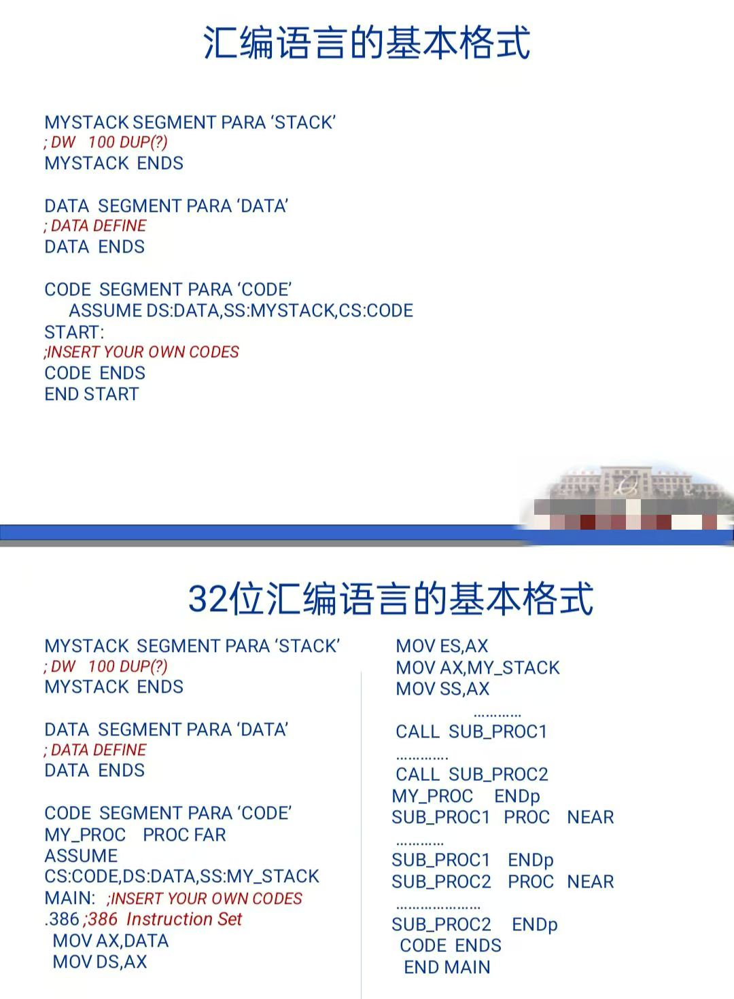

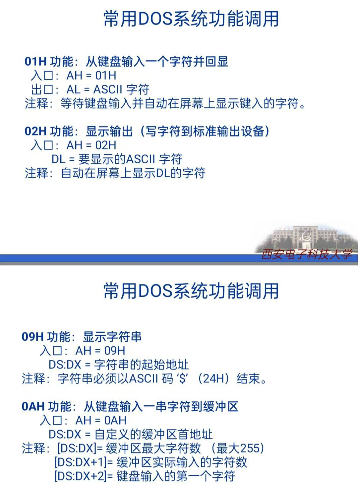

### 实验要求

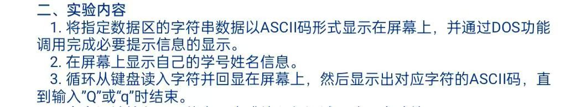

这是第一次实验，相对简单，主要是熟悉汇编语言编写和实践

### 代码解析

```asm
mystack segment stack
  db 128 dup(0)    ;初始化为0
mystack ends

data segment
  nextl db 0ah,0dh,'$'
  msg1 db 'Number:22009290060',0ah,0dh,'$'
  msg2 db 'Name:WangShuXian',0ah,0dh,'$'
  msg3 db 'enter:','$'
  msg4 db 'ASCII:','$'
  num db 'Hello World',0ah,0dh,'$'
data ends

code segment
start:
  assume ds:data,cs:code,ss:mystack
  mov ax,data
  mov ds,ax
  
  mov dx,offset msg1
  mov ah,9     ;int 21h 的 9 号功能用于显示字符串，字符串以 '$' 结尾
  int 21h
  
  mov dx,offset msg2
  mov ah,9
  int 21h

  mov dx,offset num
  mov ah,9
  int 21h

  mov si, offset num
  call PrintStringAsASCII

L1:
  mov dx,offset msg3
  mov ah,9
  int 21h  
  mov ah,1   ;int 21h 的 1 号功能用于获取用户输入的字符，结果存储在 AL 中
  mov al,00h
  int 21h   ;获取用户输入字符到AL
  mov bh,al
  mov dx,offset nextl
  mov ah,9
  int 21h
  mov dx,offset msg4
  mov ah,9
  int 21h

  mov bl,bh
  shr bl,4
  cmp bl,0ah
  jb  next1
  add bl,7

next1:
  add bl,30h
  mov dl,bl
  mov ah,2
  int 21h
  mov bl,bh
  and bl,0fh
  cmp bl,0ah
  jb  next2
  add bl,7

next2:

  add bl,30h
  mov dl,bl
  mov ah,2
  int 21h

  mov dx,offset nextl
  mov ah,9
  int 21h

  mov cx,0
  cmp bh,'Q'
  jnz next3
  mov cx,1

next3:
  cmp bh,'q'
  jnz next4
  mov cx,1

next4:
  jcxz L1
  mov ah,4ch   ;int 21h 的 4ch 号功能用于退出程序
  int 21h

PrintStringAsASCII proc
  mov ah,0

nextChar:
  lodsb      ;从[SI]中下载下一个字符到AL
  cmp al,'$'        ;判断是否到结尾
  je done
  push ax     
  call PrintASCII
  pop ax     
  jmp nextChar

done:
  ret
PrintStringAsASCII endp

PrintASCII proc     ;将字符的高4位和低4位分别转换为十六进制字符并输出
  push ax
  mov ah,2
  mov dl,al
  shr dl,4    
  cmp dl,0ah
  jb nextHigh
  add dl,7

nextHigh:
  add dl,30h
  int 21h

  mov dl,al
  and dl,0fh   
  cmp dl,0ah
  jb nextLow
  add dl,7

nextLow:
  add dl,30h
  int 21h
  mov dx,offset nextl
  mov ah,9
  int 21h
  pop ax
  ret

PrintASCII endp
code ends
end start
```

需要注意的是,以上代码需要在XINGYAN8086环境下调试全速运行可以看到，Windows的命令窗下会显示不全，因为部分语言不兼容

## 实验二 数码转换实验

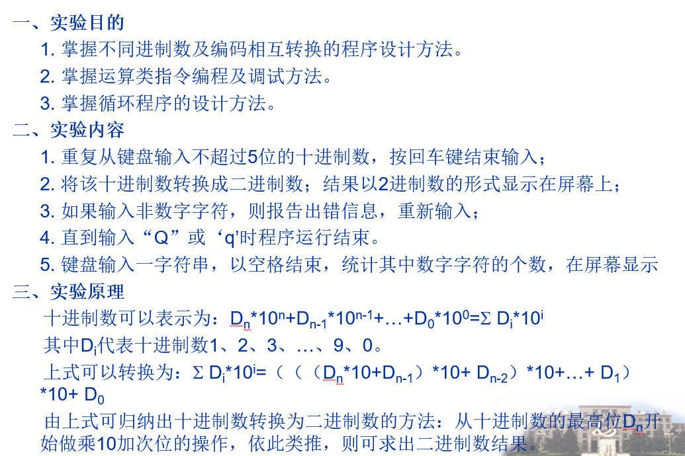

### 十进制ASCII码转换为二进制流程图

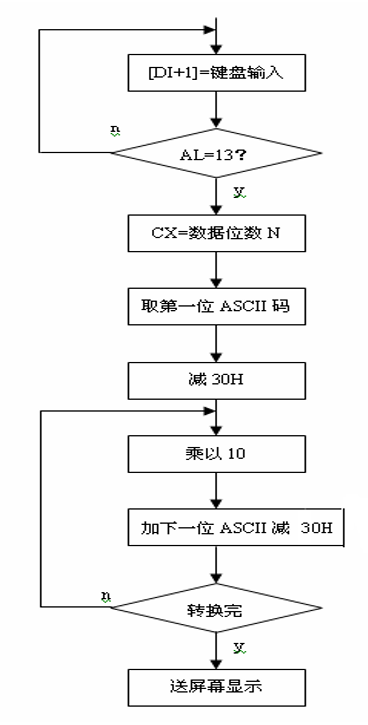

### 数码转换对应关系表

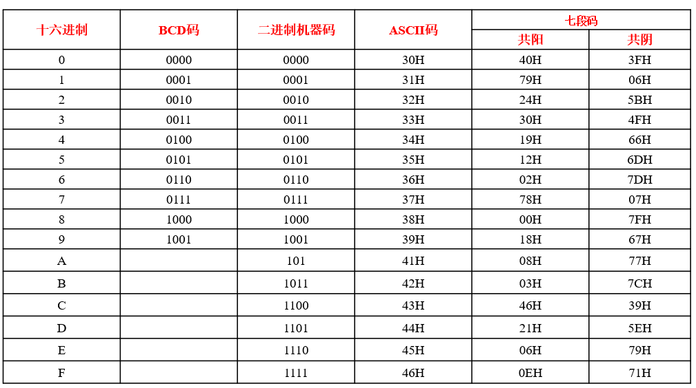

### 代码分析

```asm
_STACK SEGMENT PARA STACK'_STACK'
      DB 128 DUP(0)
_STACK ENDS
DATA SEGMENT
  hello   DB 'Input a number or an instruction!!Q OR q: EXIT,s:SEARCH',0AH,0DH,'$'
  wrong   DB 0AH,0DH,'Wrong Input(only numbers!)',0AH,0DH,'$'
  endofhex DB 0AH,0DH,'Binary:',0AH,0DH,'$'
  finish  DB 0AH,0DH,'Finished',0AH,0DH,'$'
  hello2  DB 0AH,0DH,'Search number inyour string. Space to end input',0AH,0DH,'Input string:',0AH,0DH,'$'
  finish2  DB 0AH,0DH,'FINISHED!!!',0AH,0DH,'THERE ARE ','$'
  finish3  DB ' numbers',0AH,0DH,'$'
  got    DB 5 DUP(0)
  huanhang DB 0AH,0DH,'$'
  
DATA ENDS
CODE SEGMENT
           assume cs:CODE,ds:DATA,ss:_STACK
  START:       
  beginofread:    
           mov   ax,DATA
           mov   ds,ax
           mov   dx,offset hello
           mov   ah,09H
           int   21H
           mov   bx,0H
           mov   di,offset got
           mov   cx,0H
  readchar:     
           mov   ah,01H
           mov   al,00h
           int   21H
           cmp   bx,0H
           jne   notfirst
           cmp   al,'Q'
           je   exit
           cmp   al,'q'
           je   exit
           cmp   al,'s'
           je   next
  notfirst:    ;处理非第一次输入 
           mov   bx,01H
           call  legalcheck
           cmp   bx,02H
           je   beginofread
           cmp   bx,04H
           je   endofinput
           jmp   loadinmemory
  loadinmemory:   ;输入存到内存
           mov   [di],al
           inc   cx
           inc   di
           jmp   readchar
  endofinput:    ;处理输入结束
           mov   dx,0H
           mov   di,offset got
  beginofhandle:   ;处理输入数据
           mov   bx,0H
           mov   bl,[di]
           sub   bx,30H   ;ASCII转数字
           add   dx,bx
           cmp   cx,1H
           je   endofhandle
           call  mulAHdxtodx
           dec   cx
           inc   di
           jmp   beginofhandle
  next:       
           jmp   counterofnumber
  endofhandle:    
           call  binaryoutput
           jmp   beginofread
  binaryoutput:        ;将用户输入的数字转换为二进制并输出
           mov   bx,dx
           mov   dx,0H
           mov   cx,10H
  beginofoutputloop:
           shl   bx,1
           jnc   out0
           mov   dl,'1'
           jmp   outputdl
  exit:       
           mov   ah,4CH
           int   21H
  out0:      
           mov   dl,'0'
  outputdl:     
           mov   ah,02H
           int   21H
           dec   cx
           cmp   cx,0H
           jne   beginofoutputloop
           mov   dx,offset finish
           mov   ah,09H   ;xian'shi
           int   21H
           ret
  legalcheck:          ;检查输入是否为数字（'0' 到 '9'）
           cmp   al,00H
           je   endlegalnextline
           cmp   al,30H
           jb   endlegalfalse
           cmp   al,39H
           ja   endlegalfalse
  endlegaltrue:   
           mov   bx,03H  ;如果是数字，则返回 bx = 03H
           ret
  endlegalnextline: 
           mov   bx,04H
           mov   dx,offset huanhang
           mov   ah,09h
           int   21h
           ret
  endlegalfalse:   ;否则提示错误并返回 bx = 02H
           mov   dx,offset wrong
           mov   ah,09H
           int   21H
           mov   bx,02H
           ret
  mulAHdxtodx:    
           mov   bx,0H
           mov   ax,0H
  loopofmul:     
           add   ax,dx
           inc   bx
           cmp   bx,0AH
           jb   loopofmul
           mov   dx,ax
           ret
  counterofnumber:   ;统计用户输入字符串中的数字数量并输出结果
           mov   dx,offset hello2
           mov   ah,09H
           int   21H
           mov   cx,0H
  beginofcount:   
           mov   ah,01H
           mov   al,00h
           int   21H
           cmp   al,20H
           je   endofcount
           cmp   al,30H
           jb   notnum
           cmp   al,39H
           ja   notnum
  isnum:       
           inc   cx
           jmp   beginofcount
  notnum:      
           jmp   beginofcount
  endofcount:    
           add   cx,30H
           mov   dx,offset finish2
           mov   ah,09H
           int   21H
           mov   dx,0H
           mov   dl,cl
           mov   ah,02H
           int   21H
           mov   dx,offset finish3
           mov   ah,09H
           int   21H
           jmp   beginofread
CODE ENDS
END START
```

### 程序运行流程

1. 显示提示信息 `hello`。
2. 读取用户输入：
   - 如果输入 `'Q'` 或 `'q'`，则退出程序。
   - 如果输入 `'s'`，则进入搜索数字模式。
   - 如果输入数字，则将其转换为二进制并输出。
   - 如果输入非法字符，则提示错误并重新开始。
3. 在搜索数字模式下：
   - 提示用户输入字符串。
   - 统计字符串中的数字数量并输出结果。
4. 返回主逻辑，继续等待用户输入。

## 实验三 基本IO口扩展实验

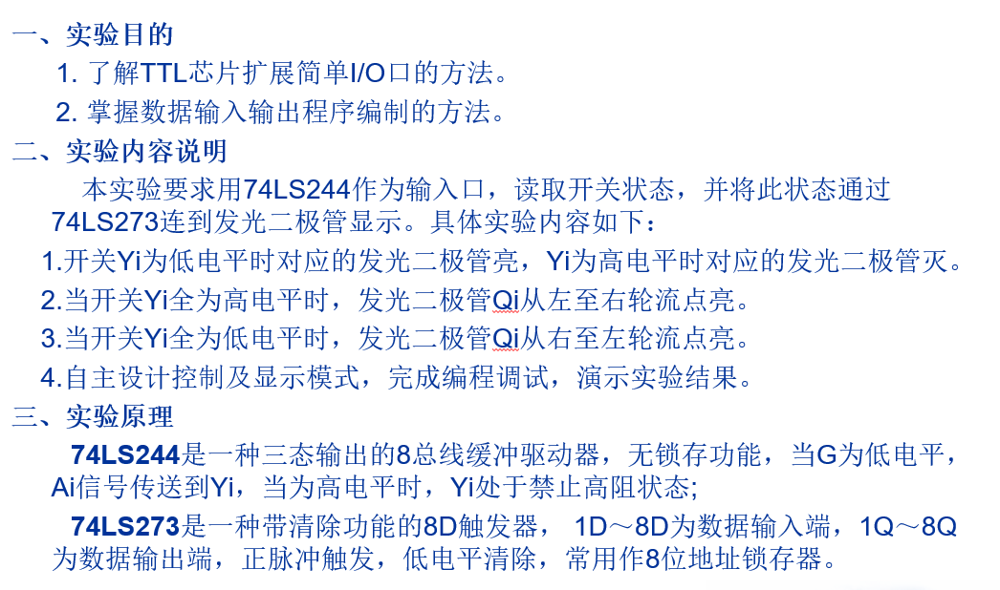

#### 内容说明

1、说明：二片74HC244组成16位的只读外设，二片74HC273组成16位的只写外设，它们 都可以按字节或字方式操作。实验仪具有16位数据总线D0..D15、BLE（低电平有效，选中挂 在低8位数据总线上外设）、BHE（低电平有效，选中挂在高8位数据总线上外设）；BLE、BHE 同时有效，对外设字方式读写，BLE或BHE有效，对外设字节方式读写。 

 二片74HC273的输出端与F4区的16个发光二极管相连；低位74HC244的输入端与F4区的 8个拨动开关相连，8个拨动开关循环左移一位后与高位74HC244的输入端相连。  

2、编写程序：将B4区的二片74HC244中数据读出、写入二片74HC273中；然后逐一点亮 挂在74HC273上的16个发光二级管；循环执行  

3、连接线路验证功能，熟悉它的使用方法。

#### 实验原理图

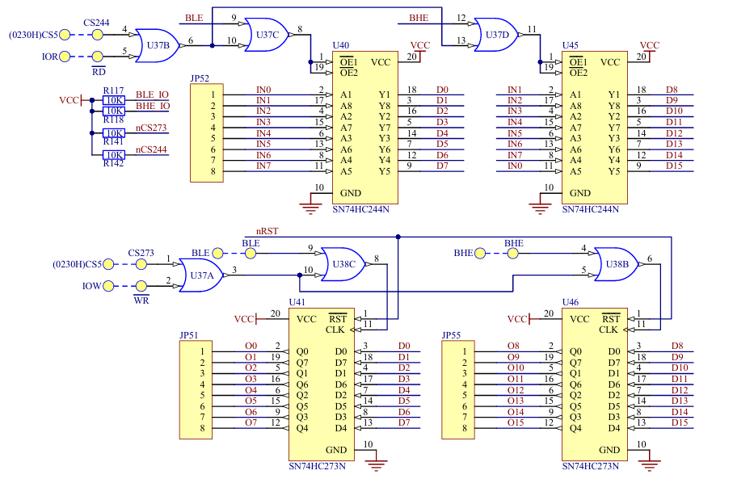

#### 实验步骤

连线说明

| B4(I/O)区：CS273、CS244 |      A3区：CS5、CS5      |
| :---------------------: | :----------------------: |
|   B4(I/O)区：BLE、BHE   |      A3区：BLE、BHE      |
|    B4(I/O)区：RD、WR    |      A3区：IOR、IOW      |
|  B4(I/O)区：JP51、JP55  | F4区：JP18、JP19(发光管) |
|     B4(I/O)区：JP52     |    F4区：JP27（开关）    |
|   B4区：JP57(D0..D7)    |    A3区：JP42(D0..D7)    |
|   B4区：JP56(D8..D15)   |   A3区：JP40(D8..D15)    |

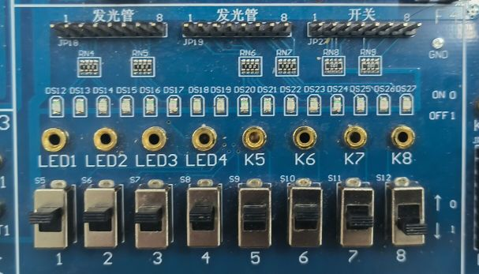

开关为K0，K7~K1

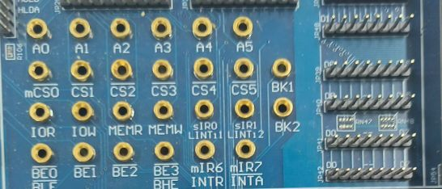

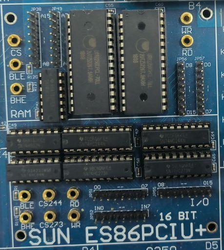

#### 代码解析

```asm
IO244	EQU	0230H	;74LS244端口地址
IO273	EQU	0230H	;74LS273端口地址

_STACK	SEGMENT	STACK
		DW	100	DUP(?)
_STACK	ENDS

_DATA	SEGMENT WORD	 PUBLIC 'DATA'
_DATA	ENDS

CODE		SEGMENT
ASSUME CS:CODE, DS:_DATA, SS:_STACK
START	PROC	 NEAR
		MOV	AX, _DATA
        	MOV DS, AX
INPUT:	
		MOV	DX, IO244
		IN	AX, DX
		CMP	AX, 0FFFFH	;若开关全为低电平
		JZ Q1			;从右往左依次点亮	
		CMP	AX, 0		;若开关全为高电平
		JZ Q2			;从左往右依次点亮
		MOV	DX, IO273
		NOT	AX			;AX取非送给273,点亮对应的二极管
		OUT	DX, AX
		JMP	INPUT
Q1:
		MOV	AX, 7FFFH
		MOV	DX, IO273
R2L:
		CALL	 DELAY		;延时
		OUT	DX, AX		;送给273,点亮对应的二极管
		ROL	AX, 1
		CMP	AX, 7FFFH
		JNE	R2L			;若相等,说明一轮从右往左已经完成,若不等,则继续循环
		JMP	INPUT
		
Q2:
		MOV	AX, 0FFFEH
		MOV	DX, IO273
L2R:
		CALL	 DELAY
		OUT	DX, AX
		ROR	AX, 1
		CMP	AX, 0FFFEH
		JNE	L2R			;若相等,说明一轮从左往右已经完成,若不等,则继续循环
		JMP	INPUT		;继续读入开关状态
Delay 	PROC NEAR		;延时子程序
Delay1:	
XOR	CX,CX		;做一个异或操作将CX清零,仅循环一次
		LOOP	$
		RET
Delay	ENDP
START	ENDP		
CODE		ENDS		
END		START
```

如果要更改为8位灯，只需要把按键控制删掉两位（如7FFF->7F）

AX改为AL即可

## 实验四 可编程并行接口实验

### 实验目的

1. 了解可编程并行接口8255的内部结构； 
2.  掌握工作方式、初始化编程及应用

### 实验内容

1. 流水灯实验：利用8255的A口、B口循环点亮发光二极管； 
2. 交通灯实验：利用8255的A口模拟交通信号灯； 
3.  I/O 输入输出实验：利用8255的A口读取开关状态，8255的B口把状态送发光二极管 显示；
4.   在完成(1)基础上，增加通过读取开关控制流水灯的循环方向和循环方式； 
5.  在完成(2)基础上，增加通过读取开关控制交通红绿灯的亮灭时间；

### 实验过程

#### 实验电路的连接

模块的WR、RD分别连到ISA总线接口模块的IOWR、IORD。
模块的数据（AD0～AD7）、 地址线（A0～A7）分别连到ISA总线接口模块的数据（LD0～LD7）、地址线（LA0～LA7）。 
8255 模块选通线CE连到ISA总线接口模块的0000H。
8255的PA0～PA7连到发光二极管的 L0～L7；
8255 的PB0～PB7连到发光二极管的L8～L15

#### 流水灯实验程序设计与分析

在流水灯实验中，我们使用CS和A0、A1选择8255内部的三个8位并行口和控制寄存 器。根据8255端口地址可知，其A，B，C口及控制寄存器地址分别为0270H、0271H、0272H、 0273H。在本次实验中仅用到了A口作为数据传输端口，以及控制寄存器端口进行8255的配 置

#### 流水灯代码分析

```asm
COM_ADD EQU 0273H 
PA_ADD EQU 0270H 
PB_ADD EQU 0271H 
PC_ADD EQU 0272H 
_STACK SEGMENT STACK
           DW 100 DUP(?)
_STACK ENDS
_DATA SEGMENT WORD PUBLIC 'DATA'
_DATA ENDS
CODE SEGMENT
START PROC NEAR
           ASSUME CS:CODE, DS:_DATA, SS:_STACK
           MOV    AX,_DATA                        ; 将数据段地址加载到AX寄存器
           MOV    DS,AX                           ; 将数据段地址传送给数据段寄存器DS
           NOP
           MOV    DX,COM_ADD                      ; 将串口地址传送给DX寄存器
           MOV    AL,82H                          ; 设置AL寄存器的值为82H
           OUT    DX,AL
	

INPUT:

       MOV    AX, 0FFFFH
       MOV    DX, PA_ADD
       OUT    DX, AX
       MOV    DX, PC_ADD
       OUT    DX, AX
       
       MOV    DX, PB_ADD
       IN     al, DX
       mov    ah, 0
	
       CMP    al, 0FFH                        
       JZ     low1
       CMP    al, 0                         
       JZ     high1
       cmp    al, 0FH
       JZ     START111
       MOV    DX, PA_ADD
       OUT    DX, al
       MOV    DX, PC_ADD
       OUT    DX, AL                                  
       JMP    INPUT
low1:                ;输入值为 0FFH
       MOV    al, 7FH                        
       MOV    DX, PA_ADD                    
low2:  
       ROL    al, 1                         
       OUT    DX, al
       CALL   Delay
       CMP    al, 7FH
       JNE    low2
       MOV    AX, 0FFFFH                     
       OUT    DX, AX       ;将 7FH 循环左移并输出到端口A，直到恢复为 7FH
low3:                      ;端口C
       MOV    al, 7FH       
       MOV    DX, PC_ADD
low4:  
       ROL    al, 1
       OUT    DX, al
       CALL   Delay
       CMP    al, 7FH
       JNE    low4
       JMP    INPUT
START111: JMP START1
START222: JMP INPUT       
high1:                ;输入值为0
       MOV    al, 0FEH
       MOV    DX, PC_ADD
high2: 
       ROR    al, 1
       OUT    DX, al
       CALL   Delay
       CMP    al, 0FEH
       JNE    high2
       MOV    AX, 0FFFFH
       OUT    DX, AX    ;将 0FEH 循环右移并输出到端口C，直到恢复为 0FEH    
high3:                  ;端口A
       MOV    al, 0FEH
       MOV    DX, PA_ADD
high4: 
       ROR    al, 1
       OUT    DX, al
       CALL   Delay
       CMP    al, 0FEH
       JNE    high4
       JMP    INPUT
START1:MOV    BL,0FEH      ;输入值为 0FH
START2:MOV    DX,PA_ADD    ;将 0FEH 循环右移并输出到端口A和端口C，直到恢复为 0FEH
       MOV    AL,BL
       OUT    DX,AL
       MOV    DX,PC_ADD
       OUT    DX,AL
       CALL   Delay
       ROR    BL,1          
       CMP    BL,0FEH
       JZ     START222
       JMP    START2


Delay PROC NEAR     ;通过空循环实现延时
    Delay1:
           XOR    CX,CX
           LOOP   $
           RET
Delay ENDP

START ENDP
CODE ENDS
END START
```

#### 8255交通灯

本次实验还有8255交通灯实验，源代码如下：

```asm
COM_ADD		EQU	0273H	
PA_ADD		EQU	0270H	
PB_ADD		EQU	0271H	
PC_ADD		EQU	0272H	

_STACK		SEGMENT	STACK	
		DW	100 DUP(?)	
_STACK		ENDS		
			
_DATA		SEGMENT	WORD PUBLIC 'DATA'
LED_Data	DB	10111110B	;东西绿灯，南北红灯
		DB	10111111B	;东西绿灯闪烁，南北红灯
		DB	10111101B	;东西黄灯亮，南北红灯
		DB	11101011B	;东西红灯，南北绿灯
		DB	11111011B	;东西红灯，南北绿灯闪烁
		DB	11011011B	;东西红灯，南北黄灯亮
_DATA		ENDS		
			
CODE		SEGMENT		
START		PROC	NEAR	
		ASSUME	CS:CODE, DS:_DATA, SS:_STACK
		MOV	AX,_DATA	
		MOV	DS,AX
		NOP
		MOV	DX,COM_ADD
		MOV	AL,80H		;PA、PB、PC为基本输出模式
		OUT	DX,AL
		MOV	DX,PA_ADD	;灯全熄灭
		MOV	AL,0FFH
		OUT	DX,AL
		LEA	BX,LED_Data
START1:		MOV	AL,0
		XLAT
		OUT	DX,AL		;东西绿灯，南北红灯
		CALL	DL5S
		MOV	CX,6
START2:		MOV	AL,1
		XLAT
		OUT	DX,AL		;东西绿灯闪烁，南北红灯
		CALL	DL500ms
		MOV	AL,0
		XLAT
		OUT	DX,AL
		CALL	DL500ms
		LOOP	START2
		MOV	AL,2		;东西黄灯亮，南北红灯
		XLAT
		OUT	DX,AL
		CALL	DL3S
		MOV	AL,3		;东西红灯，南北绿灯
		XLAT
		OUT	DX,AL
		CALL	DL5S
		MOV	CX,6
START3:		MOV	AL,4		;东西红灯，南北绿灯闪烁
		XLAT
		OUT	DX,AL
		CALL	DL500ms
		MOV	AL,3
		XLAT
		OUT	DX,AL
		CALL	DL500ms
		LOOP	START3
		MOV	AL,5		;东西红灯，南北黄灯亮
		XLAT
		OUT	DX,AL
		CALL	DL3S
		JMP	START1


DL500ms		PROC	NEAR
		PUSH	CX
		MOV	CX,60000
DL500ms1:	LOOP	DL500ms1
		POP	CX
		RET
DL500ms		ENDP

DL3S		PROC	NEAR
		PUSH	CX
		MOV	CX,6
DL3S1:		CALL	DL500ms
	 	LOOP	DL3S1
	 	POP	CX
	 	RET
	 	ENDP
			
DL5S		PROC	NEAR
		PUSH	CX
		MOV	CX,10
DL5S1:		CALL	DL500ms
	 	LOOP	DL5S1
	 	POP	CX
	 	RET
		ENDP

START		ENDP		
CODE		ENDS		
	 	END	START
```

对其代码做了简单修改，增加了全部灯亮和全部灯灭的功能，为演示方便，延时设置为2s

修改后代码如下：

```asm
COM_ADD    EQU 0273H  
PA_ADD     EQU 0270H  
PB_ADD     EQU 0271H  
PC_ADD     EQU 0272H  

_STACK     SEGMENT STACK  
            DW 100 DUP(?)  
_STACK     ENDS  

_DATA      SEGMENT WORD PUBLIC 'DATA'
LED_Data   DB 10111110B  ; 东西绿灯，南北红灯
            DB 10111111B  ; 东西绿灯闪烁，南北红灯
            DB 10111101B  ; 东西黄灯亮，南北红灯
            DB 11101011B  ; 东西红灯，南北绿灯
            DB 11111011B  ; 东西红灯，南北绿灯闪烁
            DB 11011011B  ; 东西红灯，南北黄灯亮
            DB 11111111B  ; 所有灯熄灭（新增状态）
            DB 00000000B  ; 所有灯绿灯（新增状态）
_DATA      ENDS  

CODE       SEGMENT  
START      PROC NEAR  
            ASSUME CS:CODE, DS:_DATA, SS:_STACK
            MOV AX,_DATA  
            MOV DS,AX
            NOP
            MOV DX,COM_ADD
            MOV AL,80H      ; PA、PB、PC为基本输出模式
            OUT DX,AL
            MOV DX,PA_ADD   ; 灯全熄灭
            MOV AL,0FFH
            OUT DX,AL
            LEA BX,LED_Data

START1:     MOV AL,0
            XLAT
            OUT DX,AL       ; 东西绿灯，南北红灯
            CALL DL2S       ; 延时2秒
            MOV CX,6
START2:     MOV AL,1
            XLAT
            OUT DX,AL       ; 东西绿灯闪烁，南北红灯
            CALL DL500ms    ; 延时500毫秒
            MOV AL,0
            XLAT
            OUT DX,AL
            CALL DL500ms    ; 延时500毫秒
            LOOP START2
            MOV AL,2        ; 东西黄灯亮，南北红灯
            XLAT
            OUT DX,AL
            CALL DL2S       ; 延时2秒
            MOV AL,3        ; 东西红灯，南北绿灯
            XLAT
            OUT DX,AL
            CALL DL2S       ; 延时2秒
            MOV CX,6
START3:     MOV AL,4        ; 东西红灯，南北绿灯闪烁
            XLAT
            OUT DX,AL
            CALL DL500ms    ; 延时500毫秒
            MOV AL,3
            XLAT
            OUT DX,AL
            CALL DL500ms    ; 延时500毫秒
            LOOP START3
            MOV AL,5        ; 东西红灯，南北黄灯亮
            XLAT
            OUT DX,AL
            CALL DL2S       ; 延时2秒

         ; 新增状态：所有灯熄灭
         MOV AL,6        ; 所有灯熄灭
         XLAT
         OUT DX,AL
         CALL DL2S       ; 延时2秒
         ; 新增状态：所有灯绿灯
         MOV AL,7        ; 所有灯绿灯
         XLAT
         OUT DX,AL
         CALL DL2S       ; 延时2秒

         JMP START1

DL500ms     PROC NEAR
            PUSH CX
            MOV CX,60000
DL500ms1:   LOOP DL500ms1
            POP CX
            RET
DL500ms     ENDP

DL2S        PROC NEAR
            PUSH CX
            MOV CX,4
DL2S1:      CALL DL500ms    ; 调用500毫秒延时4次
            LOOP DL2S1
            POP CX
            RET
DL2S        ENDP

START       ENDP  
CODE        ENDS  
            END START
```

