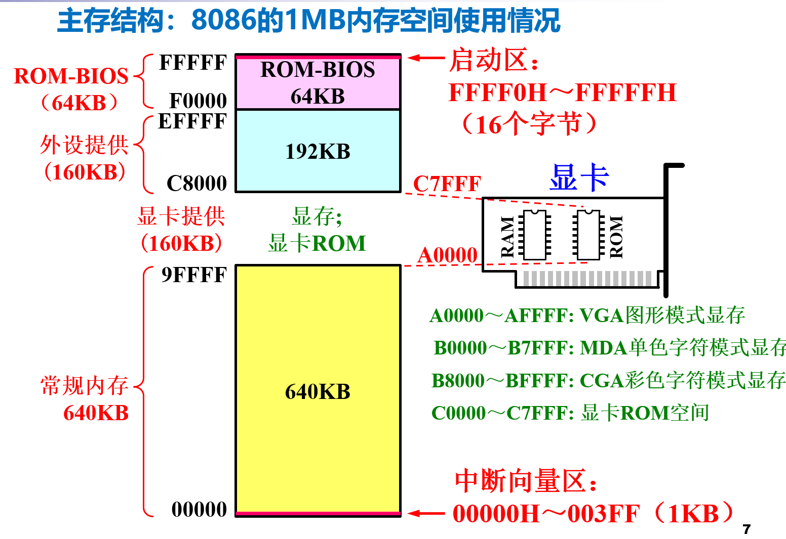
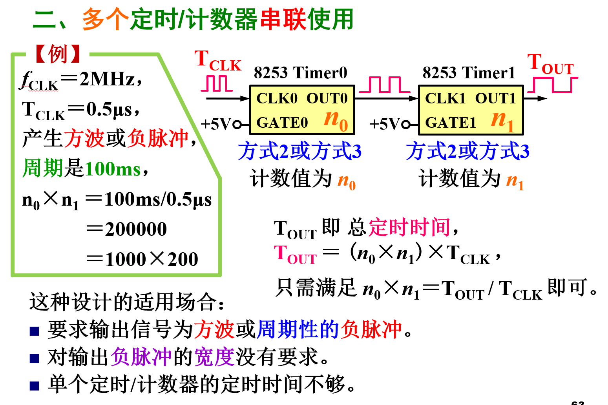
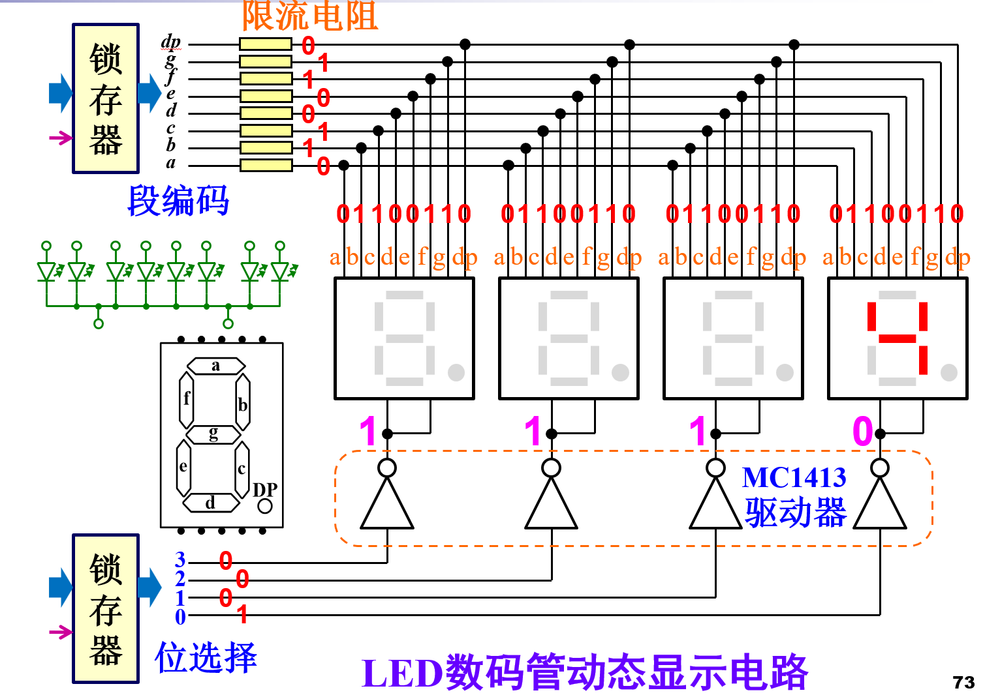
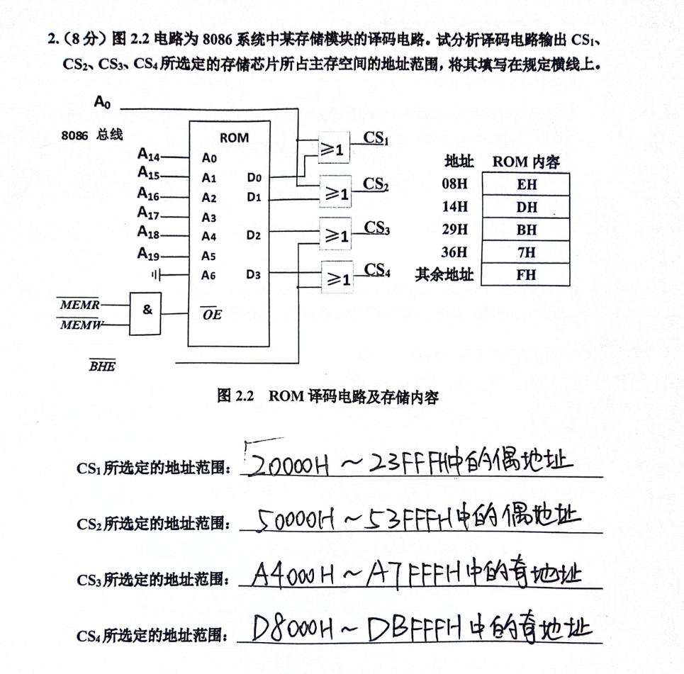

# 微机原理

### 第一章

### 第二章

从8086 CPU开始，Intel CPU设计采用了**向下兼容**的特性

ROM-BIOS

占据高端地址，用来存储BIOS代码

### 第三章

#### 常用指令

1. **MOV**：将源操作数的值复制到目标操作数。例如，`MOV AX, BX` 将寄存器 BX 的值复制到寄存器 AX。
2. **JEA**：无条件跳转到指定的地址。例如，`JEA label` 跳转到名为 label 的标签处。
3. **PUSH**：将操作数压入堆栈。例如，`PUSH AX` 将寄存器 AX 的值压入堆栈。
4. **POP**：从堆栈中弹出值并将其存储到操作数。例如，`POP AX` 将堆栈顶部的值弹出并存储到寄存器 AX。
5. **CALL**：调用子程序。例如，`CALL subroutine` 调用名为 subroutine 的子程序。
6. **RET/IRET**：返回到调用者。RET 用于常规子程序，而 IRET 用于中断处理程序。
7. **INT n**：触发中断 n。例如，`INT 21H` 触发中断 21H，通常用于调用 MS-DOS 功能。
8. **ADD/ADC/INC/SUB/SBB/DEC/NEG/MUL/IMUL/DIV/IDIV**：执行加法、加法带进位、递增、减法、减法带借位、递减、求负、乘法、有符号乘法、除法和有符号除法操作。
9. **AND/OR/NOT/XOR/SHL/SHR/ROL/ROR/SAR**：执行按位与、按位或、按位非、按位异或、左移、逻辑右移、循环左移、循环右移和算术右移操作。
10. **LOOP**：重复执行一系列指令，直到计数器为零。例如，`LOOP label` 跳转到名为 label 的标签处，并将计数器减一，直到计数器为零。
11. **JMP**：无条件跳转到指定的地址。例如，`JMP label` 跳转到名为 label 的标签处。
12. **CMP**：比较两个操作数的值。例如，`CMP AX, BX` 比较寄存器 AX 和 BX 的值。
13. **TEST**：执行按位与操作，但不改变操作数的值。例如，`TEST AX, BX` 比较寄存器 AX 和 BX 的值，但不影响它们的值。
14. **JZ/JE/JNZ/JNE/JC/JNC/JA/JAE/JB/JBE/JG/JGE/JL/JLE**：根据条件跳转到指定的地址。例如，`JZ label` 如果前一条指令的结果为零（零标志为真），则跳转到名为 label 的标签处。

- **JZ/JE**：当零标志（ZF）为真时，即前一条指令的结果为零时，跳转到指定地址。
- **JNZ/JNE**：当零标志（ZF）为假时，即前一条指令的结果不为零时，跳转到指定地址。
- **JC**：当进位标志（CF）为真时，即前一条指令产生了进位时，跳转到指定地址。
- **JNC**：当进位标志（CF）为假时，即前一条指令没有产生进位时，跳转到指定地址。
- **JA/JAE**：当无符号数比较结果大于（JG）或大于等于（JAE）时，跳转到指定地址。
- **JB/JBE**：当无符号数比较结果小于（JB）或小于等于（JBE）时，跳转到指定地址。
- **JG/JGE**：当有符号数比较结果大于（JG）或大于等于（JGE）时，跳转到指定地址。
- **JL/JLE**：当有符号数比较结果小于（JL）或小于等于（JLE）时，跳转到指定地址

15.**IN**：从指定端口读取数据。例如，`IN AL, DX` 从端口 DX 读取数据到寄存器 AL。

16.**OUT**：向指定端口写入数据。例如，`OUT DX, AL` 将寄存器 AL 的数据写入端口 DX。

用左移指令实现乘法指令，优点是速度快，缺点是有溢出的可能性

#### 汇编语言寻址方式

1. **直接寻址**：在直接寻址中，指令中直接给出操作数的有效地址（即内存地址）。例如，“MOV AX, [1234H]”中，1234H是直接给出的内存地址。 
2. **间接寻址**：间接寻址通过一个寄存器来获取操作数的地址。例如，“MOV AX, [BX]”中，BX寄存器包含了操作数的地址。
3. **寄存器寻址**：操作数直接存储在CPU的某个寄存器中，指令中会明确指出使用哪个寄存器。例如，“ADD AX, BX”表示将AX寄存器和BX寄存器的内容相加，结果存回AX。
4. **基址寻址**：基址寻址使用一个基址寄存器（如BX、BP）和一个偏移量来确定操作数的地址。例如，“MOV AX, [BP+SI+123H]”中，BP是基址寄存器，SI是偏移量。
5. **变址寻址**：变址寻址与基址寻址类似，但使用的是变址寄存器（如SI、DI）而不是基址寄存器。例如，“MOV AX, [SI+123H]”中，SI是变址寄存器。
6. **相对基址加变址寻址**：这种寻址方式结合了基址寻址和变址寻址的特点，使用一个基址寄存器和一个变址寄存器以及一个偏移量来确定操作数的地址。例如，“MOV AX, [BP+SI+234H]”中，BP是基址寄存器，SI是变址寄存器。
7. **段内寻址**：段内寻址通常用于处理大于64KB的数据块，如大型数组或数据结构。它依赖于段寄存器（如DS、SS）和偏移量来确定操作数的地址。例如，“MOV AX, DS:[SI+123H]”中，DS是段寄存器，SI是偏移量。
8. **立即寻址**：立即寻址的特点是操作数本身设在指令字内，即形式地址A不是操作数的地址，而是操作数本身，又称之为立即数。例如，“MOV AX, 1234H”中，1234H就是立即数。
9. **隐含寻址**：隐含寻址是指指令字中不明显地给出操作数的地址，其操作数的地址隐含在操作码或某个寄存器中。例如，单地址的指令格式，就不明显地在地址字段中指出第二个操作数的地址，而是规定累加寄存器AC作为第二个操作数地址。
10. **寄存器间接寻址**：
    - 在寄存器间接寻址中，指令中的寄存器内容不是操作数本身，而是操作数所在内存单元的地址。
    - 例如，指令“MOV AX, [BX]”中，BX寄存器包含了操作数的地址，AX将获得该地址处的内容。
    - 这种寻址方式的特点是需要通过寄存器间接地访问内存，因此称为寄存器间接寻址。
11. **寄存器相对寻址**：
    - 寄存器相对寻址是指操作数的有效地址是基址寄存器或变址寄存器与指令中给出的偏移量之和。
    - 例如，指令“MOV AX, [SI+3]”中，SI寄存器的内容加上偏移量3得到操作数的地址，然后将该地址处的内容加载到AX中。
    - 这种寻址方式常用于处理数组等数据结构，因为它可以通过改变偏移量来访问不同的数组元素。
12. **PC相对寻址**：
    - PC相对寻址的有效地址是将程序计数器PC的内容（即当前指令的地址）与指令字中的偏移量相加而成。
    - 例如，在转移类指令中，如果指令为“JMP 100H”，则表示程序将跳转到当前指令地址加上100H的地方执行。
    - 这种寻址方式常用于实现程序中的条件跳转和循环控制。

### 第四章

- 时钟偏移是指在一个同步数字电路系统中，同一个时钟信号到达不同触发器（Flip - Flop）的时间差异。简单来说，就是由于时钟信号在传输路径上的延迟不同，导致各个时序元件接收到时钟沿的时刻不一致。

高频明显

- 线间串扰是指在相邻的信号传输线之间，由于电磁耦合效应，一条信号线上的信号会对另一条信号线产生干扰。当一条信号线（干扰线）上的信号发生变化（如从高电平变为低电平）时，它会在周围空间产生电磁场，这个电磁场会在相邻的信号线（被干扰线）上感应出电压或电流，从而干扰被干扰线的正常信号传输。

### 第五章

### 第六章

8259用于管理外部可屏蔽中断源INTR

进行优先级判优的信息来源于IRR，ISR，IMR

CPU执行IRET中断返回，自动EOI方式下也不需要发EOI命令

级联时从属 8259 只能设置为全嵌套方式，不能设置为一般嵌套方式

### 第七章

1. 8259 的寄存器

   - **中断请求寄存器 IRR（Interrupt Request Register）**：用于存放所有中断请求信号的状态。当有中断请求输入时，相应的位会被置 1。
   - **内部服务寄存器 ISR（In-Service Register）**：用于记录正在被 CPU 服务的中断。当 CPU 响应中断并开始处理时，对应的中断位会在 ISR 中被置 1。

   1. **若 8259 初始化为非自动中断结束方式，那么在 CPU 发出中断响应 INTA 期间，8259 的中断请求寄存器 IRR 和内部服务寄存器 ISR 有什么变化？**

      - **IRR 的变化**：当 CPU 发出中断响应 INTA 时，8259 会将 IRR 中优先级最高的中断请求位（本题中为 IR2 对应的位）复位。这是因为 8259 已经知道 CPU 要处理这个中断请求，所以将 IRR 中该请求标记清除，但实际上该中断请求仍然存在，只是 8259 已经将其记录在 ISR 中准备处理。
      - **ISR 的变化**：8259 会将 ISR 中与该中断请求对应的位（即 IR2 对应的位）置 1，表示该中断正在被 CPU 服务。

   2. **如果在 IR2 中断处理程序中发布一般 EOI 命令，会产生什么结果？**

      - 在非自动中断结束方式下，如果在 IR2 中断处理程序中发布一般 EOI 命令，会将 ISR 中 IR2 对应的位复位。这样做的结果是，8259 会认为 IR2 中断已经处理完毕，从而可以响应新的同优先级或更低优先级的中断请求（如果有）。但需要注意的是，如果此时还有更高优先级的中断请求在 IRR 中，8259 会先处理更高优先级的中断，而不是立即响应新的同优先级或更低优先级的中断。、

      

### 第八章

当某设备的LED 数码管个数很多时，如何处理？

**增加驱动能力** **优化扫描方式**

给每行一个低电平然后检查列信号

二极管的作用是防止在键盘扫描过程中，多个按键同时按下时产生总线竞争。

## 试卷

### 17年

### 20年

第三小问，注意，var3是负数

- **第 10 行**：`MUL 10`是错误的。`MUL`指令是无符号乘法指令，其操作数应该是寄存器或内存单元，而不能是立即数`10`，所以此处应打`×`。
- **第 12 行**：`MOV VAR3, BL`是正确的。`VAR3`被定义为字节型变量（`DB`），`BL`是 8 位寄存器，两者数据宽度匹配，可以进行数据传送，所以此处打`√`。

2:每次循环写入一个字（字节），所以地址指针DI要加2，以便指向下一个存储单元。

4-2 A2 A1 A0为11（3） 0时选择PC

10001000 C低四位是输出

- 二极管 D1 - D4 的作用：隔离作用，防止列间信号干扰，总线竞争；钳位作用，保护输入端口，稳定输入信号。
- 键盘扫描的操作过程：先初始化 8255，将 A 口设为输入，C 口高 4 位设为输出，C 口低 4 位设为输入；然后通过 C 口高 4 位逐列输出低电平进行扫描，同时读取 A 口数据判断按键是否按下及位置；最后根据扫描结果进行按键识别与处理。

初始化控制地址A1A0都是11

这里注意out被反相了所以输出是上升沿

- 关于中断向量码
  - 在 8259 芯片中，初始化时设置了`ICW2 = 52H`，中断向量码的高 5 位由`ICW2`的高 5 位确定，低 3 位由中断请求引脚`IR`的编号确定。
  - `ICW2 = 52H`，其二进制为`01010010`，高 5 位是`01010`。`IR5`的编号是 5，转换为二进制是`101`，将这两部分组合起来，得到中断向量码为`01010101B`，即`55H`。
- 关于中断处理程序首地址的段地址和段内偏移地址
  - 在 8086 系统中，中断向量表用于存储中断处理程序的入口地址（段地址和偏移地址）。每个中断向量占 4 个字节，其中前两个字节是偏移地址，后两个字节是段地址。
  - 中断向量码乘以 4 就是该中断在中断向量表中的地址。`IR5`的中断向量码是`55H`，`55H * 4 = 154H`，所以中断向量表单元地址为`00154H`处存放的是`IR5`中断源的中断处理程序首地址的段内偏移地址，地址为`00156H`处存放的是段地址。

#### 版本2

20年第四大题第2题，第一句要改成MOV DX，8006H

20年第六大题 第一小题 B选项不选
结束中断不是EOI，是IRET

### 21年

初始化控制地址A1A0都是11

LEA主要用于获取变量的地址

#### 版本2

4、特征位寻址、命令字顺序寻址

### 22年

6、简单是查询，注重效率是中断方式

8、push——，pop++

2（2）带进位加法，cf=1
（3）按位异或

### 24年

人智院简答

8253 方式 2 在二进制计数时最大分频次数为 65536（64KB），在 BCD 码计数时最大分频次数为 10000。

1，8255A口的三种工作方式及其特点

方式 0（基本输入 / 输出方式）

不需要联络信号（如选通信号、应答信号等），A 口的 8 位数据线可以直接作为输入或输出端口使用。

方式 1（选通输入 / 输出方式）

A 口在这种方式下，除了 8 位数据线用于数据传输外，还使用了 C 口的部分引脚作为联络信号，用于实现与外设之间的数据传输控制和状态反馈

方式 2（双向选通输入 / 输出方式）

这是 A 口特有的工作方式，它将方式 1 的选通输入和选通输出功能结合在一起，实现数据的双向传输。A 口的 8 位数据线既可以作为输入，又可以作为输出，分时使用。

2、统一编址和独立编址的异同和优缺点

存储器统一编址(存储器映像编址)：
在这种编址方式中，I/O端口和内存单元统一编址，
即把I/O端口当作内存单元对待，
从整个内存空间中划出一个子空间给I/O端口，
每一个I/O端口分配一个地址码，
用访问存储器的指令对I/O端口进行操作。 

存储器统一编址的优点是：
I/O端口的数目几乎不受限制；
访问内存指令均适用于I/O端口，对I/O端口的数据处理能力强；
cpu无需产生区别访问内存操作和I/O操作的控制信号，从而可减少引脚。

存储器统一编址缺点是：
程序中I/O操作不清晰，难以区分程序中的I/O操作和存储器操作；
I/O端口占用了一部分内存空间；
I/O端口地址译码电路较复杂(因为内存的地址位数较多)。

I/O独立编址：
I/O端口编址和存储器的编址相互独立，
即I/O端口地址空间和存储器地址空间分开设置，互不影响。
采用这种编址方式，对I/O端口的操作使用输入/输出指令(I/O指令)。

I/O独立编址的优点是：
不占用内存空间；
使用I/O指令，程序清晰，很容易看出是I/O操作还是存储器操作；
译码电路比较简单(因为I／0端口的地址空间一般较小，所用地址线也就较少)。
I/O独立编址缺点是：只能用专门的I/O指令，访问端口的方法不如访问存储器的方法多。

3、什么是总线周期，CPU执行一个总线周期要多少个时钟周期，什么时候插入T~w~，T~w~会持续多久

8088/8086CPU把BIU完成一次访问存储器或外设操作所谓的时间称为一个总线周期，一个总线周期最少包含4个时钟周期（T1~T4）。当访问存储器（读、写）或外设时，存储器或外设不能及时地配合CPU传送数据，存储器或外设通过“READY”信号在T3之前向CPU发一个“数据未准备好”信号，CPU会在T3之后插入一个或多个等待时钟周期Tw。当存储器外设准备好数据，通过“READY”发“准备好”信号，CPU接收到这个信号后，会自动脱离Tw状态进入T4状态，因此插入多少个Tw取决于“READY”信号。

猜测会考

8086主存分体数据分段寻址1MB，接口不分段寻址64MB

8088无T~w~下，一个总线周期4T

8086无T~w~下，偶地址开始的16位读写，一个总线周期为4T。

IP启动地址0000H,CS为FFFFH

1MB使用情况
中断向量区1KB(0000H~003FFH)
常规内存640KB
显卡160KB（A000H~C7FFFH）
外设160KB
ROM-BIOS 64KB（F0000H-FFFFFH）
启动区FFFF0H~FFFFFH

8086最大工作方式和最小工作方式
微机中除了主处理器8086，还允许接入其他协处理器（运算处理器8087、I/O 处理器8089）构成多微处理器系统，系统总线由 8086 和总线控制器 8288 提供的信号共同形成；
74LS373：锁存地址信号，与复用的状态信号分离

时钟偏移是指在一个同步数字电路系统中，同一个时钟信号到达不同触发器（Flip - Flop）的时间差异。简单来说，就是由于时钟信号在传输路径上的延迟不同，导致各个时序元件接收到时钟沿的时刻不一致。
高频明显

线间串扰是指在相邻的信号传输线之间，由于电磁耦合效应，一条信号线上的信号会对另一条信号线产生干扰。当一条信号线（干扰线）上的信号发生变化（如从高电平变为低电平）时，它会在周围空间产生电磁场，这个电磁场会在相邻的信号线（被干扰线）上感应出电压或电流，从而干扰被干扰线的正常信号传输。

- 中断过程
  1. 中断源发出中断请求
  2. 满足中断条件，进行中断响应
     - 断点保护（硬件完成）
       - PSW压栈，关中断，CS压栈，IP压栈
     - 中断判优
       - 硬件判优
       - 软件判优
     - 中断源识别
       - 软件查询
       - 中断矢量法
     - 获得中断服务子程序首地址
       - 固定入口法
       - 中断向量法
  3. 中断处理——中断服务子程序
     - FAR类型，用IRET返回
     - 保护现场 → 开中断STI → 中断处理 → 关中断CLI → 恢复现场 → 中断返回IRET
     - RISC寄存器分页，中断服务程序无需PUSH POP
  4. 中断返回 IRET
     - IRET指令使CPU把堆栈内保存的断电信息弹出到IP、CS、FLAG中

- **中断向量码**：是一个用于标识不同中断源的编号。在 8086/8088 系统中，中断向量码范围是 0 - 255（00H - FFH），每个中断源都对应一个唯一的中断向量码。
- **中断向量表地址**：中断向量表是用于存放中断处理程序入口地址（即中断处理程序首地址）的一段内存区域。在 8086/8088 系统中，中断向量表位于内存的最低 1KB 地址空间（00000H - 003FFH），每个中断向量（即每个中断源对应的入口地址）占 4 个字节，其中前两个字节存放中断处理程序首地址的偏移地址，后两个字节存放段地址。中断向量表地址是通过中断向量码计算得出的，计算公式为：中断向量表地址 = 中断向量码 × 4。
- **中断处理程序首地址**：是中断处理程序在内存中的起始地址，由段地址和偏移地址两部分组成。当发生中断时，CPU 根据中断向量码找到对应的中断向量表地址，然后从中断向量表中取出中断处理程序首地址，进而跳转到中断处理程序去执行相应的中断处理操作。

中断响应时，IRR对应的位清0，ISR对应的位置1；发EOI命令后，ISR对应的位清0

级连时只能有一片8259为主片，其余的均为从属片

固定优先级：IR0最高，IR7最低

- 在中断系统的语境下，一般屏蔽是指一种机制，用于暂时禁止某些中断源的中断请求信号到达处理器的中断处理逻辑。通过设置相应的屏蔽位，程序员可以控制哪些中断被暂时忽略，哪些可以正常响应。这就好比在一个繁忙的办公室里，你可以通过某种方式（设置屏蔽位）让某些来电（中断请求）暂时不被接听，而只处理那些你认为更重要或者当前可以处理的来电。
- EOI 是中断处理机制中的一个重要环节。在非自动 EOI 方式下，当中断处理程序完成对中断的处理后，需要由软件显式地向中断控制器发送一个中断结束信号。这与自动 EOI 方式形成对比，自动 EOI 方式下，中断控制器在中断处理完成后自动检测并清除中断标志位。

键盘扫描的原理及过程

- **扫描原理基础**：通过逐行（或逐列）向矩阵的行（或列）线发送扫描信号，然后检测列（或行）线的状态来确定是否有按键按下。当没有按键按下时，行线和列线是相互隔离的；当有按键按下时，对应的行线和列线就会导通，通过检测导通的行 - 列组合来确定被按下的按键。

初始化——低电平逐行（列）扫描，按键编码确定，防抖处理，释放检测