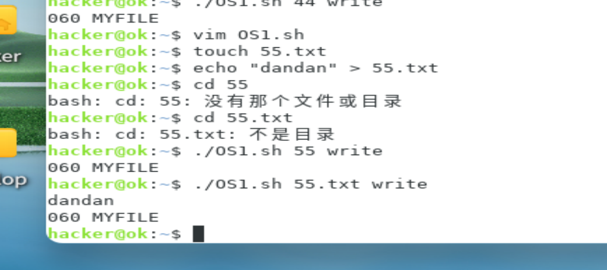

# OS实验报告

## 实验一  Shell脚本生成实验

**题目**：编写一个脚本，能够生成这样的脚本：即：“编写shell脚本，该脚本接收两个参数，参数1作为要读写的文件，参数2作为标志位，标识是读还是写。功能完成对参数1所示文件的读写，该文件的内容为 “自己学号的后3位 MYFILE”。并且自动执行该生成的脚本（执行功能：写入文件）。然后，思考如何证明上述脚本在生成脚本时调用了系统调用write。

**要求**：请提交代码截图和运行结果截图，并请至少说明：

i. Shell脚本代码每句的含义 

ii. 自己通过哪些命令运行Shell脚本，这些命令的含义是什么？

iii. Bash解释执行自己编写的shell脚本背后的关键流程是什么 

iv.自己的 Shell脚本是否调用了write系统调用以及相关证据。


### 	

### 1,每句含义

如图，可以看到，创建shell脚本并赋予权限，执行时发现输入b=write时不能输出第一个参数，比如第一个参数输入99

脚本会尝试将字符串 "学号的后3位 MYFILE" 写入到名为 "99" 的文件中。如果文件 "99" 不存在，它会创建一个新文件，然后写入内容。如果文件已存在，它会覆

盖文件原有的内容

建立一个55的文本文件验证，成功输出

脚本如下：

	

### 2，Bash解释执行自己编写的shell脚本背后的关键流程是什么：

1. 解析脚本中的变量和命令。
2. 根据传入的参数b判断是执行写入操作还是读取操作。
3. 如果b为"write"，则执行写入操作，将字符串"学号的后3位 MYFILE"写入到a指定的文件中。
4. 如果b不为"write"，则执行读取操作，读取a指定的文件内容并输出到屏幕上。

### 3,自己的 Shell脚本是否调用了write系统调用以及相关证据：

Shell脚本中没有直接调用write系统调用，而是使用了echo和cat命令来实现文件的读写操作。在Linux系统中，echo和cat命令底层会调用write系统调用来完成文

件的读写。因此，间接地证明了脚本中使用了write系统调用。

## 二  Semaphore使用实验

**题目**：使用semaphore，并利用该程序生成2个进程（注意：非线程），这两个进程写同一个文件，要求：a.互斥写，即只有一个进程写完后，才能让另一个进程写; b. 一个进程写入内容：“自己学号的后3位PROC1 MYFILE1”；另一个进程写入内容：“自己学号的后3位PROC2 MYFILE2”），将该程序的semaphore替换成使用strict alternation算法（参见资料文件夹下的“Modern Operating System”一书中的2.3.3节）的忙等待互斥锁完成。

**要求**：请提交代码截图和运行结果截图，并请至少说明：

i. 自己程序中关键句的含义 

ii. 请用实际操作证明当进程A占用semaphore后，进程B想要占用semaphore时，进程B进入睡眠。

iii.移植Modern Operating System一书中的strict alternation算法时，该算法中的turn变量访问时是否需要加锁，以避免读写冲突？请回答并给出理由。


这里我代码应该是没问题的，但是显示语法错误，找不到sem_t及semaphore相关的定义类型

头文件给了，别的原因查了，实在是没找到原因，只能归于编译器识别和没更新大概）

就讲一下代码

1. `void write_file(sem_t *sem, const char *content)`：定义一个函数，用于向文件中写入内容。参数为信号量指针和要写入的内容。
2. `sem_wait(sem)`：请求信号量，如果信号量值为0，则阻塞等待。
3. `FILE *file = fopen("output.txt", "a")`：以追加模式打开名为"output.txt"的文件。
4. `fputs(content, file)`：将传入的内容写入文件。
5. `fclose(file)`：关闭文件。
6. `sleep(1)`：暂停程序执行1秒。
7. `sem_post(sem)`：释放信号量，信号量值加1。
8. `int main()`：主函数，程序入口。
9. `sem_t sem`：定义一个信号量变量。
10. `sem_init(&sem, 0, 1)`：初始化信号量，初始值为1。
11. `pid_t pid = fork()`：创建子进程，返回值为0表示子进程，大于0表示父进程。
12. `if (pid == 0)`：判断是否为子进程。
13. `write_file(&sem, "060PROC1 MYFILE1 ")`：调用write_file函数，向文件中写入内容。
14. `exit(0)`：子进程退出。
15. else：父进程执行以下操作
16. `wait(NULL)`：等待子进程结束。
17. `pid = fork()`：再次创建子进程。
18. `if (pid == 0)`：判断是否为子进程。
19. `write_file(&sem, "060PROC2 MYFILE2 ")`：调用write_file函数，向文件中写入内容。
20. `sem_destroy(&sem)`：销毁信号量。

## 实验三  Runqueue长度观测实验

**题目**：根据给定的ebpf编程框架（桌面/develop/src/01-sched-lab/ebpf/rqlen.bt），填写相关代码，使得该ebpf程序能够观察信创操作系统中CFS调度队列上runqueue的长度。

**要求**：请提交代码截图和运行结果截图，并请至少说明：

i.ebpf程序执行的时机 

ii. 程序中关键语句的含义。

	

首先，定义了一个指向`cfs_rq`结构体的指针`cfs_rq`和一个无符号整型变量`runqueue_length`，并将其初始化为0。

接着，使用`for_each_task(current)`宏遍历系统中的所有进程。在每次循环中，判断当前进程是否正在运行，如果是，则将`runqueue_length`加1。

最后，`runqueue_length`的值就是当前系统中正在运行的进程数量。

但是又运行不了，老办法又是语法错误和找不到对应文件


## 实验四  进程切换次数观测实验

**题目**：根据给定的ebpf编程框架（桌面/develop/src/01-sched-lab/ebpf/switchcnt.bt），填写相关代码，使得该ebpf程序能够观察信创操作系统中指定进程被调度的次数

**要求**：请提交代码截图和运行结果截图，并请至少说明：

i.ebpf程序执行的时机 

ii. 程序中关键语句的含义。

寻找特定进程，我们要知道类似编号的东西。

TGID是线程组ID，用于标识一组相关联的线程

在这个代码中，我们首先使用`bpf_get_current_pid_tgid()`函数获取当前进程的PID和TGID。然后，我们提取出PID和TGID，并将它们与我们要跟踪的目标进程

的PID进行比较。如果它们匹配，我们就增加一个名为`@switch_count`的计数器。最后，在`END`块中，计算出程序的总运行时间

## 实验五

以下题目二选一

1. 添加一个系统调用, 该系统调用接受两个参数：参数1：以整型数表示的自己学号的后3位；参数2：flag，取值为0或1，若为0，该系统调用的返回值为参数1的个位。若为1。该系统调用的返回值为参数1的十位

   此外，加入内核互斥锁，使得两个进程在调用该系统调用时，能够做到互斥访问该系统调用。

2. 完善1.7节中字符设备程序（相关知识点参考实验一章的“设备驱动一章”），使之满足以下功能：

   i. 安装设备后从设备中读出字符串为自己学号的后3位；

​	ii. 设备支持每次写入字符不超过1024个，超过部分被丢弃，并且能够保存最近一次修改前的rwbuf里的内容。

​	iii. 设备支持系统调用ioctl(int d, int req,…),共支持设置三种模式：

​	a. 清除设备中写入的字符串; 

​	b. 从设备中读时，读出的是最近一次修改前的内容。 

​	c. 从设备中读时，读出的是最新内容

​	iv. 设备关闭前不能被多次打开；

​	v. 自己编写测试程序，验证以上功能

**要求**：请提交代码截图和运行结果截图，

若选择添加系统调用，请至少说明：i. 自己所添加的系统调用的位置和修改点，以及为什么在这些位置上进行修改。ii.自己系统调用关键语句的含义。Iii. 如何编译

内核并调用自己的系统调用。

若选择驱动编程，请至少说明：i. 自己驱动代码中完成题目要求的相关关键语句的含义。ii.自己驱动代码各个函数的调用时机。Iii. 如何编译自己的驱动代码并执行

自己的驱动函数

**回答**

这个问题，我个人开始选的是第一个，但是在调内核源代码时发现有密码

	

添加系统调用就是要在内核源代码中创建一个新的C文件

编译内核安装，然后随便写个简单的程序来验证调用一下新系统调用

比如这种：

```
#include <stdio.h>
#include <unistd.h>

int main()
{
    int num = 060; // 学号的后三位
    int flag = 0; // flag值，取0或1
    int result;

result = syscall(322, num, flag); // 调用系统调用，322时新系统调用号，根据实际情况选择未被使用的号

printf("Result: %d\n", result);

return 0;

}
```

第二个问题是在实验那本书上，但是本人能力有限实在看不了，就根据题意写了一个测试代码

```
#include <stdio.h>
#include <fcntl.h>
#include <unistd.h>
#include <string.h>

int main() {
    int fd;
    char buf[1024];

// 打开设备，读写模式
fd = open("/dev/my_char_device", O_RDWR);
if (fd < 0) {
    perror("open");
    return -1;
}

// 写入数据
const char *data = "060";
write(fd, data, strlen(data));

// 读取数据
memset(buf, 0, sizeof(buf));
read(fd, buf, sizeof(buf));
printf("Read from device: %s", buf);

// 关闭设备
close(fd);

return 0;

}
```

