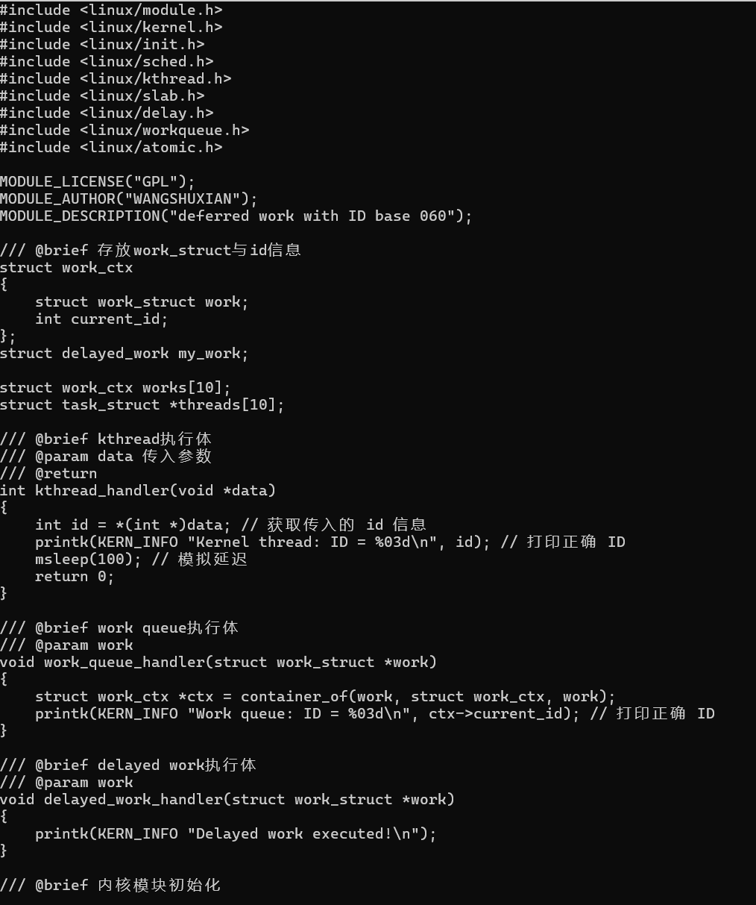
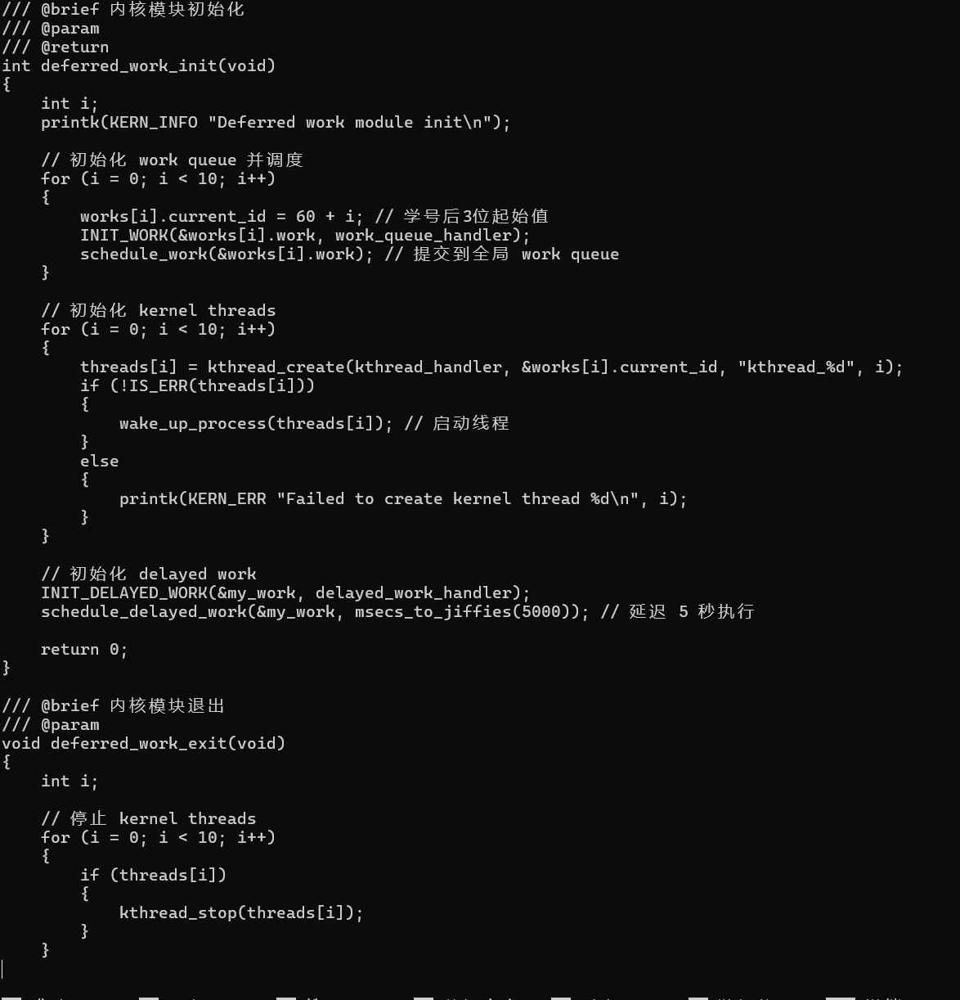
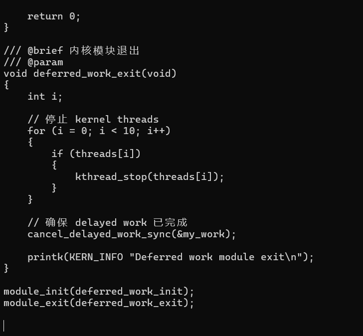
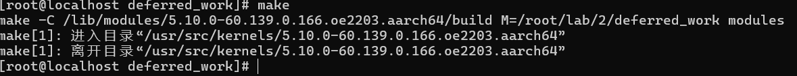
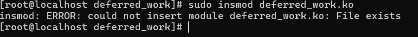
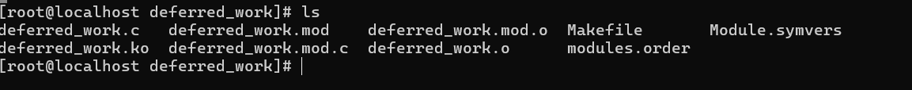
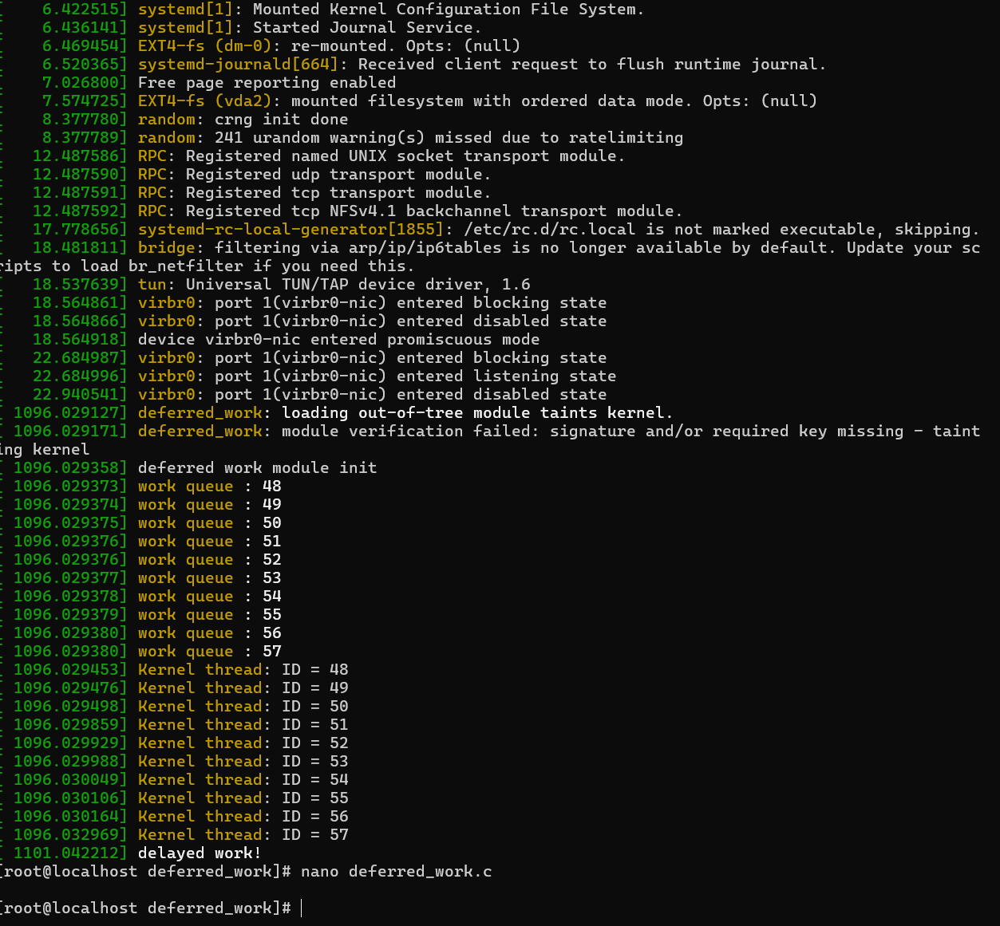
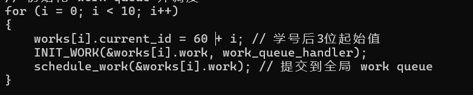
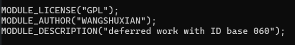

# 操作系统课设报告

计算机科学与技术学院 王舒贤 22009290060 

教师：李航

## 实验一 内核API

### 实验目的 

通过本实验的学习，掌握信创操作系统内核定制中所常用的内核数据结构和函数，具体包括：
i.内核链表；ii. 内核内存的分配释放； iii.内核线程；iv.内核锁；

### 实验内容

设计一个内核模块，并在此内核模块中创建一个内核链表以及两个内核线程。

• 线程1需要遍历进程链表并将各个进程的pid、进程名加入到内核链表中。  
• 线程2中需不断从内核链表中取出节点并打印该节点的元素。

在卸载模块时停止内核线程并释放资源。

### 实验代码及解析

```c
#include <linux/module.h>
#include <linux/kernel.h>
#include <linux/init.h>
#include <linux/list.h>
#include <linux/sched.h>
#include <linux/kthread.h>
#include <linux/rcupdate.h>
#include <linux/slab.h>
#include <linux/delay.h>
#include <linux/sched/signal.h>
#include <linux/string.h>

MODULE_LICENSE("GPL");
MODULE_AUTHOR("FuShengyuan");
MODULE_DESCRIPTION("A simple kernel module with a list and two threads.");

static LIST_HEAD(my_list);
static struct task_struct *thread1, *thread2;
spinlock_t lock;

// 定义链表节点结构
struct pid_node {
    int pid;
    char comm[16];
    struct list_head list;
};

// thread1 函数体：遍历所有进程并将信息加入链表
static int thread1_func(void *data) {
    struct task_struct *task;

    while (!kthread_should_stop()) {
        // 遍历进程列表并添加到链表中
        rcu_read_lock();
        for_each_process(task) {
            struct pid_node *node = kmalloc(sizeof(struct pid_node), GFP_KERNEL);
           if (!node) {
                rcu_read_unlock();
                return -ENOMEM;
            }
            node->pid = task->pid;
            strncpy(node->comm, task->comm, sizeof(node->comm) - 1);
            node->comm[sizeof(node->comm) - 1] = '\0';

            // 加锁后将节点添加到链表
            spin_lock(&lock);
            list_add_tail(&node->list, &my_list);
            spin_unlock(&lock);
        }
        rcu_read_unlock();

        msleep(5000);  // 每隔5秒更新一次链表
    }
    return 0;
}

// thread2 函数体：从链表中取出节点并打印信息
static int thread2_func(void *data) {
    struct pid_node *node, *tmp;

    while (!kthread_should_stop()) {
        spin_lock(&lock);
        list_for_each_entry_safe(node, tmp, &my_list, list) {
            printk(KERN_INFO "Process PID: %d, Name: %s\n", node->pid, node->comm);
            list_del(&node->list);
            kfree(node);
        }
        spin_unlock(&lock);

        msleep(2000);  // 每隔2秒打印链表信息
    }
    return 0;
}

// 模块初始化函数
int kernel_module_init(void) {
    printk(KERN_INFO "List and thread module init\n");

    spin_lock_init(&lock);  // 初始化自旋锁

    // 创建线程1
    thread1 = kthread_run(thread1_func, NULL, "thread1_func");
    if (IS_ERR(thread1)) {
        printk(KERN_ERR "Failed to create thread1\n");
        return PTR_ERR(thread1);
    }

    // 创建线程2
    thread2 = kthread_run(thread2_func, NULL, "thread2_func");
    if (IS_ERR(thread2)) {
        printk(KERN_ERR "Failed to create thread2\n");
        kthread_stop(thread1);
        return PTR_ERR(thread2);
    }

    return 0;
}

// 模块清理函数
void kernel_module_exit(void) {
    struct pid_node *node, *tmp;

    // 停止线程1
    if (thread1)
        kthread_stop(thread1);

    // 停止线程2
    if (thread2)
        kthread_stop(thread2);

    // 清理链表
    spin_lock(&lock);
    list_for_each_entry_safe(node, tmp, &my_list, list) {
       list_del(&node->list);
        kfree(node);
    }
    spin_unlock(&lock);

    printk(KERN_INFO "List and thread module exit\n");
}

module_init(kernel_module_init);
module_exit(kernel_module_exit);
```

### 收获

作为课设开始的实验，相对简单，更多是用来练习和熟练内核和虚拟机相关操作

## 实验二 deferred work 

###  实验内容  

设计并实现一个**内核模块**，该模块旨在通过**work queue**和**kernel thread**两种不同的机制 来完成延迟工作（deferred work），并对比分析这两种实现方式的异同点。  

具体实验步骤如下：  

1. 分别采用work queue和kernel thread两种方式调用10个函数（函数内部打印学号后3 位依次加1的方式区分。例如函数1中打印315，函数2中打印316，以此类推），观察并 记录work queue与 kernel thread在执行函数时的顺序差异。请注意，每个函数应当对 应一个独立的kernel thread，即10个函数需由10个不同的kernel thread分别执行。  
2. 探究work queue中的delayed_work功能，要求在模块加载成功的5秒后打印一条预设 的信息，以验证delayed_work的延迟执行效果。

### 实验任务拆解

1. **内核线程实现延迟工作**：
   - 创建 10 个内核线程，每个线程执行一个特定的函数并输出学号后 3 位。
   - 观察函数执行顺序。
2. **Workqueue 实现延迟工作**：
   - 使用 `workqueue` 调用同样的 10 个函数，输出顺序按 workqueue 的 FIFO 特性排列。
   - 对比两者执行顺序。
3. **`delayed_work` 功能验证**：
   - 在模块加载后 5 秒，通过 `delayed_work` 打印一条消息，验证延迟执行功能。

### 完整源码

```c
#include <linux/module.h>
#include <linux/kernel.h>
#include <linux/init.h>
#include <linux/sched.h>
#include <linux/kthread.h>
#include <linux/slab.h>
#include <linux/delay.h>
#include <linux/workqueue.h>
#include <linux/atomic.h>

MODULE_LICENSE("GPL");
MODULE_AUTHOR("WANGSHUXIAN");
MODULE_DESCRIPTION("deferred work with ID base 060");

/// @brief 存放work_struct与id信息
struct work_ctx
{
    struct work_struct work;
    int current_id;
};
struct delayed_work my_work;

struct work_ctx works[10];
struct task_struct *threads[10];

/// @brief kthread执行体
/// @param data 传入参数
/// @return
int kthread_handler(void *data)
{
    int id = *(int *)data; // 获取传入的 id 信息
    printk(KERN_INFO "Kernel thread: ID = %03d\n", id); // 打印正确 ID
    msleep(100); // 模拟延迟
    return 0;
}

/// @brief work queue执行体
/// @param work
void work_queue_handler(struct work_struct *work)
{
    struct work_ctx *ctx = container_of(work, struct work_ctx, work);
    printk(KERN_INFO "Work queue: ID = %03d\n", ctx->current_id); // 打印正确 ID
}

/// @brief delayed work执行体
/// @param work
void delayed_work_handler(struct work_struct *work)
{
    printk(KERN_INFO "Delayed work executed!\n");
}

/// @brief 内核模块初始化
/// @param
/// @return
int deferred_work_init(void)
{
    int i;
    printk(KERN_INFO "Deferred work module init\n");

// 初始化 work queue 并调度
for (i = 0; i < 10; i++)
{
    works[i].current_id = 60 + i; // 学号后3位起始值
    INIT_WORK(&works[i].work, work_queue_handler);
    schedule_work(&works[i].work); // 提交到全局 work queue
}

// 初始化 kernel threads
for (i = 0; i < 10; i++)
{
    threads[i] = kthread_create(kthread_handler, &works[i].current_id, "kthread_%d", i);
    if (!IS_ERR(threads[i]))
    {
        wake_up_process(threads[i]); // 启动线程
    }
    else
    {
        printk(KERN_ERR "Failed to create kernel thread %d\n", i);
    }
}

// 初始化 delayed work
INIT_DELAYED_WORK(&my_work, delayed_work_handler);
schedule_delayed_work(&my_work, msecs_to_jiffies(5000)); // 延迟 5 秒执行

return 0;

}

/// @brief 内核模块退出
/// @param
void deferred_work_exit(void)
{
    int i;

// 停止 kernel threads
for (i = 0; i < 10; i++)
{
    if (threads[i])
    {
        kthread_stop(threads[i]);
    }
}

// 确保 delayed work 已完成
cancel_delayed_work_sync(&my_work);

printk(KERN_INFO "Deferred work module exit\n");

}

module_init(deferred_work_init);
module_exit(deferred_work_exit);
```

### 核心模块设计与解释

#### 1. **Kernel Thread (`kthread_handler`)**

输入参数：通过 `data` 接收传入的 `current_id`。

功能：打印线程的 `ID`，模拟延迟，确保线程间有一定间隔。

```c
int id = *(int *)data; // 获取传入的 id 信息
printk(KERN_INFO "Kernel thread: ID = %d\n", id);
msleep(100); // 模拟延迟
```

#### 2. **Work Queue (`work_queue_handler`)**

功能：通过 `container_of` 获取 `work_ctx` 结构体，提取`current_id`。打印 `ID`

```c
struct work_ctx *ctx = container_of(work, struct work_ctx, work);
printk(KERN_INFO "Work queue: ID = %d\n", ctx->current_id);
```

####  **3. 模块初始化 (`deferred_work_init`)**

**Work Queue**：初始化 `works` 数组并提交到全局 work queue。

```c
INIT_WORK(&works[i].work, work_queue_handler);
schedule_work(&works[i].work);
```

**Kernel Threads**：

为每个 `work_ctx` 创建一个内核线程。

```c
threads[i] = kthread_create(kthread_handler, &works[i].current_id, "kthread_%d", i);
wake_up_process(threads[i]);
```

**Delayed Work**：

使用 `INIT_DELAYED_WORK` 初始化，并延迟 5 秒提交。

```c
INIT_DELAYED_WORK(&my_work, delayed_work_handler);
schedule_delayed_work(&my_work, msecs_to_jiffies(5000));
```

#### **4. 模块退出 (`deferred_work_exit`)**

停止内核线程：

```c
kthread_stop(threads[i]);
```

确保 `delayed_work` 完成：

```c
cancel_delayed_work_sync(&my_work);
```

### 实验过程与遇到的问题

代码修改完成，从逻辑上感觉没有问题，去跑了一遍试试

这里可以用`vim`或者`nano`模式插入源文件

我个人用不惯`vim`，为了方便选择`nano`

**文件里源代码如下**：







在代码所在目录运行`make`：



如果成功，会生成 `deferred_work.ko` 文件，这是内核模块文件

检查是否生成：

这里显示已经存在了

也可以`ls`看一下当前目录：



使用 `dmesg` 查看模块的运行日志：



我的学号结尾是060，刚开始以为是中间初始编号没写对



重试一遍，发现仍然相同结果从48开

这里以为没规定全体变量的原因



再次尝试结果依旧，猜想是由于 `works[i].current_id` 的赋值未正确映射到打印逻辑

### **原因分析**

1. **ID 初始化**

   在代码中，`works[i].current_id` 是按 `60 + i` 初始化的，但 `kthread_handler` 和 `work_queue_handler` 打印的值与硬件分配或其他内存初始值有关，可能未正确引用 `works` 的数据。

2. **硬件编号与 `works` 的分离**

   如果 `work_queue` 或 `kthread` 的调度参数未正确传递，则默认从内核任务编号开始（如 `48`）。

3. **指针引用问题**

   传递给 `kthread_handler` 和 `work_queue_handler` 的参数可能未正确关联到 `works[i].current_id`。

继续解决，尝试进行赋值修改，发现赋值与结果无关，打印的值仍然是48应该是调度参数没能正确传递，所以从默认任务标号48（虽然不知道为啥编号48）开始

后续重新启动虚拟机，重新写入代码完成上述流程，这次多了非常多系统日志，但是连基本学号显示也没有，不知问题所在，作罢

### 收获与反思

对于内核相关更加了解，熟练虚拟机和linux相关应用

虽然问题很遗憾没有彻底解决，甚至没能明白具体机制（过于复杂）

但是收获确实是有的，相关代码的编写，机制的了解

## 实验三 edu设备驱动

### 实验目的

掌握信创操作系统内核定制中所常见PCI设备驱动适配技术

### 实验内容

旨在让学生深入理解并实践edu设备驱动的开发，提供了edu设备驱动的框架代码，在此基础上完成关键代码的实现

### 代码补全

#### `edu_driver_probe` 函数补充

目标是为edu_dev_info分配内存，将BAR地址映射到内核空间，设置IRQ和驱动私有数据

```c
static int edu_driver_probe(struct pci_dev *dev, const struct pci_device_id *id)
{
    int ret = 0;
    printk("executing edu driver probe function!\n");

// 启用设备
ret = pci_enable_device(dev);
if (ret) {
    printk(KERN_ERR "IO Error.\n");
    return -EIO;
}

// 为 edu_dev_info 分配内存
edu_info = kmalloc(sizeof(struct edu_dev_info), GFP_KERNEL);
if (!edu_info) {
    printk(KERN_ERR "Failed to allocate memory for edu_dev_info\n");
    return -ENOMEM;
}

// 获取设备的 IRQ
edu_info->irq = dev->irq;

// 请求 PCI 设备的资源区域
ret = pci_request_regions(dev, "edu_driver");
if (ret) {
    printk("PCI request regions err!\n");
    goto out_mypci;
}

// 将 BAR 地址映射到内存
edu_info->ioaddr = pci_ioremap_bar(dev, 0);  // 这里使用 BAR 0
if (!edu_info->ioaddr) {
    printk(KERN_ERR "Failed to map PCI BAR\n");
    goto out_regions;
}

// 设置驱动的私有数据
pci_set_drvdata(dev, edu_info);  // 通过 pci_set_drvdata 将驱动私有数据与设备绑定
printk("Probe succeeded. PCIe ioport addr start at %llX, edu_info->ioaddr is 0x%p.\n", edu_info->io, edu_info->ioaddr);

return 0;

out_iounmap:
    iounmap(edu_info->ioaddr);
out_regions:
    pci_release_regions(dev);
out_mypci:
    kfree(edu_info);
    return ret;
}
```

#### `edu_driver_remove` 函数补充

释放设备资源并清理内存

```c
static void edu_driver_remove(struct pci_dev *dev)
{
    struct edu_dev_info *edu_info = pci_get_drvdata(dev);  // 获取驱动的私有数据

// 取消映射的 BAR 地址
iounmap(edu_info->ioaddr);

// 释放 PCI 资源
pci_release_regions(dev);

// 释放内存
kfree(edu_info);

// 禁用设备
pci_disable_device(dev);

printk("Device is removed successfully.\n");

}
```

#### `kthread_handler` 内核线程补充

计算阶乘并将结果存储在 `user_data` 结构中，确保原子性

```c
int kthread_handler(void *data)
{
    struct thread_data *thread_data_ptr = (struct thread_data *)data;
    uint64_t value = thread_data_ptr->input_data;
    struct user_data *user_data_ptr = thread_data_ptr->user_data_ptr;

printk("ioctl cmd 0: factorial for input: %d\n", value);

// 阶乘计算
uint64_t result = 1;
for (int i = 1; i <= value; i++) {
    result *= i;
}

// 加锁，确保原子性
spin_lock(&lock);
user_data_ptr->data = result;  // 保存计算结果
spin_unlock(&lock);

printk("Result: %llu\n", result);
return 0;

}
```

#### `edu_dev_open` 函数补充

为每个进程分配 `user_data` 结构体并绑定到 `filp->private_data`

```c
static int edu_dev_open(struct inode *inode, struct file *filp)
{
    struct user_data *user_data_ptr = kmalloc(sizeof(struct user_data), GFP_KERNEL);
    if (!user_data_ptr) {
        printk(KERN_ERR "Failed to allocate memory for user data\n");
        return -ENOMEM;
    }

user_data_ptr->id = current_id++;  // 为每个进程分配唯一的 ID

// 将 user_data 结构体绑定到 filp->private_data
filp->private_data = user_data_ptr;

printk("Device opened, user id: %d\n", user_data_ptr->id);
return 0;

}
```

#### `edu_dev_release` 函数补充

释放 `edu_dev_open` 中分配的内存。

```c
static int edu_dev_release(struct inode *inode, struct file *filp)
{
    struct user_data *user_data_ptr = filp->private_data;

// 释放用户数据内存
kfree(user_data_ptr);

printk("Device released\n");
return 0;

}
```

#### `edu_dev_unlocked_ioctl` 函数补充

实现 `ioctl` 调用来传递阶乘计算的输入参数，并启动内核线程计算结果

```c
long edu_dev_unlocked_ioctl(struct file *pfilp_t, unsigned int cmd, unsigned long arg)
{
    struct user_data *user_data_ptr = pfilp_t->private_data;

if (cmd == 0) {
    printk("ioctl cmd 0: Start factorial computation\n");

​    // 启动内核线程进行阶乘计算
​    struct thread_data *thread_data_ptr = kmalloc(sizeof(struct thread_data), GFP_KERNEL);
​    if (!thread_data_ptr) {
​        return -ENOMEM;
​    }

​    thread_data_ptr->user_data_ptr = user_data_ptr;
​    thread_data_ptr->input_data = arg;

​    struct task_struct *task = kthread_create(kthread_handler, thread_data_ptr, "edu_kthread");
​    if (IS_ERR(task)) {
​        printk(KERN_ERR "Failed to create kernel thread\n");
​        kfree(thread_data_ptr);
​        return PTR_ERR(task);
​    }

​    wake_up_process(task);  // 唤醒内核线程
}

return 0;

}
```

####  驱动程序初始化和注销

这部分已经完整定义了，看了下大概功能

```c
static int __init edu_dirver_init(void)
{
    printk("HELLO PCI\n");
    int ret = 0;

// 注册字符设备
ret = register_chrdev(EDU_DEV_MAJOR, EDU_DEV_NAME, &edu_dev_fops);
if (0 > ret) {
    printk("kernel edu dev register_chrdev failure\n");
    return -1;
}
printk("chrdev edu dev is insmod, major_dev is 200\n");

// 注册 edu PCI 设备
ret = pci_register_driver(&pci_driver);
if (ret) {
    printk("kernel edu dev pci_register_driver failure\n");
    return ret;
}

// 初始化自旋锁
spin_lock_init(&lock);
return 0;

}

static void __exit edu_dirver_exit(void)
{
    // 注销字符设备
    unregister_chrdev(EDU_DEV_MAJOR, EDU_DEV_NAME);

// 注销 edu PCI 设备
pci_unregister_driver(&pci_driver);

printk("GOODBYE PCI\n");

}
```

### 问题和纠错

user_space.cpp中，接口交互未能成功实现，理应实现阶乘等一系列功能

怀疑是`ioctl` 的第二个操作（读取计算结果）时没有获取返回值的正确方式

传入的参数 `0` 和 `1` 对应于驱动中的操作命令（如写入值、读取结果）。但在驱动端，可能需要正确处理这些命令。

## 课设收获

linux内核机制的了解更加深刻，相关代码的编写倒是比较简单

与同学讨论他甚至去看了一遍参考资料书去接受老师拷打

我只去完成了三个问题，相比之下深感自己不足

但是讨论过程中也是相对更加了解，也是学到东西了！