# 数据库上机作业

## 内容要求

为某大学设计一套学籍管理数据库系统

### 数据库语义

1.学校有若干**专业**，每个专业每年招若干个**班**，每个班有若干**学生**

2.每个专业有自己的**教学计划**，规定了该专业相关课程的性质（必修或选修）以及授课学期；例如，数据库课程对计算机专业为必修、在大三上学期，但对数学专业可能为选修、在大三下学期，而中文专业可能不学这门课

3.一位**教师**可以给多个班带课，但不能给一个班带多门课

4.一门课程最多允许学生一次补考；学生达到如下条件之一的被开除：不及格必修课累计达10学分、或不及格选修课累计达15学分

5.上述语义未涉及到的事项和细节，可自行做出合理假定

### 功能需求

 建库时应录入一定数量的（不能过少）学生、教师、课程、成绩等基本信息

1.录入一位学生，应包含学号、姓名、性别、出生年月、班级等信息

2.按学号、姓名、专业三种方式查询学生基本信息

3.录入一位学生一门课的成绩

4.查询一位学生所修的课程、性质（必修或选修）、学期、学分及成绩；查询他的必修课平均成绩、所有课程平均成绩（平均成绩应按学分加权）

5.查询一位学生被哪些教师教过课

6.查询快要被开除的学生（距被开除差3学分之内）

### 注意事项

1.在数据库的设计过程中需要运用规范化理论（第六章），避免出现插入/删除异常、数据冗余等问题

2.应设定关系的完整性规则，如实体完整性（例如主码），参照完整性（外码），用户定义的完整性（例如性别只能为“男”或“女”）

3.可以使用索引来加快查询的速度（不强求）

4.可以使用视图来简化系统的设计（不强求）

5.附部分数据示例，可以参考使用；但这些仅是一部分，仍需寻找或构造需要的数据

## 实体结构

为了实现上述功能，数据库需要包含以下主要实体：

**学生（Student）**：存储学生的基本信息。
学号StudentID，姓名Name，性别Gender，出生日期Date_Birth，所在班ClassID

**班级（Class）**：管理班级信息及其所属专业。
班号ClassID，所在专业MajorID，班级名称ClassName

**专业（Major）**：记录不同专业的基本信息。
专业编号MajorID，名称MaiorName

**教师（Teacher）**：存储教师的基本信息。
工号TeacherID，姓名Name，性别Gender

**课程（Course）**：管理课程信息及其属性（必修或选修）。
课程号CourseID，课程名称CourseName，课程学分Credits

**成绩（Grades）**：记录学生在各课程中的成绩。
成绩标号GradesID，学生学号StudentID，课程号CourseID，成绩Grades，补考成绩ResitGrades

**教学计划（Plan）**：管理各专业的相关课程信息
计划号PlanID，专业号MajorID，课程名ClassID，课程性质ClassType，年级Grade

**课程-教师关系（Course_Teacher）**：表示教师可教授哪些课程。
课程号CourseID，老师工号TeacherID

**班级-课程-教师关系（Class_Course_Teacher）**：确保一位教师只能为一个班级教授一门课程。
班级号ClassID，课程号CourseID，老师工号TeacherID

此外，需满足以下约束：

**教师授课限制**：一位教师可以给多个班级带课，但不能给同一个班级带多门课。

**开除标准**：不及格必修课累计达到10学分，或不及格选修课累计达到15学分。

## E-R图设计

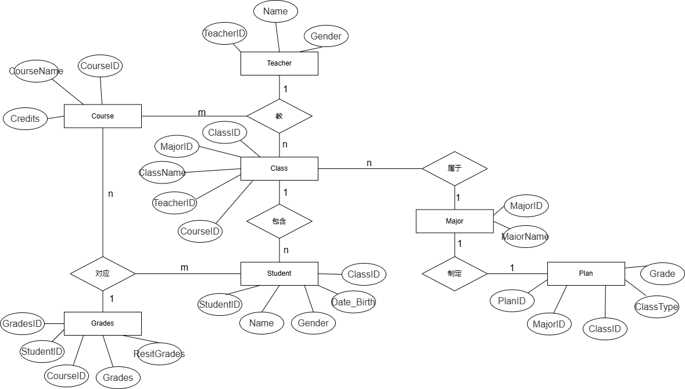

## 逻辑结构设计

1. **Teacher（TeacherID，Name，Gender）**
   - 教师表，包含教师 ID、姓名和性别。
2. **Class（ClassID，ClassName，TeacherID，MajorID）**
   - 班级表，包含班级 ID、班级名称、教师 ID 和专业 ID。
3. **Major（MajorID，MajorName）**
   - 专业表，包含专业 ID 和专业名称。
4. **Course（CourseID，CourseName，Credits，ClassID，MajorID）**
   - 课程表，包含课程 ID、课程名称、学分、班级 ID 和专业 ID。
5. **Student（StudentID，Name，Gender，Date_Birth，ClassID，MajorID）**
   - 学生表，包含学生 ID、姓名、性别、出生日期、班级 ID 和专业 ID。
6. **Grades（GradesID，StudentID，CourseID，Grades）**
   - 成绩表，包含成绩 ID、学生 ID、课程 ID 和成绩。
7. **Plan（PlanID，ClassID，MajorID，Grade，ClassType）**
   - 教学计划表，包含计划 ID、班级 ID、专业 ID、年级和班级类型。
8. **关系**
   - **Teacher**与**Class**是一对多关系（一个教师可以教多个班级）。
   - **Class**与**Major**是多对一关系（多个班级属于一个专业）。
   - **Class**与**Course**是一对多关系（一个班级可以有多门课程）。
   - **Student**与**Class**是多对一关系（多个学生属于一个班级）。
   - **Student**与**Major**是多对一关系（多个学生属于一个专业）。
   - **Student**与**Grades**是一对多关系（一个学生可以有多门课程的成绩）。
   - **Plan**与**Class**是一对多关系（一个教学计划可以对应多个班级）。
   - **Plan**与**Major**是一对多关系（一个教学计划可以对应多个专业）。

## 功能实现（选用哪种DBMS，如何用SQL语句实现各功能，对于查询功能贴出查询结果）

使用MySQL

### 创建数据库

```sql
CREATE DATABASE UniversityManagement;
USE UniversityManagement;
```

### 创建表

#### 教师表 (Teacher)

```sql
CREATE TABLE Teacher (
    TeacherID INT PRIMARY KEY,
    Name VARCHAR(50) NOT NULL,
    Gender ENUM('男', '女') NOT NULL
);
```

#### 专业表 (Major)

```sql
CREATE TABLE Major (
    MajorID INT PRIMARY KEY,
    MajorName VARCHAR(50) NOT NULL
);
```

#### 班级表 (Class)

```sql
CREATE TABLE Class (
    ClassID INT PRIMARY KEY,
    ClassName VARCHAR(50) NOT NULL,
    MajorID INT,
    FOREIGN KEY (MajorID) REFERENCES Major(MajorID)
);
```

#### 课程表 (Course)

```sql
CREATE TABLE Course (
    CourseID INT PRIMARY KEY,
    CourseName VARCHAR(100) NOT NULL,
    Credits INT NOT NULL,
    ClassID INT,
    MajorID INT,
    FOREIGN KEY (ClassID) REFERENCES Class(ClassID),
    FOREIGN KEY (MajorID) REFERENCES Major(MajorID)
);
```

#### 学生表 (Student)

```sql
CREATE TABLE Student (
    StudentID INT PRIMARY KEY,
    Name VARCHAR(50) NOT NULL,
    Gender ENUM('男', '女') NOT NULL,
    Date_Birth DATE NOT NULL,
    ClassID INT,
    MajorID INT,
    FOREIGN KEY (ClassID) REFERENCES Class(ClassID),
    FOREIGN KEY (MajorID) REFERENCES Major(MajorID)
);
```

#### 成绩表 (Grades)

```sql
CREATE TABLE Grades (
    GradesID INT PRIMARY KEY AUTO_INCREMENT,
    StudentID INT,
    CourseID INT,
    Grades DECIMAL(4,2),
    ResitGrades DECIMAL(4,2),
    FOREIGN KEY (StudentID) REFERENCES Student(StudentID),
    FOREIGN KEY (CourseID) REFERENCES Course(CourseID)
);
```

#### 教学计划表 (Plan)

```sql
CREATE TABLE Plan (
    PlanID INT PRIMARY KEY,
    ClassID INT,
    MajorID INT,
    Grade INT,
    ClassType ENUM('必修', '选修'),
    FOREIGN KEY (ClassID) REFERENCES Class(ClassID),
    FOREIGN KEY (MajorID) REFERENCES Major(MajorID)
);
```

#### 课程-教师关系表 (Course_Teacher)

```sql
CREATE TABLE Course_Teacher (
    CourseID INT,
    TeacherID INT,
    PRIMARY KEY (CourseID, TeacherID),
    FOREIGN KEY (CourseID) REFERENCES Course(CourseID),
    FOREIGN KEY (TeacherID) REFERENCES Teacher(TeacherID)
);
```

#### 班级-课程-教师关系表 (Class_Course_Teacher)

```sql
CREATE TABLE Class_Course_Teacher (
    ClassID INT,
    CourseID INT,
    TeacherID INT,
    PRIMARY KEY (ClassID, CourseID),
    FOREIGN KEY (ClassID) REFERENCES Class(ClassID),
    FOREIGN KEY (CourseID) REFERENCES Course(CourseID),
    FOREIGN KEY (TeacherID) REFERENCES Teacher(TeacherID)
);
```

### 插入示例数据

这里发现有给的示例数据，但是和自己设置的不太一样，还是自己捏了

```sql
INSERT INTO Teacher (TeacherID, Name, Gender) VALUES
(1, '张老师', '男'),
(2, '李老师', '女');

INSERT INTO Major (MajorID, MajorName) VALUES
(1, '计算机科学'),
(2, '数学');

INSERT INTO Class (ClassID, ClassName, MajorID) VALUES
(1, '计算机1班', 1),
(2, '数学1班', 2);

INSERT INTO Course (CourseID, CourseName, Credits, ClassID, MajorID) VALUES
(1, '数据库', 3, 1, 1),
(2, '高等数学', 4, 2, 2);

INSERT INTO Student (StudentID, Name, Gender, Date_Birth, ClassID, MajorID) VALUES
(1, '张三', '男', '2000-01-01', 1, 1),
(2, '李四', '女', '2000-02-02', 2, 2);

INSERT INTO Grades (StudentID, CourseID, Grades, ResitGrades) VALUES
(1, 1, 85.5, NULL),
(2, 2, 90.0, NULL);

INSERT INTO Plan (PlanID, ClassID, MajorID, Grade, ClassType) VALUES
(1, 1, 1, 3, '必修'),
(2, 2, 2, 3, '选修');

INSERT INTO Course_Teacher (CourseID, TeacherID) VALUES
(1, 1),
(2, 2);

INSERT INTO Class_Course_Teacher (ClassID, CourseID, TeacherID) VALUES
(1, 1, 1),
(2, 2, 2);
```

### 查询示例

#### 按学号查询学生基本信息

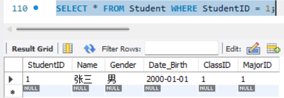	

#### 按姓名查询学生基本信息

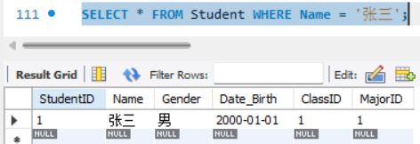	

#### 按专业查询学生基本信息

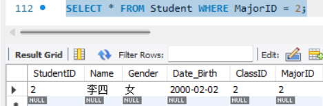	

#### 录入一位学生一门课的成绩

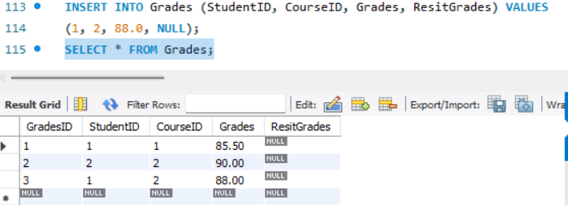

#### 查询一位学生所修的课程、性质、学期、学分及成绩

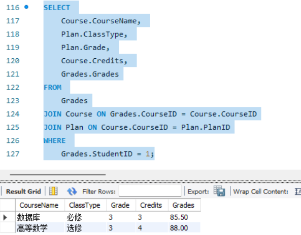

#### 查询一位学生的必修课平均成绩、所有课程平均成绩

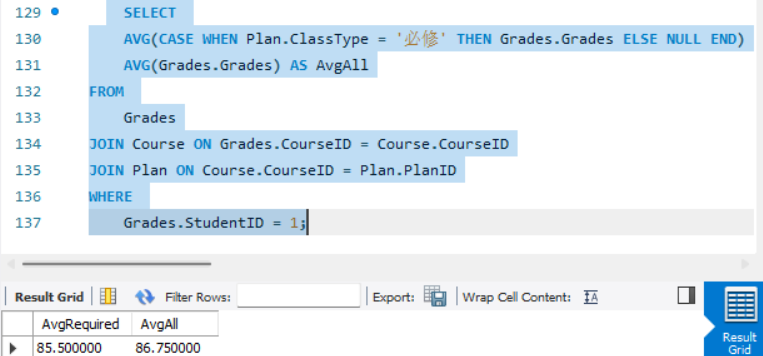

#### 查询一位学生被哪些教师教过课

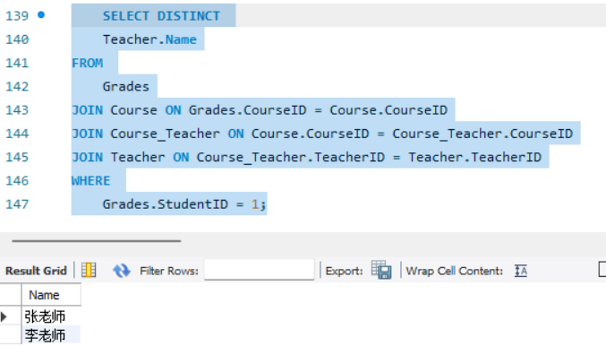

#### 查询快要被开除的学生（距被开除差3学分之内）

```sql
SELECT 
    Student.StudentID, 
    Student.Name, 
    SUM(CASE WHEN Grades.Grades < 60 AND Plan.ClassType = '必修' THEN Course.Credits ELSE 0 END) AS FailedRequiredCredits,
    SUM(CASE WHEN Grades.Grades < 60 AND Plan.ClassType = '选修' THEN Course.Credits ELSE 0 END) AS FailedElectiveCredits
FROM 
    Grades
JOIN Student ON Grades.StudentID = Student.StudentID
JOIN Course ON Grades.CourseID = Course.CourseID
JOIN Plan ON Course.CourseID = Plan.PlanID
GROUP BY 
    Student.StudentID
HAVING 
    FailedRequiredCredits >= 7 OR FailedElectiveCredits >= 12;
```

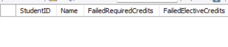	

### 索引和视图

#### 创建索引

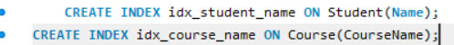	

#### 创建视图

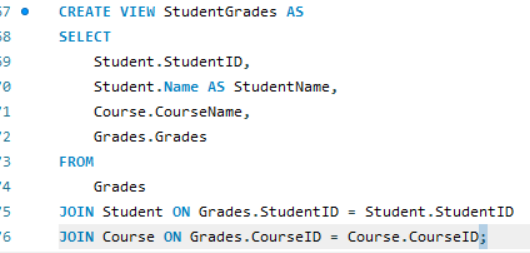	

### 完整性约束

**实体完整性**  每个表的主键已经定义，确保实体完整性。

**参照完整性**  外键约束已经定义，确保参照完整性。

**用户定义的完整性**  

例如，性别字段使用`ENUM`类型，确保只能为“男”或“女”。

```sql
ALTER TABLE Student ADD CONSTRAINT chk_gender CHECK (Gender IN ('男', '女'));
```

## 遇到的主要问题及解决方法

创建表时是否使用`UNIQUE`进行唯一性约束

尝试去做java页面结合，基于vue框架，然后还没搞懂，学习ing

没有使用触发器进行多表联动

数据一致性保障

当学生的基本信息（如姓名、性别等）在学生表（`students`）中发生更改时，相关联的其他表（如成绩表`grades`、选课表`course_selections`）中的学生信息也应同步更新

```sql
-- 创建更新触发器 
CREATE TRIGGER update_student_info 
AFTER UPDATE ON students 
FOR EACH ROW BEGIN    
UPDATE grades    
SET student_name = NEW.student_name, student_gender = NEW.student_gender   WHERE student_id = NEW.student_id;     
UPDATE course_selections    
SET student_name = NEW.student_name, student_gender = NEW.student_gender   WHERE student_id = NEW.student_id; 
END;
```

数据完整性保障

当删除一个学生记录时，确保与之相关的成绩记录和选课记录也被删除

```sql
-- 创建删除触发器 
CREATE TRIGGER delete_student_info 
BEFORE DELETE ON students 
FOR EACH ROW BEGIN    
DELETE FROM grades    
WHERE student_id = OLD.student_id;     
DELETE FROM course_selections    
WHERE student_id = OLD.student_id; 
END;
```

超大数据如何一次性导入？python导入或者利用相关工具

## 总结

刚开始在捣鼓SQL SEVER，发现大家还是都用主流的MySQL屁颠屁颠的下了

自己只能实现简单编写，想不到怎么设计的精妙和更多功能

想做一个前端展示的页面然后发现自己不会的地方还有很多，还得学

主键的理解感觉有些生疏，开始设计逻辑关系和E-R图时犹豫了好久

本来可以做的更好，但是拖着不改，想着放在假期，其实平时也有很多时间，这点需要改正

关于补考，可以设置检查，60分以下需要补考，补考成绩60分以下学分挂掉，这方面的联动可以写一些