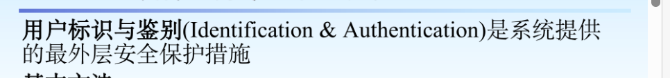

# SQL学习

## 数据定义

### 数据定义语句

<table> 
    <tbody align="center">
    <tr><td rowspan="2">操作对象</td><td colspan="3">操作方式</td></tr>    
    <tr><td>创建</td><td >删除</td><td>修改</td></tr>    
	<tr><td>模式</td><td>CREATE SCHEMA</td><td>DROP SCHEMA</td><td></td></tr>
    <tr><td>表</td><td>CREATE TABLE</td><td>DROP TABLE</td><td>ALTER TABLE</td></tr>
    <tr><td>视图</td><td>CREATE VIEW</td><td>DROP VIEW</td><td></td></tr>
    <tr><td>索引</td><td>CREATE INDEX</td><td>DROP INDEX</td><td></td></tr>
</table>


### 数据类型

数据类型（data_type）规定了列可容纳何种数据类型。下面的表格包含了SQL中最常用的数据类型：

|                       数据类型                       |                             描述                             |
| :--------------------------------------------------: | :----------------------------------------------------------: |
| integer(size),int(size),smallint(size),tinyint(size) |            仅容纳整数、在括号内规定数字的最大位数            |
|           decimal(size,d),numeric(size,d)            | 容纳带有小数的数字、“size” 规定数字的最大位数、“d” 规定小数点右侧的最大位数 |
|                      char(size)                      | 容纳固定长度的字符串（可容纳字母、数字以及特殊字符）、在括号中规定字符串的长度 |
|                    varchar(size)                     | 容纳可变长度的字符串（可容纳字母、数字以及特殊的字符）、在括号中规定字符串的最大长度 |
|                   date(yyyy-mm-dd)                   |                           容纳日期                           |
|                    time(hh:mm:ss)                    |                          一天的时间                          |

### 模式

**创建模式**

```sql
CREATE SCHEMA <模式名> AUTHORIZATION <用户名>
```

- 没有指定模式名默认为用户名

**删除模式**

```sql
DROP SCHEMA <模式名> CASCADE|RESTRICT:
```

- CASCADE （级联）：删除模式的同时把该模式中所有的数据库对象全部删除
- RESTRICT （限制）：如果该模式中定义了下属的数据库对象，则拒绝该删除语句的执行；当该模式中没有任何下属对象是才能执行

### 基本表

#### CREATE TABLE – 创建表

**语法：**

```sql
CREATE TABLE 表名称
(
列名称1 数据类型,[列级完整性约束条件]
列名称2 数据类型,
列名称3 数据类型
....
[表级完整性约束条件]
);
```

#### 常用完整性约束

##### **1、主码约束 (Primary Key)**

主码约束用于确保每条记录在表中是唯一的，即主码的值不能重复且不能为NULL。每个表只能有一个主码。

```sql
CREATE TABLE Student (
    StudentID INT PRIMARY KEY,
    Name VARCHAR(50),
    Age INT
);
```

**组合主键**：如果主码由多个列组成，可以定义组合主码

```sql
CREATE TABLE Enrollment (
    StudentID INT,
    CourseID INT,
    EnrollmentDate DATE,
    PRIMARY KEY (StudentID, CourseID)
);
```

##### **2、外码约束（Foreign Key）**

外码约束用于建立表与表之间的关系，保证外码列中的值在引用的表中是存在的。外码通常用于维护数据的参照完整性。

```sql
CREATE TABLE Enrollment (
    StudentID INT,
    CourseID INT,
    EnrollmentDate DATE,
    PRIMARY KEY (StudentID, CourseID),
    FOREIGN KEY (StudentID) REFERENCES Student(StudentID)
);
```

**特性**：外码的值必须在被引用表的主码或唯一码中存在，或可以为NULL。

**级联操作**： 外码可以设置**ON DELETE**和**ON UPDATE**级联操作，如`CASCADE`、`SET NULL`等。

如果表已经创建，可以通过`ALTER TABLE`来添加外码约束

##### **3、唯一约束（Unique）**

唯一约束保证列中的值唯一，但允许值为NULL（NULL不视为重复值）。一个表中可以有多个唯一约束。

##### **4、非空约束（NOT NULL）**

非空约束用于确保列中的数据不能为空。非空约束经常与其他约束一起使用（如主码约束），以确保列中数据的完整性。

##### **5、检查约束（Check）**

检查约束用于限制列中的值，确保数据符合某些条件。通过检查约束，可以定义列的取值范围或模式。

```sql
CREATE TABLE Employee (
    EmployeeID INT PRIMARY KEY,
    Age INT CHECK (Age >= 18),               -- 年龄必须大于等于18
    Salary DECIMAL(10, 2) CHECK (Salary > 0) -- 工资必须大于0
);
```

**特性**：检查约束在数据插入或更新时生效，如果条件不满足则插入或更新操作会失败。

**复杂条件：**

```
CREATE TABLE Student (
    StudentID INT PRIMARY KEY,
    Age INT,
    Grade CHAR(1),
    CHECK (Grade IN ('A', 'B', 'C', 'D', 'F'))  -- 限制Grade列的值在A-F之间
);
```

##### **6、默认约束（Default）**

默认约束允许在列中没有提供数据时自动填入默认值。这有助于避免NULL值并确保列中有合理的默认数据。

```sql
CREATE TABLE Orders (
    OrderID INT PRIMARY KEY,
    OrderDate DATE DEFAULT CURRENT_DATE,      -- 默认订单日期为当前日期
    Status VARCHAR(10) DEFAULT 'Pending'      -- 默认状态为Pending
);
```

#### 删除基本表

```sql
DROP TABLE <表名> [RESTRICT|CASCADE] 
```

- RESTRICT(限制)：删除表有限制（不能被其他表的约束引用，不能存在依赖该表对象）
- CASCADE(级联)：删除表没有限制

#### 修改基本表

```sql
ALTER TABLE <表名>

​		[ADD<新列名><数据类型>[完整性约束]]

​		[DROP<列名>|<完整性约束>]

​		[ALTER COLUMN<列名><数据类型>]
```

### 索引


### 插入

`INSERT INTO` 语句用于向表格中插入新的行

```sql
INSERT INTO 表名称 VALUES (值1, 值2,....);
```

也可以指定要插入数据的列：

```sql
INSERT INTO table_name (列1, 列2,...) VALUES (值1, 值2,....);
```


### 查询

#### 单表查询

##### **语法：**

```sql
SELECT * FROM 表名称;
```

我们也可以指定所要查询数据的列：

```sql
SELECT 列名称 FROM 表名称;
```

##### DISTINCT – 去除重复值

如果一张表中有多行重复数据，如何去重显示呢？可以了解下 `DISTINCT`

```sql
SELECT DISTINCT 列名称 FROM 表名称;
```

##### ORDER BY – 排序

ORDER BY 语句用于根据指定的列对结果集进行排序，默认按照升序对记录进行排序，如果您希望按照降序对记录进行排序，可以使用 DESC 关键字。

```SQL
SELECT * FROM 表名称 ORDER BY 列1,列2 DESC;
```

默认排序为 ASC 升序，DESC 代表降序

##### WHERE – 条件过滤

如果需要从表中选取指定的数据，可将 WHERE 子句添加到 SELECT 语句。

```sql
SELECT 列名称 FROM 表名称 WHERE 列 运算符 值;
```

子句常用的查询条件：

| 查询条件 |                    谓词                    |
| :------: | :----------------------------------------: |
|   比较   |          =,<,>,<=,>=,<>,!=,!>,!<           |
| 确定范围 | BETWEEN...AND...<br />NOT BETWEEN...AND... |
| 确定集合 |                 IN,NOT IN                  |
| 字符匹配 |               LIKE,NOT LIKE                |
|   空值   |            IS NULL,IS NOT NULL             |
| 复合条件 |                 AND,OR,NOT                 |

集函数不能直接和where重用

##### UPDATE – 更新数据

Update 语句用于修改表中的数据。

```SQL
UPDATE 表名称 SET 列名称 = 新值 WHERE 列名称 = 某值;
```

##### DELETE – 删除数据

DELETE 语句用于删除表中的行。

```SQL
DELETE FROM 表名称 WHERE 列名称 = 值;
```

##### TRUNCATE TABLE – 清除表数据

如果我们仅仅需要除去表内的数据，但并不删除表本身，那么我们该如何做呢？

可以使用 TRUNCATE TABLE 命令（仅仅删除表格中的数据）：

```SQL
TRUNCATE TABLE 表名称;
```

##### LIKE – 查找类似值(字符串匹配)

LIKE 操作符用于在 WHERE 子句中搜索列中的指定模式

```sql
SELECT 列名/(*) FROM 表名称 WHERE 列名称 LIKE 值;
```

%（百分号）：代表任意长度（可以为零）的字符串

_（下划线）：  代表任意单个字符

用户查询字符串本身带%或_时，在模板1中要转义的字符前加上换码字符（如“\”）

#####  IN – 锁定多个值

IN 操作符允许我们在 WHERE 子句中规定多个值

```sql
SELECT 列名/(*) FROM 表名称 WHERE 列名称 IN (值1,值2,值3);
```

##### BETWEEN – 选取区间数据

操作符 BETWEEN … AND 会选取介于两个值之间的数据范围。这些值可以是数值、文本或者日期。

```sql
SELECT 列名/(*) FROM 表名称 WHERE 列名称 BETWEEN 值1 AND 值2;
```

##### AS – 别名

通过使用 SQL，可以为列名称和表名称指定别名（Alias），别名使查询程序更易阅读和书写。

表别名：

```sql
SELECT 列名称/(*) FROM 表名称 AS 别名;
```

列别名：

```sql
SELECT 列名称 as 别名 FROM 表名称;
```

实际应用时，这个 `AS` 可以省略，但是列别名需要加上 `" "`

#### 连接查询--将两个（以上）表连接进行查询

```sql
select * from persons p,orders o where p.id_p=o.id_p;
```

执行过程：表1中找到第一个元组，凑头扫描表2逐一查找满足的元组拼接，表2查找完以后，再找表1中第二个元组重复上述过程

**自身连接**

类如间接查询，先修课，需要给表起别名以示区别，所有属性名都是同名属性，必须使用别名前缀

##### JOIN – 多表关联

`JOIN` 用于根据两个或多个表中的列之间的关系，从这些表中查询数据。

有时为了得到完整的结果，我们需要从两个或更多的表中获取结果。我们就需要执行 `join`。

数据库中的表可通过码将彼此联系起来。主码（Primary Key）是一个列，在这个列中的每一行的值都是唯一的。在表中，每个主码的值都是唯一的。这样做的目的是在不重复每个表中的所有数据的情况下，把表间的数据交叉捆绑在一起。

```sql
select 列名
from 表A
INNER|LEFT|RIGHT|FULL JOIN 表B
ON 表A主码列 = 表B外码列;
```

下面列出一些JOIN 类型，以及它们之间的差异。

中间加OUTER为外连接

- JOIN: 如果表中有至少一个匹配，则返回行
- INNER JOIN: 内部连接，返回两表中匹配的行
- LEFT JOIN: 即使右表中没有匹配，也从左表返回所有的行
- RIGHT JOIN: 即使左表中没有匹配，也从右表返回所有的行
- FULL JOIN: 只要其中一个表中存在匹配，就返回行

`USING（列名）`简化连接条件，包含相同列名

#### 集合查询

##### UNION – 合并结果集

`UNION` 操作符用于合并两个或多个 SELECT 语句的结果集。

```sql
SELECT 列名 FROM 表A
UNION
SELECT 列名 FROM 表B;
```

UNION 操作符默认为选取不同的值。如果查询结果需要显示重复的值，请使用 `UNION ALL`。

```sql
SELECT 列名 FROM 表A
UNION ALL
SELECT 列名 FROM 表B;
```

**注意：** UNION 内部的 SELECT 语句必须拥有相同数量的列。列也必须拥有相似的数据类型。同时，每条 SELECT 语句中的列的顺序必须相同。

##### INTERSECT-交操作

##### EXCEPT-差操作

#### 嵌套查询

子查询一般情况下，不能使用ORDER BY子句

子查询一定要在比较符之后

不相关子查询：子查询条件不依赖于父查询

相关子查询：子查询条件与父查询当前值有关

带有谓词相关的子查询

##### ANY(SOME)：某个值

##### ALL：所有值

##### EXISTS：

带有exists的子查询不返回任何数据，只返回逻辑真值true或假值false,检查每次查询值

一定是相关子查询，内部与外部查询有联系

- 内层查询结果非空，返回真值
- 内层查询结果为空，返回假值

### 视图-VIEW

在 SQL 中，视图是基于 SQL 语句的结果集的可视化的表。

视图包含行和列，就像一个真实的表。视图中的字段就是来自一个或多个数据库中的真实的表中的字段。我们可以向视图添加 SQL 函数、WHERE 以及 JOIN 语句，我们也可以提交数据，就像这些来自于某个单一的表。

```sql
CREATE VIEW 视图名[列名] AS
SELECT 列名
FROM 表名
WHERE 查询条件;
```

视图总是显示最近的数据。每当用户查询视图时，数据库引擎通过使用 SQL 语句来重建数据。

如果需要更新视图中的列或者其他信息，无需删除，使用 `CREATE OR REPLACE VIEW` 选项：

```sql
CREATE OR REPLACE VIEW 视图名 AS
SELECT 列名
FROM 表名
WHERE 查询条件;
```

删除视图就比较简单，跟表差不多，使用 `DROP` 即可：

```sql
drop view 视图名;
```

`WITH CHECK OPTION`放在句尾 是 SQL 中用于视图（`VIEW`）的一种约束，用来确保通过视图插入或更新的数据符合视图的定义条件。

当视图定义了 `WITH CHECK OPTION` 后，任何试图通过该视图进行的 `INSERT` 或 `UPDATE` 操作，都会先检查数据是否符合视图的筛选条件。只有符合条件的数据才能被插入或更新。如果数据不符合视图定义条件，则 SQL 将拒绝该操作，防止用户（有意或无意）通过视图对不属于视图范围内的基本表数据进行更新

### 触发器

图

联动多表，修改触发

## 常用函数

函数使用语法

```sql
SELECT function(列) FROM 表;
```

### AVG – 平均值

AVG 函数返回数值列的平均值。NULL 值不包括在计算中。

```sql
SELECT AVG(列名) FROM 表名;
```

###  COUNT – 汇总行数

COUNT() 函数返回匹配指定条件的行数。

`count()` 中可以有不同的语法：

- COUNT(*) ：返回表中的记录数。
- COUNT(DISTINCT 列名) ：返回指定列的不同值的数目。
- COUNT(列名) ：返回指定列的值的数目（NULL 不计入）

```sql
SELECT COUNT(*) FROM 表名;
SELECT COUNT(DISTINCT 列名) FROM 表名;
SELECT COUNT(列名) FROM 表名;
```

### MAX – 最大值    MIN – 最小值

`MAX` 函数返回一列中的最大值/最小值。NULL 值不包括在计算中。

```sql
SELECT MAX/MIN(列名) FROM 表名;
```

MIN 和 MAX 也可用于文本列，以获得按字母顺序排列的最高或最低值。

### SUM – 求和

`SUM` 函数返回数值列的总数（总额）。

```sql
SELECT SUM(列名) FROM 表名;
```

### GROUP BY – 分组

GROUP BY 语句用于结合合计函数，根据一个或多个列对结果集进行分组

```sql
SELECT 列名A, 统计函数(列名B)
FROM 表名
WHERE 查询条件
GROUP BY 列名A;
```

使用GROUP BY子句后，SELECT子句的列名列表中只能出现分组属性和集函数

### HAVING – 句尾连接

在 SQL 中增加 HAVING 子句原因是，WHERE 关键字无法与合计函数一起使用

```sql
SELECT 列名A, 统计函数(列名B)
FROM table_name
WHERE 查询条件
GROUP BY 列名A
HAVING 统计函数(列名B) 查询条件;
```

### UCASE/UPPER – 大写

`UCASE/UPPER` 函数把字段的值转换为大写。

```sql
select upper(列名) from 表名;
```

### LCASE/LOWER – 小写

`LCASE/LOWER` 函数把字段的值转换为小写。

```sql
select lower(列名) from 表名;
```

###  LEN/LENGTH – 获取长度

`LEN/LENGTH` 函数返回文本字段中值的长度

```sql
select length(列名) from 表名;
```

### ROUND – 数值取舍

`ROUND` 函数用于把数值字段舍入为指定的小数位数，四舍五入

```sql
select round(列名,精度) from 表名;
```

### NOW/SYSDATE – 当前时间

`NOW/SYSDATE` 函数返回当前的日期和时间。

```sql
select sysdate from 表名;
```

 如果使用 Sql Server 数据库，请使用 `getdate()` 函数来获得当前的日期时间

### 窗口函数`ROW_NUMBER()`

用于在查询结果中为每一行分配一个唯一的行号。这个行号基于指定的分组和排序条件，是从 1 开始递增的。它非常适合在需要按某种顺序排名的场景中使用，例如按成绩排名或按时间排序。

```
语法
ROW_NUMBER() OVER (PARTITION BY column_name ORDER BY column_name [ASC|DESC])
```

- **PARTITION BY**：按指定列进行分组，每组数据的 `ROW_NUMBER` 从 1 开始重新计算。如果不指定 `PARTITION BY`，则 `ROW_NUMBER` 在整个结果集中进行编号。
- **ORDER BY**：指定排序列和排序方式（升序 `ASC` 或降序 `DESC`），定义行号的分配顺序。

**示例**

假设有一个成绩表 `SC`，包含学生的学号 `Sno`、课程号 `Cno`、和 `成绩 Grade`。我们希望找到每门课程按成绩从高到低排名的记录：

```
SELECT Sno, Cno, Grade,
       ROW_NUMBER() OVER (PARTITION BY Cno ORDER BY Grade DESC) AS rank
FROM SC;
```

在这个例子中：

- `PARTITION BY Cno`：按课程号 `Cno` 进行分组。
- `ORDER BY Grade DESC`：每组内按成绩 `Grade` 从高到低排序。
- `ROW_NUMBER()` 生成的 `rank` 列为每门课程中成绩从高到低的排名。

这样将会生成一个按课程号顺序成绩排名的表，可以用其`rank=1`作为条件来找各科排名第一的同学

### `LIMIT`和`OFFSET`

SQL 中用于控制查询结果中返回记录数量和开始位置的关键字，通常在分页、获取特定排名的记录时使用。

- **`LIMIT n`**：指定返回的最大行数，`n` 是要返回的行数。比如，`LIMIT 1` 表示只返回 1 行。
- **`OFFSET m`**：指定跳过的行数，`m` 是要跳过的行数。比如，`OFFSET 1` 表示跳过第 1 行，从第 2 行开始返回结果。

## 使用中一些小知识

### GO语句

SQL 中，`GO` 不是 SQL 语言的一部分，而是一个批处理命令，通常用于 SQL Server 和一些其他的 SQL 客户端工具（如 SQL Server Management Studio 或 SQLCMD）。它用于分隔批处理命令，并且通常在脚本中用来指示 SQL Server 执行一个命令块。

**GO 的作用：**

- **分隔批处理**：当你在一个 SQL 脚本中有多个 SQL 语句时，`GO` 可以作为语句的分隔符，把一个长的 SQL 脚本分割成多个批次执行。
- **提交批处理**：每个 `GO` 后的 SQL 语句会作为一个独立的批次提交到 SQL Server。

**注意：**

- `GO` 不是 SQL 标准的一部分，因此它不适用于所有数据库系统。例如，MySQL、PostgreSQL 等数据库不支持 `GO`，而是直接通过分号 `;` 来分隔 SQL 语句。
- 在 SQL Server 中，`GO` 是由客户端工具（如 SQL Server Management Studio）解析和执行的，而不是数据库引擎本身。


## 关系数据库理论

#### **三级结构模式**

- 模式（数据库整体结构）
- 外模式（模式子集，面向具体应用）
- 内模式（对数据的存储模式）

#### **一个完整的关系模型内涵的定义**

- R（U，D，dom（），F）
- 关系名（属性集，关系的域，属性到域上的映射关系，数据依赖）

内涵是静态的，称为关系模式

关系模式中属性间的某些依赖关系
会发生插入异常，删除异常，更新异常，数据冗余
可以通过模式分解来消除其中不合适的依赖

### 规范化

规范化是指定义关系模式应该符合的条件，确保关系1模式不出现某些操作异常，并减少数据冗余

## 复习

### 第四章 数据库安全性




### 第五章 数据库完整性


### 第六章 关系数据库理论


#### 不存在部分依赖


#### 逻辑蕴含


F含有依赖关系A→B，B→C, 则可推出A→C，所以F逻辑蕴含A→C

**被F逻辑蕴涵**的**所有**函数依赖集合称为**F的闭包**(Closure)，记作 F+


#### 极小函数依赖集


**步骤一：分解多属性右部项**

**去掉多余的函数依赖** 假如去掉每一个看能不能推出来

因为此时F中有BCD→E，存在左部冗余所以进行步骤三

**步骤三：去掉各依赖左部多余的属性**

假设去掉BCD中的B：因为此时推不出其他属性所以CD+ ={C，D}，不包含B，所以不可去掉。

假设去掉BCD中的C：因为此时推不出其他属性所以BD+ ={B，D}，不包含C，所以不可去掉。

假设去掉BCD中的D：因为B→D，所以此时BC+={B，C，D}，包含D，所以可以去掉。


L类属性：关系模式中的属性，只出现在函数依赖集**左边**的属性

R类属性：关系模式中的属性，只出现在函数依赖集**右边**的属性

N类属性：关系模式中的属性，**没有**出现在函数依赖集里的属性

LR类属性：关系模式中的属性，出现在函数依赖集**左、右两边**的属性


### 无损连接性


### 事务


#### 封锁


