# 模拟电子线路实验

## 实验一  二极管特性及其应用

**实验目的：**

了解半导体二极管在电子电路中的多种用途。

掌握电子电路实验仪器的基本使用方法。

熟悉和掌握示波器、信号发生器的正确使用方法

**实验内容**

**二极管特性测试与分析**

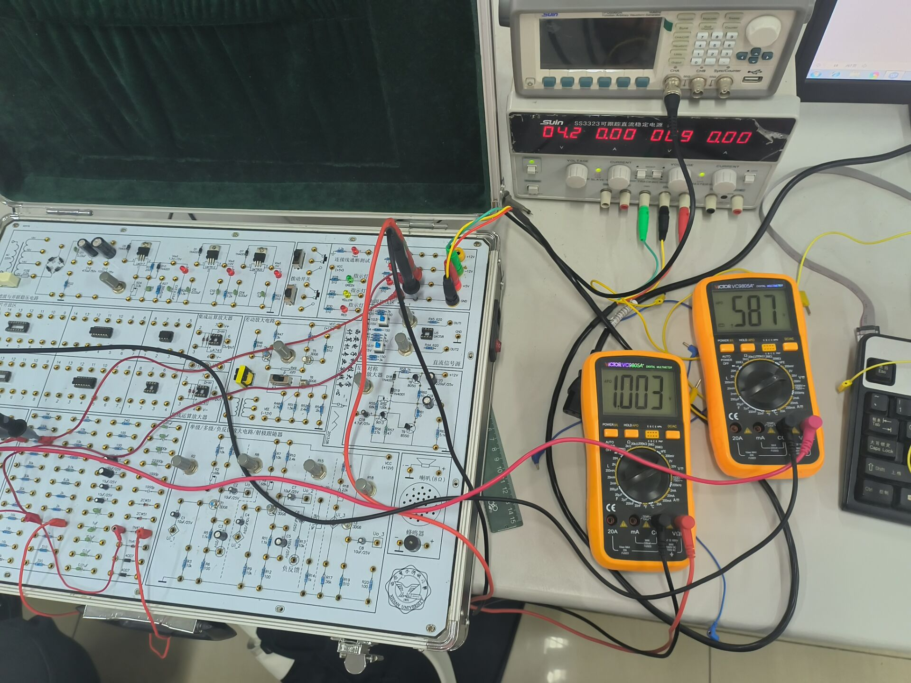	两个电表测试相对精准

1.1、**二极管单向导电性a**

| 正向输入直流电流Vi | 0.2v | 0.5v | 0.7v | 1.0v | 1.5v | 2.0v | 2.5v | 3.0v |
| :----------------: | :--: | :--: | :--: | :--: | :--: | :--: | :--: | :--: |
|     输出电压Vo     |      |      |      |      |      |      |      |      |

1.2.**二极管单项导电性b**

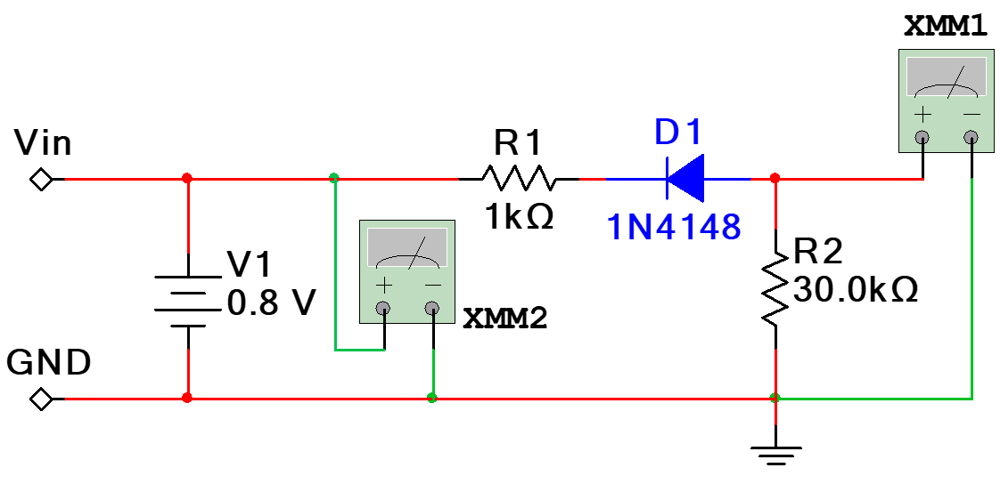

| 反向输入直流电源Vi | 0.5v | 1.0v | 1.5v | 2.0v | 2.5v | 3.0v | 3.5v | 3.0v |
| :----------------: | :--: | :--: | :--: | :--: | :--: | :--: | :--: | :--: |
|     输出电压Vo     |      |      |      |      |      |      |      |      |

2.1.**限幅特性a**

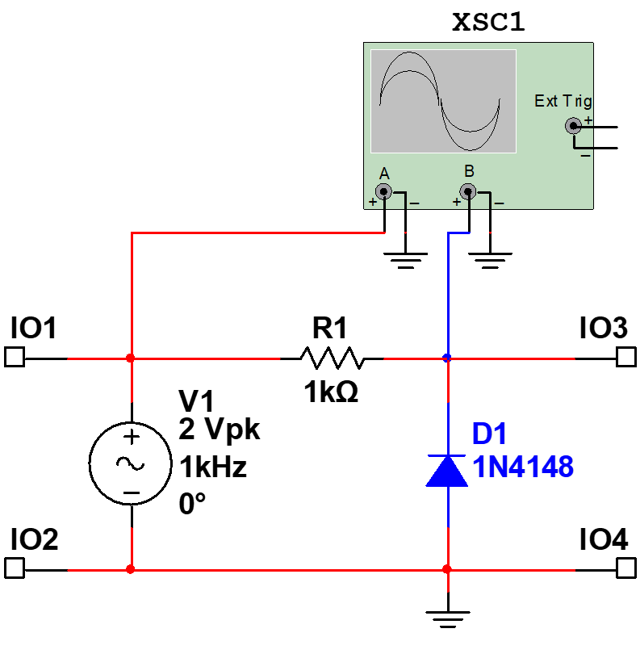

| 输入交流有效电压 | 0.2V | 0.5V | 0.7V | 1.0V | 1.5V | 2.0V | 2.5V | 3.0V |
| :--------------: | :--: | :--: | :--: | :--: | :--: | :--: | :--: | :--: |

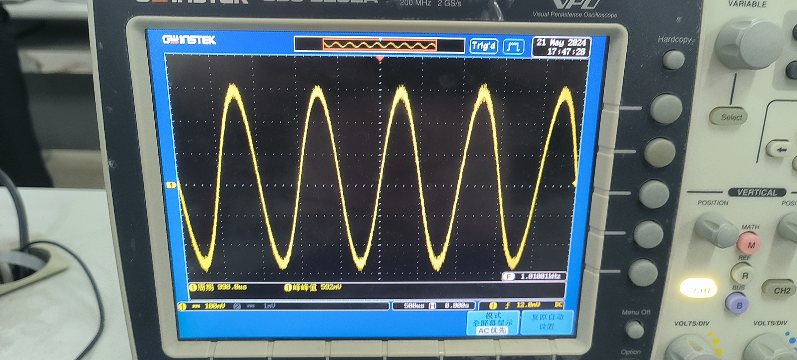

​					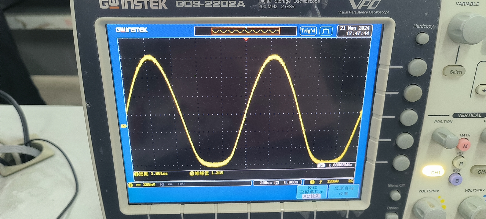

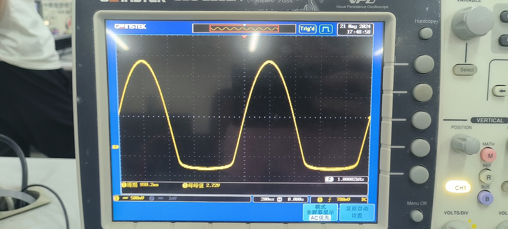

2.2.**限幅特性b**

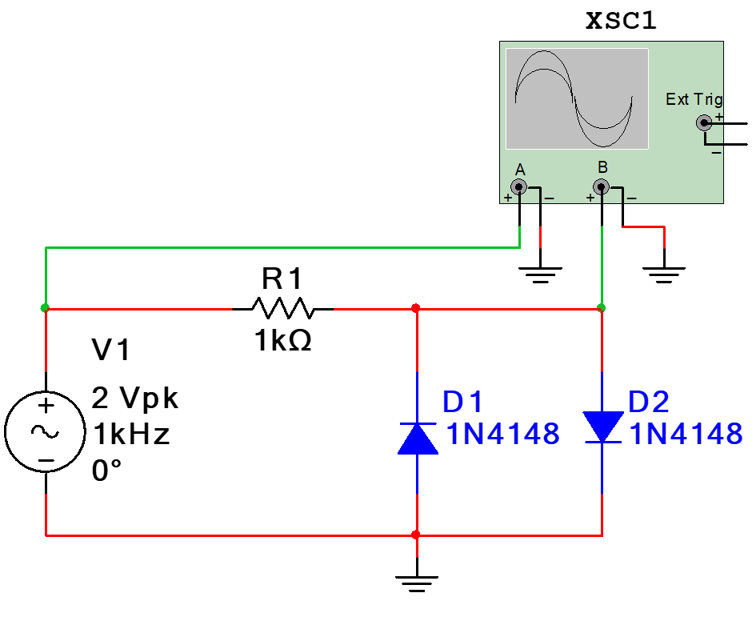

| 输入交流有效电压 | 0.2V | 0.5V | 0.7V | 1.0V | 1.5V | 2.0V | 2.5V | 3.0V |
| :--------------: | :--: | :--: | :--: | :--: | :--: | :--: | :--: | :--: |

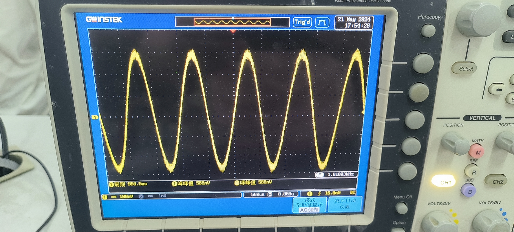

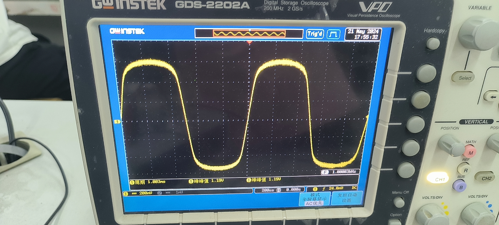

3.**半波整流电路**

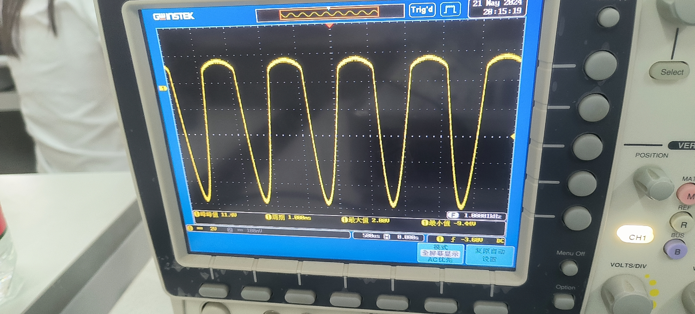

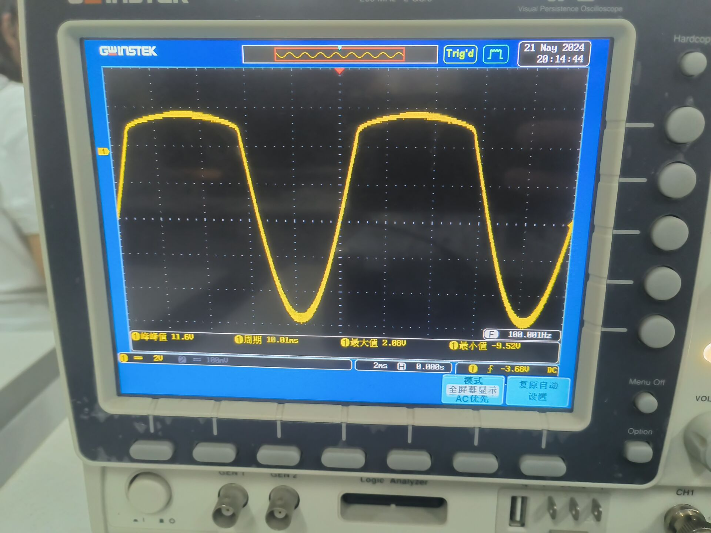

实验数据见附页

## 实验二  三极管单级交流放大电路

**实验电路：**

**1.** **电路参数对放大器工作点的影响**

##### (1)R~b~~l~对工作点的影响

**测试电路设置条件：**

电源电压E~c~为10V，将电位器W~2~旋至最大或最小，测量晶体管集电极、基极和发射极对地电压V~c~，V~B~，V~E~并计算V~B~~E~,V~C~~E~和I~C~的值

|      |      |      |      |      |      |      |
| ---- | ---- | ---- | ---- | ---- | ---- | ---- |
|      |      |      |      |      |      |      |
|      |      |      |      |      |      |      |

**2.** **工作点对波形的影响** 见附页

**3.** **放大器最大不失真输出的调整**

**4.** **放大器电压放大倍数A~V~测试**

|      |      |      |
| ---- | ---- | ---- |
|      |      |      |
|      |      |      |
|      |      |      |

**5.** **测量放大器输入电阻** r~i~

在实验内容3所调定的工作状态下

输入信号加到A端，f＝1KHz

调节信号源输出电压，使D点电压为10mV~P-P~

测量V~A~和W~1~值，计算出放大器输入电阻r~i~

|      |      |      |      |
| ---- | ---- | ---- | ---- |
|      |      |      |      |

**6.** **测量放大器输出电阻r~O~**

在实验内容3所调定的工作状态下

输入信号 V~i~＝10mV，f＝1KHz

测量负载开路时的输出电压V~O~和

接上负载R~L~＝4.7KΩ时的输出电压V~OL~

计算放大器的输出电阻r~O~

|      |      |      |      |
| ---- | ---- | ---- | ---- |
|      |      |      |      |
|      |      |      |      |

## 实验三 三极管负反馈交流放大电路

**一、实验目的**

 1．加深对负反馈对放大器性能的理解。

 2.学习电压串联负反馈放大器的调试和测量方法。

 3.学会EDA工具软件Multisim设计、仿真、调试基本负反馈放大器的方法。

|      |      |      |
| ---- | ---- | ---- |
|      |      |      |
|      |      |      |
|      |      |      |

|      |      |      |      |      |      |      |
| ---- | ---- | ---- | ---- | ---- | ---- | ---- |
|      |      |      |      |      |      |      |
|      |      |      |      |      |      |      |

|      |      |      |      |      |      |      |      |      |      |
| ---- | ---- | ---- | ---- | ---- | ---- | ---- | ---- | ---- | ---- |
|      |      |      |      |      |      |      |      |      |      |
|      |      |      |      |      |      |      |      |      |      |
|      |      |      |      |      |      |      |      |      |      |

|      |      |      |      |      |      |
| ---- | ---- | ---- | ---- | ---- | ---- |
|      |      |      |      |      |      |
|      |      |      |      |      |      |

|      |      |      |      |      |      |
| ---- | ---- | ---- | ---- | ---- | ---- |
|      |      |      |      |      |      |
|      |      |      |      |      |      |

## 实验四  运算放大器应用

**实验目的**：

熟悉和了解运算放大器的参数和性能。

熟悉和掌握运算放大器在比例运算、积分方面的应用。

1.反向比例运算器

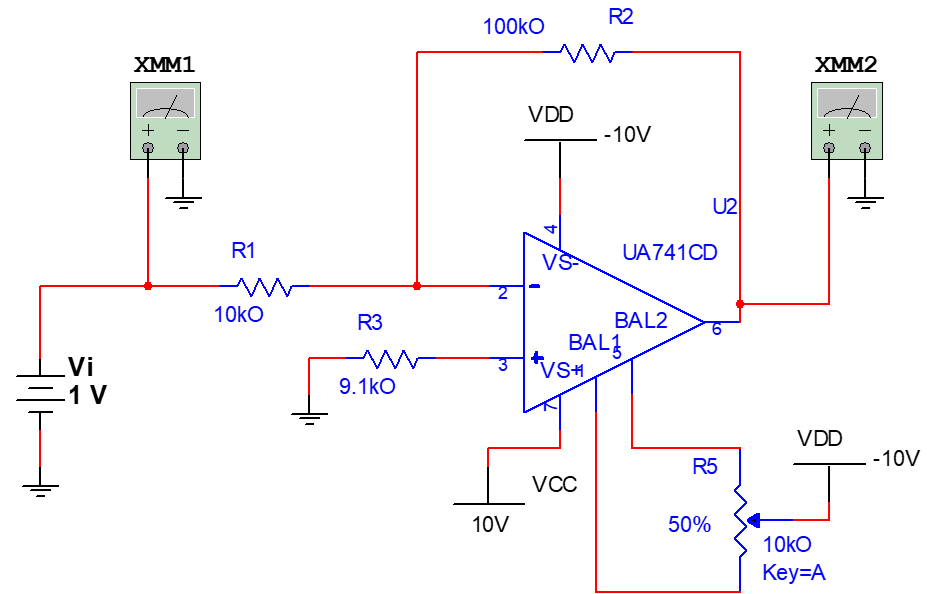

电源线	

|      |      |      |      |      |      |      |      |
| ---- | ---- | ---- | ---- | ---- | ---- | ---- | ---- |
|      |      |      |      |      |      |      |      |
|      |      |      |      |      |      |      |      |

示波器

|      |      |      |      |      |      |      |
| ---- | ---- | ---- | ---- | ---- | ---- | ---- |
|      |      |      |      |      |      |      |
|      |      |      |      |      |      |      |
|      |      |      |      |      |      |      |

2.同相比例放大器

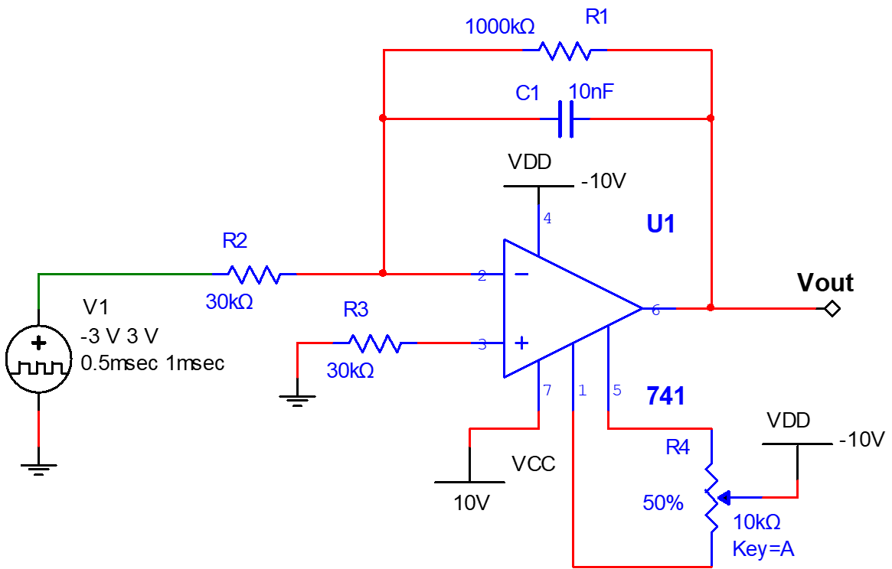	

|      |      |      |      |      |      |      |      |
| ---- | ---- | ---- | ---- | ---- | ---- | ---- | ---- |
|      |      |      |      |      |      |      |      |
|      |      |      |      |      |      |      |      |

|      |      |      |      |      |      |      |
| ---- | ---- | ---- | ---- | ---- | ---- | ---- |
|      |      |      |      |      |      |      |
|      |      |      |      |      |      |      |
|      |      |      |      |      |      |      |

## 实验五   集成运放放大器应用（1）

**一、实验目的**

  1．了解集成运算放大器的工作特点、性能参数，掌握理想集成运算放大器的特点。

  2．学习应用Multisim12仿真分析集成运算放大器组成比例、求和、微积分电路的特点及性能。

  3．了解平衡电阻的取值及作用。

  4．熟悉Multisim12软件的仿真使用。

**二，实验设备和材料**

1．装有Multisim 12的计算机。

2．虚拟函数信号发生器。

3．虚拟双通道示波器。

4．虚拟数字万用表。

5．其他虚拟器件若干

**三，实验内容**

1，同相比例运算电路

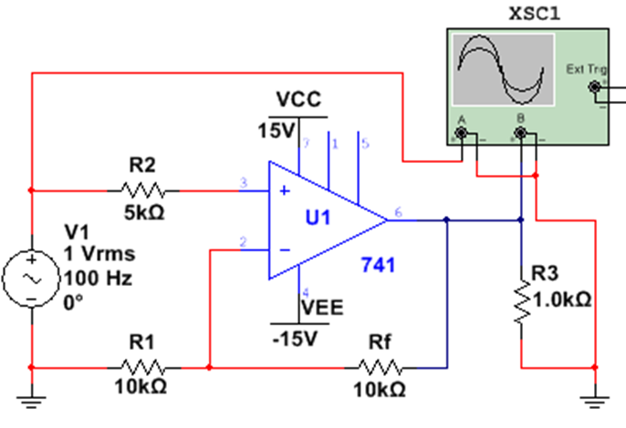	

2.反向比例运算电路

​	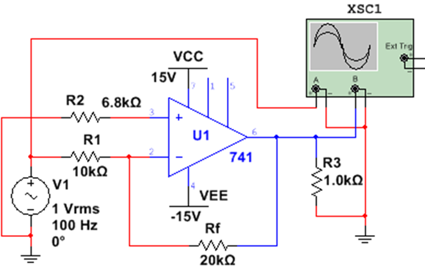

3，反向求和电路

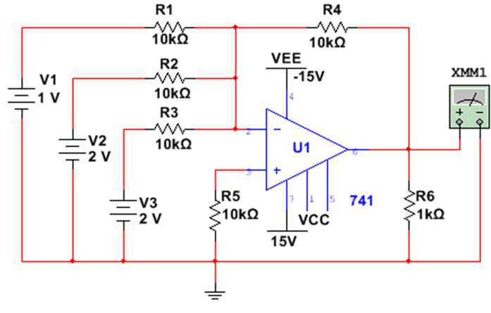	

4，和差电路

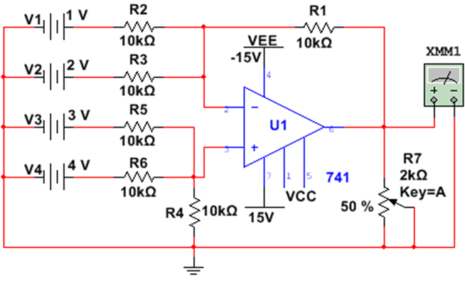	

## 实验八  有源滤波器电路

**一，实验目的**

1.学会利用Multisim12仿真分析由运算放大器组成的RC有源滤波器。

2.掌握由运算放大器组成的RC有源滤波器的工作原理、电路结构和基本性能。

3.学会运用理论知识计算满足一定设计要求的元件参数。

4.掌握有源滤波器基本参数的测量方法。

5.熟悉应用Multisim12软件高级分析功能的使用方法。

**二，实验设备和材料**

1．装有Multisim12的计算机。

2．虚拟函数信号发生器。

3．虚拟双通道示波器。

4．虚拟数字万用表。

5．其他虚拟器件若干。

**仿真实验内容**

1，二阶低通滤波器仿真电路

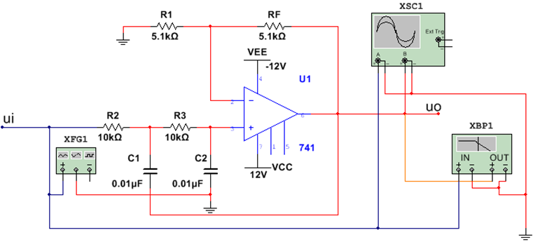	

2，二阶高通滤波器电路

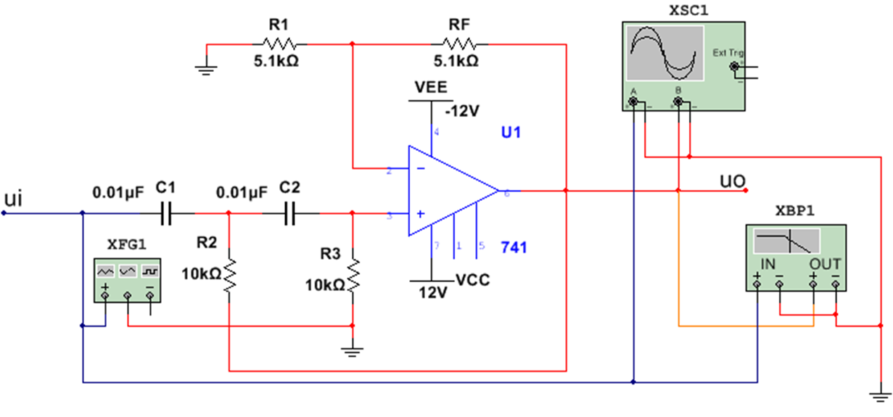	

3，二阶带通滤波器仿真电路

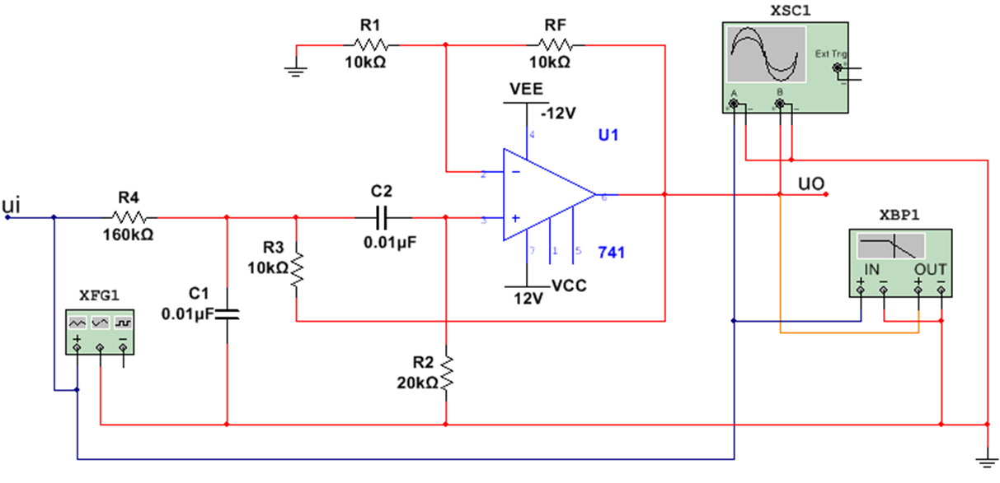	

