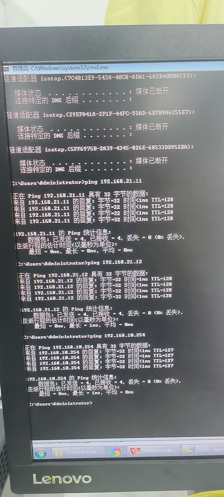
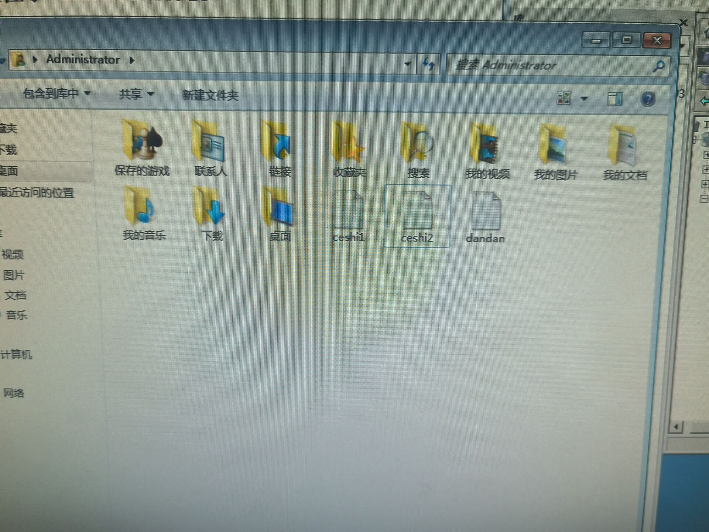

# 《计算机通信和网络》实验

## 第一次实验  网络基础知识及双绞线制作  访问配置网络设备实验

### 1.1

1、每组：1台交换机通过网线连接3台电脑PC，构建小的星型以太网

2、为3台PC配置相同子网的不同ip，用ipconfig查看网卡有关配置信息

3、用ping命令：测试从本机源地址到目标ip的网络连通情况。

4、对内容2，为PC配置不同子网的ip，并ping测试等，理解IP有关知识点

5、练习、测试、理解本节有关知识点，做好实验记录，理解网络知识点  	

### 1.3 访问配置网络设备

**实验目的**

学习访问网络设备的方法；

熟悉网络连接设备及附件的使用；

学习交换机和路由器配置管理的方法和指令

**实验内容** 

1.通过CONsole电缆实现网络设备与PC机COM串口连接；

2.正确配置PC机超级终端程序的串口参数；

3.熟悉H3C路由器和交换机的开机自检过程和输出界面；

4.学会处理实验中出现的异常问题。

**实验要求**

1、每组：1台交换机通过网线连接3台电脑PC，构建小的星型以太网

2、为3台PC配置相同子网的不同ip，用ipconfig查看网卡有关配置信息

3、用ping命令：测试从本机源地址到目标ip的网络连通情况

4、为PC配置不同子网的ip，互相ping测试等，理解IP有关知识点

​      验证：同一个网段子网的机器可以直接通讯；不同子网下则不通

5、以上操作要画好网络拓扑图，标注清晰有关信息，做好实验记录，理解网络知识点  

6、练习：通过CONSOLE口，熟练使用超级终端软件访问网络设备，学习交换机常用命令。

7、display current-configuration：查看配置信息，并理解之

8、每2人做一根标准的网络直通线

**结果如下：**

## 第二次实验 

### 实验一 交换机和VLAN划分

**实验目的**

理解交换机工作过程和端口属性；

学习交换机的基本设置方法 ；

掌握VLAN的划分和配置命令

ps：交换机工作在数据链路层

**设计拓扑图如下：**

​	

**结果测试**

配置PC机IP地址，用网线将PC机连接到相应的端口，用ping命令测试，同一vlan中的端口连接的机器可以连通，则表示实验成功；

不同vlan中端口连接的机器，不能ping通。

​	

### 实验2 跨交换机VLAN划分

**实验目的**

熟练掌握跨交换机的vlan划分；

熟练掌握基于端口的vlan划分；

掌握Trunk端口的配置方法

**实验步骤如下：**

1、按拓扑结构连接实验设备；

2、配置PC机的IP地址；

3、交换机1和交换机2分别创建vlan2 、vlan3，并且分配相应的端口；

4、配置Trunk端口；

5、测试结果。

**拓扑图如下：**

​	

**结果测试**

配置PC机IP地址，用平行双绞线将PC机分别连接到相应端口，用ping命令测试，同一vlan连接的机器可以连通，不同VLAN中的PC机不能连通，则表示实验成功。

	

## 第三次实验 

### 实验1 路由器配置和子网交换

**实验目的**

 理解路由器在网络中的作用和用法

 掌握路由器的基本配置命令

了解网络地址规划的原则和方法

**实验内容**

将小组内的2-3台PC机划分成2个不同的网段，用合适的网络设备组建成一个广域网，使处在两个不同网段中的PC机能够互相连通

画出网络拓扑图

正确使用网络设备连接网络

用Ping命令测试网络的连通性

**拓扑图如下：**

​	

**结果测试**

若路由器连接的两个不同网络的PC机可以相互连通，则表示实验结果正确；

用ping命令测试：逐步测试，先ping最近的ip，再ping次近的ip，一步一步ping到最远的目标ip，方便一步一步排查故障。

**结果如下：**

	

### 实验2 单臂路由实验

单臂路由是指在路由器的一个接口上通过配置子接口的方式，实现原来相互隔离的不同虚拟局域网之间的互联互通。

**实验目的**

深入了解虚拟局域网的划分、封装和通信原理

理解路由器子接口概念和封装协议

掌握路由器子接口的基本配置命令

**实验步骤**

 1、规划网络连接拓扑图

 2、按照拓扑图连接网络设备

 3、在交换机上配置好vlan信息

 4、将交换机上与路由器相连的以太网口配置成trunk模式 

 5、进入路由器指定接口的子接口，配置好该子接口的ip地址，为该子接口封装DOT1Q协议

  6、在PC机上用ping命令测试

​	

**结果测试**

在PC机上用ping命令测试，不同网段的PC机能够ping通，则表示实验成功。

	

## 第四次实验

### 实验一 静态路由配置实验

**实验目的**

掌握静态路由原理和配置方法

掌握查看路由表的方法

**实验步骤**

1、画好网络拓扑图，确定实际网段的ip地址等信息

2、按划分的网段将硬件设备连接好，再接通电源；

3、配置计算机ip地址、子网掩码和网关；

4、配置路由器ip地址和路由表；

5、测试网络连接。

	

### 实验2 RIP路由配置

**拓扑图如下：**

​	

**实验结果如下：**

全部ping通，实验成功

## 第五次实验

### 实验一  Windows下的DNS服务器配置

**实验目的**

理解DNS服务器的基本概念和工作原理；

掌握在Windows 2003 server 上安装DNS服务器的方法；

掌握DNS服务器的配置方法；

掌握DNS域名解析的测试方法

**实验内容**

在Windows 2003 server 上安装DNS服务器；

在Windows 2003 server 上配置DNS服务器

创建DNS正向解析区域；

创建DNS反向解析区域；

配置计算机成为DNS服务器的客户端；

在客户端进行DNS正向解析测试；

在客户端进行DNS反向解析测试

**实验过程**

1、理解DNS服务器的基本概念和原理。

2、熟悉DNS服务器、客户机的配置方法。

3、用ping命令测试DNS正向解析：ping 域名，得到主机的IP地址信息。

4、用nslookup测试DNS反向解析：nslookup IP地址，得到主机域名信息

**实验配置如下**

	

**实验结果**

	

### 实验二   Windows下的DHCP服务器配置

**实验目的**

理解DHCP服务器的基本概念和原理；

掌握在Windows 2003 server 上安装DHCP服务器的方法；

掌握DHCP服务器的配置方法；

掌握基于DHCP服务器的客户机IP地址动态获取方法

**实验内容**

在Windows 2003 server 上安装DHCP服务器；

在Windows 2003 server 上配置DHCP服务器

建立IP作用域；

DHCP选项配置（默认网关、DNS等）；

保留特定的IP地址给特定的客户端使用；

DHCP客户端的配置与测试。

**实验结果**

开始检查仍是第一个实验配置的地址，释放并把地址设置自由选取后，renew出我们保留的地址

	

	

## 第六次实验

Windows下的WEB和FTP服务器配置

**实验目的**

–理解IIS服务的基本概念；

–掌握在Windows 2003 server 上安装WEB服务器的方法；

–掌握WEB服务器的配置方法；

掌握在客户端访问WEB服务器的方法

–理解FTP的基本概念与工作原理；

–安装FTP服务器方法；

–配置与管理FTP服务器的方法；

–客户端访问FTP服务器的方法

正常配置完以后

	

接下来完成ftp的写入和读取下载

主机用户文件夹 文件 ceshi1.txt ceshi2.txt

虚拟机ftp默认文件 1111.txt dandan.txt

	

	

