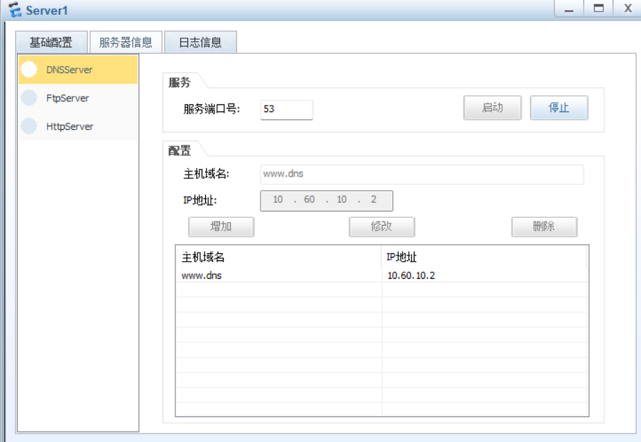
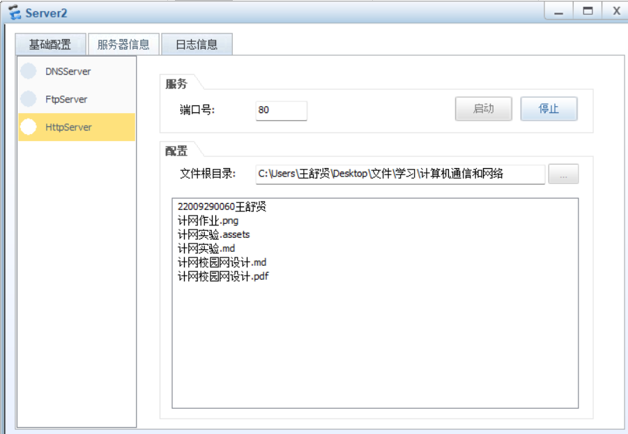
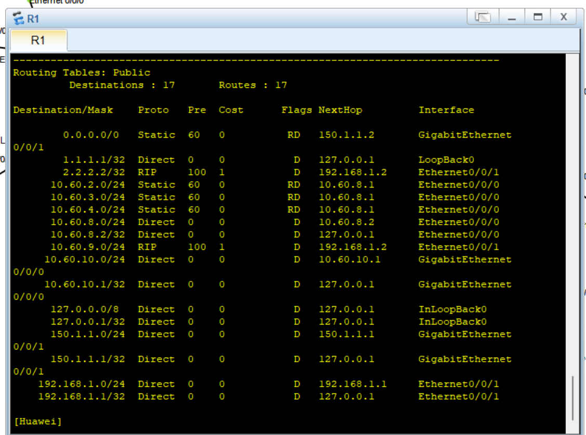
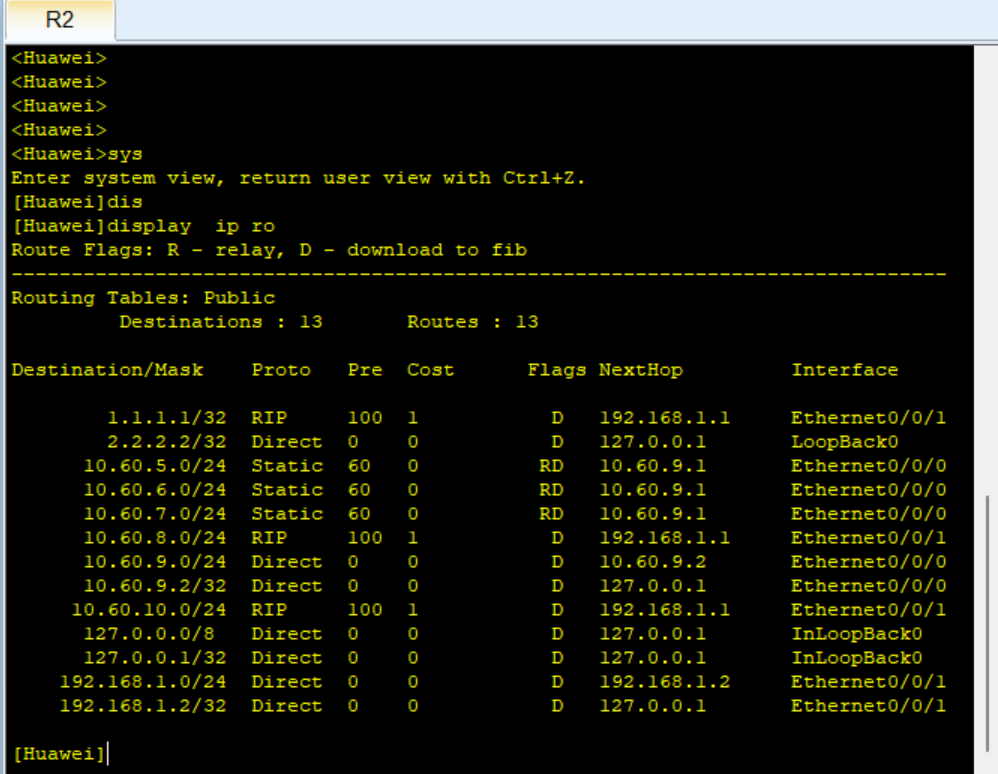
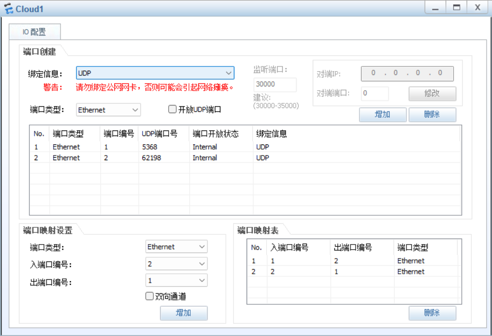

# 计网校园网设计

## 要求

**重新做的第二版**

改进过，基本没有任何问题了

报告来不及写特别完整了，但是大差不差

按拓扑图完成校园网设计项目，要求如下：

（1）所有主机可访问外网；

（2）主机可通过域名访问Web服务器，选做FTP服务器；

（3）为网络配置动态路由；

（4）教学楼主机通过DHCP自动获取地址，办公楼划分VLAN；

（5）科技楼主机使用专用地址，需通过NAT来访问外网（选做）；

（6）无线局域网采用AC+FIT AP模式（选做）；

（7）为设备分配合适的IP地址和子网掩码，IP地址的第二个字节使用学号的后两位；

（8）在已经配置过的交换机和路由器的用户视图下运行save命令以保存配置，然后在eNSP菜单中点击“保存”以保存拓扑，文件名为“学号姓名”，将文件压缩后提交（压缩文件名仍为“学号姓名”），同时需要提交报告。

	

## 一些命令和准备

**以下是途中寻找的一些知识点**

属于同一子网（网段）的网络节点才能直接通讯，不同子段通过路由器互通

静态IP：固定IP，一旦分配给某个节点，则不会自动更改；

   网络中对外提供服务的节点（如服务器等），一般必须使用静态ip

动态IP：设备每次开机后，自动从DHCP服务器请求获得的ip等信息

​    客户机终端，一般采用动态ip（网络端口设置为自动获取方式）

网关Gateway：表明该子网的出口，只有设置好网关的IP地址，TCP/IP协议才能实现不同网络之间的相互通信

•如果只在自己的子网内通信，则与网关就无关，可以不设网关；

•如果从ip到网关之间不能相互通信，则该ip的终端无法与外网通信

输入ping 目标机ip：测试从本机源地址到目标ip的网络连通性

路由器ROUTER是一种连接多个局域网络或网段的网络设备，它能将不同网络或网段之间的数据信息进行“翻译”，以使它们能够相互理解对方的数据，从而构成一个更大的网络（WAN广域网）。

路由器接口类型丰富、但数量少，连接不同的局域网LAN。

路由器工作于OSI参考模型的第三层网络层， 用于分割一个广播域，把数据从一个网络发送到另一个网络。

•sysname  为设备命名 

•display 显示，可缩写为di、dis、disp等，

•display current-configuration 显示当前配置情况：常用

•undo ---删除，取消该命令后面的操作；

•undo shutdown  打开关闭的端口

display vlan all-----查看vlan信息

•↑ ↓箭头键：调出上一条/下一条历史命令

•在命令缩写的后面，按Tab键可以补全命令

vlan 2                       （创建vlan 2 ）

port e1/0/19  G1/0/25      （将端口加入vlan 2中）

VLAN：将局域网设备从逻辑上划分成一个网段，从而实现虚拟工作组的数据交换技术；

每个VLAN是一个广播域，VLAN内的主机间通信就和在一个LAN内一样，而不同VLAN间则不能直接互通，这样，广播报文被限制在一个VLAN内。

配置PC的IP地址，用ping命令测试同一个vlan中连接的计算机是否能连通

将两台交换机的连接端口设置成Trunk口，并允许所有VLAN信息通过

交换机1：

   [H3C] interface  Ethernet1/0/24       进入端口24的配置模式

   [H3C] port link-type trunk           设置端口为Trunk访问模式

   [H3C] port trunk permit vlan all      允许所有的数据从该端口通过

交换机2：

   [H3C] interface  GigabitEthernet1/0/24  进入端口24的配置模式

   [H3C] port link-type trunk   

   [H3C] port trunk permit vlan 2 3     允许VLAN2、3的数据从端口通过

•配置交换机连接到路由器的端口为Trunk口，并允许所有VLAN信息通过，同理

•配置路由器的子端口

[R0]interface GE0/0

[R0-GigabitEthernet0/0]undo shutdown     //端口激活

[R0-GigabitEthernet0/0]quit

[R0]interface GE0/0.2            //配置子端口

[R0-GigabitEthernet0/0.2]vlan-type dot1q vid 2       //绑定vlan

[R0-GigabitEthernet0/0.2]ip address 192.168.10.254 255.255.255.0

[R0-GigabitEthernet0/0.2]quit

路由器工作原理

主机PC0向主机PC3发送消息

•1、主机PC0通过网卡把数据发送出去之前，需要在各层把数据标记完整，当它在数据链路层封装数据的时候，由于不知道目标主机的MAC地址，所以主机PC0会发送广播信息，路由器听到广播后就会响应，把自己的MAC地址给PC0，让它把数据封装好。然后把数据报发送到路由器

•2、路由器重新标记数据，目标主机IP地址和源主机IP地址不变，源MAC地址不变，目的MAC地址替换为192.168.2.2（路由器）的MAC地址，通过1端口把数据转发出去

•交换端口，port link-mode bridge

•路由端口，port link-mode route

–[R0] interface GE0/0                               //配置端口GE0的参数

–[R0-GigabitEthernet0/0] port link-mode route           

–[R0-GigabitEthernet0/0] ip address 192.268.10.254 255.255.255.0（或24）  

–[R0-GigabitEthernet0/0] undo shutdown            //激活端口

–[R0-GigabitEthernet0/0] quit

–查看路由表

[R0]display ip routing-table

RIP协议用到的指令：

[H3C] rip 

[H3C-rip-1] network 192.168.10.0 自己网段

[H3C-rip-1] network 192.168.20.0 下一跳网段

DNS服务器：域名到IP地址的一一映射

## 开始

### 规划vlan

**专用（私有）IP地址**：局域网内部使用，不属于公网IP(互联网IP) 

​    A类:  10.0.0.0   －  10.255.255.255

​    B类:  172.16.0.0  － 172.31.255.255

​    C类：内部局域网192.168.0.0－192.168.255.255，小型LAN常用

这里我们使用A类

三种接口类型：

Access链路类型端口：只允许缺省VLAN通过，仅接收和发送一个VLAN的数据帧；一般用于连接用户设备。

Trunk链路类型端口：允许多个VLAN通过，可以接收和发送多个VLAN的数据帧；缺省VLAN的以太网帧不带标签；一般用于交换机之间连接。

Hybrid链路类型端口：允许多个VLAN通过，可以接收和发送多个VLAN的数据帧

每个接口都有一个缺省VLAN。缺省情况下，所有接口的缺省VLAN均为VLAN1，但用户可以根据需要进行配置：

- 对于Access接口，缺省VLAN就是它允许通过的VLAN，修改接口允许通过的VLAN即可更改接口的缺省VLAN。

- 对于Trunk接口和Hybrid接口，一个接口可以允许多个VLAN通过，但是只能有一个缺省VLAN，修改接口允许通过的VLAN不会更改接口的缺省VLAN。

- 华为交换机的接口默认是Hybrid类型的，而Hybrid类型的接口不允许使用VLAN视图下的port命令来添加端口。只有Access类型的接口支持VLAN视图下的port命令来添加。

  是不是需要先用port link-type命令一个一个的把端口模式改了呢？其实有一个更快捷的方式：使用port-group命令

  [Huawei]port-group 1to4

  [Huawei-port-group-1to4]group-member GigabitEthernet 0/0/1 to GigabitEthernet 0/0/4

  [Huawei-port-group-1to4]port link-type trunk

LSW1

| 端口号   | 端口类型 | 所属vlan | ip          |
| -------- | -------- | -------- | ----------- |
| GE 0/0/1 | trunk    | vlan 80  | 192.60.80.1 |
| GE 0/0/2 | trunk    | vlan 20  | 192.60.20.1 |
| GE 0/0/3 | trunk    | vlan 30  | 192.60.30.1 |
| GE 0/0/4 | trunk    | vlan 40  | 192.60.40.1 |

LSW2

| 端口号   | 端口类型 | 所属vlan | ip          |
| -------- | -------- | -------- | ----------- |
| GE 0/0/1 | trunk    | vlan 80  | 192.60.90.1 |
| GE 0/0/2 | trunk    | vlan 50  | 192.60.50.1 |
| GE 0/0/3 | trunk    | vlan 60  | 192.60.60.1 |
| GE 0/0/4 | trunk    | vlan 70  | 192.60.70.1 |

**配置命令** 

记得配置完以后CTRL＋Z回到主视图用save保存

**二层交换机**

以接入层交换机LSW3为例

system-view 进入系统视图

vlan batch 20

interface Ethernet 0/0/2

port link-type access

port default vlan 20   划分到vlan 2

quit

interface Ethernet 0/0/1

port link-type trunk  配置为trunk接口

port trunk allow-pass vlan 20  允许vlan2通过

quit

其他同理

**三层交换机**

system-view

vlan batch 20 30 40  80  

int g0/0/2

port link-type trunk 

port trunk allow-pass vlan all   将GigabitEthernet0/0/2端口设置为trunk类型

quit

g0/0/3和g0/0/4同理

int g0/0/1

port link-type trunk    将GigabitEthernet0/0/1端口设置为trunk类型

port trunk allow-pass vlan all      GigabitEthernet0/0/1端口允许所有VLAN通过

quit

int vlanif 20

ip add 192.60.20.2 24 #设置VLAN20的虚端口IP和掩码

int vlanif 30

ip add 192.60.3.2 24 #设置VLAN的虚端口IP和掩码

int vlanif 40

ip add 192.60.40.2 24 #设置VLAN3的虚端口IP和掩码

int vlanif 80

ip add 192.60.80.1 24 #设置VLAN1的虚端口IP和掩码

quit

ip route-static 0.0.0.0 0 192.60.80.2 #加一条默认路由，下一跳是路由器R1的Ethernet0/0/0端口

**路由器**

1.先配置接口IP

vlan 1    创建VLAN1

quit

int e0/0/0

ip add 10.60.8.2 24

int e0/0/1

ip add 192.168.1.1 24

quit

2.制定规则

acl number 2000               添加一条ACL记录，允许源地址在10.60.0.0/16网段的数据包通过路由器R1

rule 5 permit source 10.60.0.0 0.0.255.255

quit

3.配置静态路由

以添加一条静态路由为例：

ip route-static 192.60.20.0 24 192.60.8.1        添加一条静态路由，要想到达10.60.2.0/16网段，下一跳走交换机的GigabitEthernet0/0/1端口                                             

##### 配置DHCP服务

在R1上

dhcp enable #开启DHCP分配IP地址功能

ip pool qq #配置一个名为qq的地址池

network 10.60.8.0 mask 255.255.255.0 #配置网段

gateway-list 10.60.8.2#配置网关

dns-list 10.60.10.2 8.8.8.8 #配置主DNS和备份DNS

display this #查看DHCP配置

interface e0/0/0 #进入和用户相连的接口配置

dhcp select global

#使用本地全局配置的地址池分配IP地址

save #保存配置

在教学楼（pc3）上IPV4配置由静态IP改为DHCP 

ipconfig/release

ipconfig/renew

即可

**添加dns和web服务**

	

	

**添加rip**

R1命令：

sys #进入全局配置模式

interface GigabitEthernet0/0/1

ip address 150.1.1.1 24

interface LoopBack 0

ip address 1.1.1.1 32 #添加本地环回地址

rip 

version 2  #Version 1版本只支持有类地址，输入后还是会显示rip-1，是正常的。

network 192.168.1.0 #添加相邻网段

network 1.0.0.0 #添加环回网段

network 10.0.0.0 #添加相邻网段

network 150.0.0.0 #添加相邻网段

undo summary 关闭自动汇总，如果不关闭的话，会把子网所有的路由条目汇总成超网一条路由条目

#为R1配置静态路由

ip route-static 0.0.0.0 0 150.1.1.2

值得注意的是：输入network 10.86.10.0会报错，Error: The network address is invalid, and the specified address must be major-net address without any 

subnets.//提示这里必须是主维网络，不能带子网。 rip协议宣告的主维网络，通告的是子网路由。

R2命令：

sys #进入全局配置模式

interface LoopBack 0

ip address 2.2.2.2 32 #添加本地环回地址

rip 

version 2

network 192.168.1.0

network 2.0.0.0 

network 10.0.0.0

undo summary 

R3命令：

sys #进入全局配置模式

interface LoopBack 0

ip address 3.3.3.3 32 #添加本地环回地址

rip 

version 2

network 150.0.0.0

network 3.0.0.0

通过命令display IP ro查看

**R1**

	

**R2**

	

**配置外网**

	

pc和R3配置也不赘述

到这里发现ping外网电脑ping不通，去搜查资料和对比发现是R1出口路由要做NAT转换

配置NAT需要先配置不同的地址组，分配不同的地址。

配置不同的acl，分配不同的acl，最后AR1的interface GigabitEthernet0/0/1上将不同的IP地址组和不同的acl相对应起来。

在LSW1上配置一个静态路由

nat address-group 7 150.1.7.100 150.1.7.200
nat address-group 2 150.1.2.100 150.1.2.200
nat address-group 3 150.1.3.100 150.1.3.200
nat address-group 4 150.1.4.100 150.1.4.200
nat address-group 5 150.1.5.100 150.1.5.200
nat address-group 6 150.1.6.100 150.1.6.200

acl 2007
rule permit source 10.86.7.2 0.0.0.255
q
acl 2002
rule permit source 10.86.2.2 0.0.0.255
q
acl 2003
rule permit source 10.86.3.2 0.0.0.255
q
acl 2004
rule permit source 10.86.4.2 0.0.0.255
q
acl 2005
rule permit source 10.86.5.2 0.0.0.255
q
acl 2006
rule permit source 10.86.6.2 0.0.0.255
q

interface GigabitEthernet0/0/1
nat outbound 2007 address-group 7 no-pat
nat outbound 2002 address-group 2 no-pat
nat outbound 2003 address-group 3 no-pat
nat outbound 2004 address-group 4 no-pat
nat outbound 2005 address-group 5 no-pat
nat outbound 2006 address-group 6 no-pat
q

## 总结和反思

具体ensp拓扑也保存在附录文件夹了，老师可以查询配置得知

探索一个实验的过程是艰难的，不过获得知识和解决问题是快乐的

这次实验就到此为止

感谢观看！

