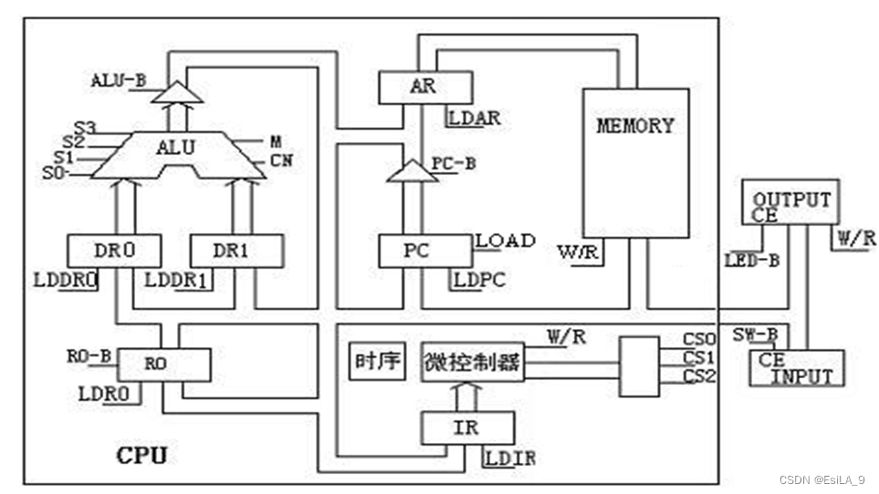
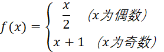

# 西电计组课设——基本模型机

## 基本模型机设计与实现

## 一，实验目的

1．深入理解基本模型计算机的功能、组成知识；

2．深入学习计算机各类典型指令的执行流程；

3．学习微程序控制器的设计过程和相关技术，掌握LPM_ROM的配置方法。

4．在掌握部件单元电路实验的基础上，进一步将单元电路组成系统，构造一台基本模型计算机。

5．**定义机器指令**，并编写相应的微程序，上机调试，掌握计算机整机概念。掌握微程序的设计方法，学会编写二进制微指令代码表。

6．通过熟悉较完整的计算机的设计，全面了解并掌握微程序控制方式计算机的设计方法。

## 二，实验原理

在部件实验过程中，各部件单元的控制信号是人为模拟产生的，而本实验将能在微过程控制下自动产生各部件单元控制信号，实现特定的功能。实验中，计算机数据通路的控制将由微过程控制器来完成，CPU从内存中取出一条机器指令到指令执行结束的一个指令周期，全部由微指令组成的序列来完成，即**一条机器指令对应一个微程序**。

**指令格式：**

采用寄存器直接寻址方式，其格式如下：

|  位  | 7     6     5     4 |    3     2     |     1     0      |
| :--: | :-----------------: | :------------: | :--------------: |
| 功能 |  OP-CODE（操作码）  | rs（源寄存器） | rd（目的寄存器） |

rs/rd选定寄存器：00-R0,01-R1,11-R

**为了向 RAM中装入程序和数据**，检查写入是否正确，并能启动程序执行，还必须设计三个控制台操作微程序。

1、存储器读操作（KRD）：下载实验程序后按总清除按键（CLR）后，控制台SWA、SWB为“0 0”时，可对RAM连续手动读出操作。

2、存储器写操作（KWE）：下载实验程序后按总清除按键（CLR）后，控制台SWA、SWB为“0 1”时，可对RAM连续手动写操作。

3、启动程序（RP）：下载实验程序后按总清除按键（CLR）后，控制台SWA、SWB为“1 1”时，即可**转入到微地址“01”号“取指令”微指令**，启动程序运行

## 三、实验设备

课程设计提供了一个基础的CPU平台，通过存储在rom里的24位微指令执行微代码，对数据通路，下一指令系统进行控制以达到运算和对RAM的交互能力。

本实验设备的字长为8: 寄存器和RAM均为8bit。

#### **微代码定义**

| 24~21 |  20  |  19  |  18  |  17  |  16  | 15~13 | 12~10 | 9~7  |   6~1   |
| :---: | :--: | :--: | :--: | :--: | :--: | :---: | :---: | :--: | :-----: |
| S3~S0 |  M   |  CN  |  WE  |  A9  |  A8  |   A   |   B   |  C   | uA5~uA0 |

#### S3~S0、M、CN指示ALU选择

ALU原有功能如下：

	

#### WE与RAM

WE指示了对RAM的读写操作选择：WE=0时允许配合A9A8=01的RAM进行读取; WE=1时需要A9A8=00的None配合写入。

#### A9A8: 通路额外控制

A9A8指示了系列操作，00时使得通路接受: 你在外边 key1,key2 按动的 input内容。

01时使得通路接受RAM的读操作。

10时使得通路向LED传递消息。

11时无相关操作，可以配合WE=1对RAM进行写操作。

#### A: 输入选通信号

A指示了对通路其他部件的写入操作:

000时无操作。

001时允许写入通用寄存器。

010时允许写入LDDR1，011时允许写入LDDR2

100时允许写入IR寄存器。

101时使得PC寄存器自增，110时允许写入AR。

#### IR寄存器

IR寄存器有一些本地文档没有写明的功能:

IR寄存器的高4位影响P1分支，后文再进行叙述。

低4位影响寄存器选择。本文作者没有太多尝试，只试过低4位: 0000, 0101的功能，不清楚上下2位对LDRi和RS-B是否分别影响。

#### B: 输出选通信号

B指示了通路其他部件的读出操作:

000时无其他操作。

001 RS-Back 时使得通路读取通用寄存器内容。

101 ALU-Back 时读取ALU输出内容。

110 PC-Back 时读取PC寄存器内容。

#### PC寄存器

PC寄存器在这次实验里多作为开始为0，借助LDPC操作在循环分支时自增后载入AR以便读取RAM的功能。

#### C: 分支操作与其他

C指示了分支操作与其他:

000时无操作

001时进入P(1)分支，进行1次IR寄存器的判断: 若高4位为0H，1H，2H，3H，4H，则跳转到当前指令、偏移1，2，3，4条指令进行执行。

即: 若当前的24bit指令里C=001, 则在进入这条语句前进行一次IR的判断，然后进行跳转。若IR的高4位=0000，则执行当前指令，否则当前指令偏移了1,2,3,4位的指令（你可以在后文的图里参考，），若IR的高4位不合法（不是0H,1H,2H,3H,4H）则程序跳回地址为0的位置(重启)。

100时进行P(4)分支，将对外部所输入的key4,key3指示进行指令的偏移跳转与执行

101时使得通路读取AR寄存器。

110时使得通路读取PC寄存器。

#### uA: 最后的6位地址指示了下一指令地址。

下面给一张ABC表更清晰

|  15  |  14  |  13  | 选择  |  12  |  11  |  10  | 选择  |  9   |  8   |  7   | 选择 |
| :--: | :--: | :--: | :---: | :--: | :--: | :--: | :---: | :--: | :--: | :--: | :--: |
|  0   |  0   |  0   |       |  0   |  0   |  0   |       |  0   |  0   |  0   |      |
|  0   |  0   |  1   | LDRi  |  0   |  0   |  1   | RS-B  |  0   |  0   |  1   | P(1) |
|  0   |  1   |  0   | LDDR0 |  0   |  1   |  0   | RD-B  |  0   |  1   |  0   | P(2) |
|  0   |  1   |  1   | LDDR1 |  0   |  1   |  1   | RI-B  |  0   |  1   |  1   | P(3) |
|  1   |  0   |  0   | LDIR  |  1   |  0   |  0   | 299-B |  1   |  0   |  0   | P(4) |
|  1   |  0   |  1   | LOAD  |  1   |  0   |  1   | ALU-B |  1   |  0   |  1   |  AR  |
|  1   |  1   |  0   | LDAR  |  1   |  1   |  0   | PC-B  |  1   |  1   |  0   | LDPC |

## 四、实验过程与设计

在本次实验中，发现可以通过修改硬件程序来更简单的实现我需要的功能

如上，修改功能为：

| S0~S3 |             功能             |
| :---: | :--------------------------: |
| 0001  |         F[4]<=DR1[0]         |
| 0010  |           右移一位           |
| 0100  |          读R0(DR2)           |
| 0101  |          写R0(DR2)           |
| 0110  | 减CN（没看到后面有相同功能） |
| 0111  |           输出80H            |

### 整体思路

在设计之初，我希望我设计的CPU能在执行基本功能的同时，实现一些数学上的功能。于是，我将目光聚集在

这个简单且有趣的方程上，我希望能设计一条指令，让CPU直接完成一次的计算。另外，我还需要配套的栈指令，用来将结果保存在RAM里，方便后续查询。

### 功能细分

为实现功能和栈操作，指令操作需要细分为如下几个单元分别完成：

：1.判断R0奇偶性，并且根据奇偶性跳转不同分支；

​      2.x/2，即右移操作；

​      3.x+1。

栈操作：1.出入栈；

​      2.初始化栈指针。

### 功能实现

#### **判断奇偶性**

 由于CPU限制，我们不能直接进行if判断。常见的解决方式是，令PC加上R0的尾数，这样，当R0为偶数时，PC+0无事发生，CPU继续执行RAM中的下一条指令；

当R0为奇数时，PC+1，跳过了RAM中下一条指令。这样就实现了RAM层面的if操作。这种方式的优势是ROM操作简单，缺点是if后只能固定加载不带地址的指

令。

而我希望这条指令可以在实现判断的同时自动跳转并执行后续操作，能够被一条指令完成，所以我的设计如下：

①  对待判断数R0进行取尾操作；

②  将结果左移四位；

③  将结果和原指令相加，输入IR。

通过修改IR高四位的值，便可以在指令运行过程中插入一次P1判断，并根据奇偶性进行跳转。这样一来，我们既可以通过Fx指令自动完成一次函数计算

（包括判断和右移/自增)，也可以直接调用右移和自增指令，利用指令嵌套的方式，提高了灵活性，便捷性。

具体流程见下图：

	

这里04地址的018048就是实现If跳转的核心，这条操作本身模拟指令00H进行P1跳转，如果R0为偶数，IR的值不会改变，依然根据00H跳转至10地址，执行右移

操作；如果R0为奇数，IR则会加上10H，P1变成根据10H跳转至10H地址，执行自增操作。

如此，便实现了FX操作的自动判断和跳转运算。

#### **出入栈**

栈操作也存在两种实现方式，直接在出入栈指令后附加栈地址，或者在CPU内部建立栈指针，自动完成栈指针维护。明显，前者需要知道当前栈指针才能进行操

作，违背了栈道本质。而后者存在实现上的问题。

   这里设计R1为栈指针，希望通过指令实现出入栈操作。在设计过程中发现，在出入栈时，既需要读写R0（数据），又需要读写R1（指针）。具体流程如下：

入栈：R1->AR；   R0->RAM;   R1->ALU;    ALU(R1+1)->R1;

出栈：R1->ALU;    ALU(R1-1)->R1;    R1->AR；   RAM -> R0；

然而根据指令规则，只能有一个源寄存器和一个目的寄存器，无法满足操作要求。

简单的办法是将出入栈和栈指针维护（递增递减）分离，每次出入栈手动改变栈指针的值。这样做依旧是设计简单，操作繁琐。

我的办法是通过ALU自动修改源/目的寄存器，实现单个指令完成出入栈的目标，具体如下：

入栈：①将R1导出到AR和DR1中暂存；

②  用ALU修改指令的源寄存器地址，从访问R1改为R0；

③  这样就能将R0的值导入到RAM，实现入栈；

④  最后把R1+1写回R1。

出栈过程类似，具体参见流程图如下：

	

#### **初始化指令**

由于栈操作的过程是完全自动的，所以需要初始化栈底指针，这里通过ALU直接生成80H，赋值给R1，实现栈指针初始化。

考虑到实际使用该CPU进行推演时，往往对输入的单个数据进行反复执行，此处直接将IN操作整合在初始化操作之后，并直接入栈。但是考虑到通用性，这

里应该分开设计，这一部分在报告末尾反思总结部分具体表述。

**总流程图如下：**

## **五、反思与总结**

在设计之初，考虑到操作的简便性，将重置栈指针和总线输入数据的操作整合为单个SE操作。这样设计是为了演示时可以更快速的进入设计核心（方程f（x））的演示。但是作为一台计算机，这样的设计缺乏通用性和复用性。应当将流程图中的SE操作拆分为重置栈指针R1的RE操作，和总线输入IN操作两部分。若要完成上述改动，可以令指令55H改为RE操作，保留ROM地址15中的数据不变。新增指令60H为IN操作，ROM地址使用16。在此改动下，初始化过程需要改为进行RE，IN，WR三个指令。

##   ROM表（微指令设计）

| 地8  | 地H  | 微指令 | S3210 | M CN W A98 |  A   |  B   |  C   |   (8)UA50   |           功能            |
| :--: | :--: | :----: | :---: | :--------: | :--: | :--: | :--: | :---------: | :-----------------------: |
|  00  |  00  | 01ED82 | 0000  |   0001 1   | 110  | 11 0 | 110  | (02)00 0010 |                           |
|  02  |  02  | 00C048 | 0000  |   0000 1   | 100  | 000  | 001  | (10)00 1000 |                           |
|  10  |  08  | 01A20F | 0000  |   0001 1   | 010  | 001  | 0 00 | (17)00 1111 |           除二            |
|  17  |  0F  | 219A00 | 0010  |   0001 1   | 001  | 10 1 | 000  | (00)00 0000 |                           |
|  11  |  09  | 01A212 | 0000  |   0001 1   | 010  | 001  | 0 00 | (22)01 0010 |            加1            |
|  22  |  12  | 059A00 | 0000  |   0101 1   | 001  | 10 1 | 000  | (00)00 0000 |                           |
|  12  |  0A  | 01A203 | 0000  |   0001 1   | 010  | 001  | 0 00 | (03)00 0011 |            IF             |
|  03  |  03  | 11CA04 | 0001  |   0001 1   | 100  | 10 1 | 000  | (04)00 0100 |         逻辑->IR          |
|  04  |  04  | 018048 | 0000  |   0001 1   | 000  | 000  | 0 01 | (10)00 1000 |            P1             |
|  13  |  1A  | 00B006 | 0000  |   0000 1   | 011  | 00 0 | 000  | (06)00 0110 |         RAM->DR2          |
|  06  |  06  | 01E20E | 0000  |   0001 1   | 110  | 00 1 | 000  | (16)00 1110 |          R2->AR           |
|  16  |  0E  | 01A207 | 0000  |   0001 1   | 010  | 00 1 | 000  | (07)00 0111 |          R2->DR1          |
|  07  |  07  | 41CA1B | 0100  |   0001 1   | 100  | 10 1 | 000  | (33)01 1011 |      ALU(读2->0)->IR      |
|  33  |  1B  | 02821F | 0000  |   0010 1   | 000  | 00 1 | 000  | (37)01 1111 |       R0->RAM(->37)       |
|  14  |  13  | 00B014 | 0000  |   0000 1   | 011  | 00 0 | 000  | (24)01 0100 |         RAM->DR2          |
|  24  |  14  | 01A215 | 0000  |   0001 1   | 010  | 00 1 | 000  | (25)01 0101 |          R2->DR1          |
|  25  |  15  | 659A16 | 0110  |   0101 1   | 001  | 10 1 | 000  | (26)01 0110 |         DR1-1->R2         |
|  26  |  16  | 01E217 | 0000  |   0001 1   | 110  | 00 1 | 000  | (27)01 0111 |          R2->AR           |
|  27  |  17  | 51CA19 | 0101  |   0001 1   | 100  | 10 1 | 000  | (31)01 1001 |      ALU写R2->0)->IR      |
|  31  |  19  | 009000 | 0000  |   0000 1   | 001  | 000  | 000  | (00)000 000 |          RAM->R0          |
|  15  |  0D  | 719A1C | 0111  |   0001 1   | 001  | 10 1 | 000  | (34)01 1100 | ALU(80H)->R2  (SE(读2写2) |
|  34  |  1C  | 01E21D | 0000  |   0001 1   | 110  | 001  | 0 00 | (35)01 1101 |          R2->AR           |
|  35  |  1D  | 00201E | 0000  |   0000 0   | 010  | 00 0 | 000  | (36)01 1110 |          SW->DR1          |
|  36  |  1E  | 038A21 | 0000  |   0011 1   | 000  | 10 1 | 000  | (41)10 0001 |       ALU(DR1)->RAM       |
|  37  |  1F  | 059A00 | 0000  |   0101 1   | 001  | 101  | 000  | (00)00 0000 |      (33->)DR1+1->R1      |
|  41  |  21  | 01A222 | 0000  |   0001 1   | 010  | 001  | 000  | (42)10 0010 |          R1->DR1          |
|  42  |  22  | 059A00 | 0000  |   0101 1   | 001  | 101  | 000  | (00)00 0000 |         DR1+1->R1         |

## 总体功能说明

| 地址 | 内容 | 助记符 |           说明           |
| :--: | :--: | :----: | :----------------------: |
| 00H  |  55  |   SE   | 初始化(R1<-80H)，IN->RAM |
| 01H  |  45  |   RD   |           出栈           |
| 02H  |  20  |   IF   |           F(x)           |
| 03H  |  35  |   WR   |           入栈           |
| 04H  |  25  |   IF   |           F(x)           |
| 05H  |  35  |   WR   |           入栈           |
| 80H  |  00  |        |           栈底           |
