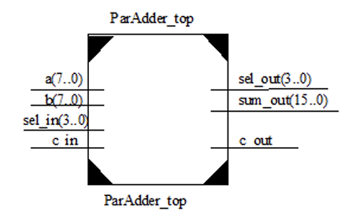

# SOC微体系结构设计实验报告

## 22009290060王舒贤

## 并行全加器ParAdder

顶层模块如图

a_in，b_in:输入 8 位加数和被加数；sel_in:数码管片选端；  c_in，c_out:进位输入，进位输出；sum_out:运算结果的输出

将程序下载到FPGA并进行检验
资源使用要求：用开关（SW0 ~ SW7）输入加数，被加数，（SW8 ~ SW11）控制用哪个数 码管显示数据，s12用于进位输入；用D8显示结果进位。 

## 数码管显示程序

## 阵列乘法器

## 加减交替除法器

## FIFO存储器

## PC程序计数器

## 程序存储器ROM