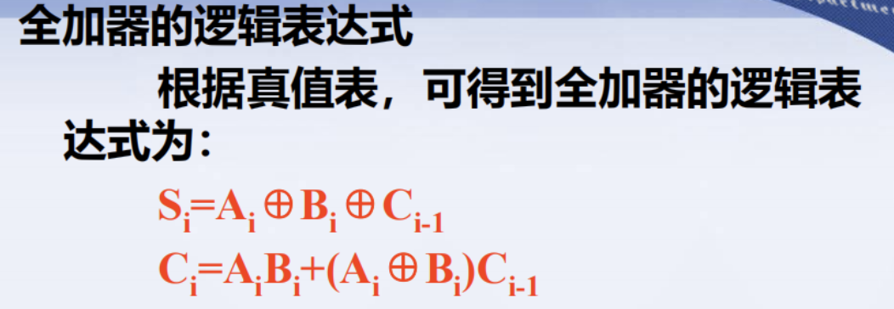
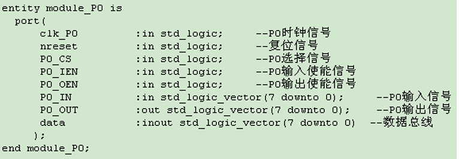
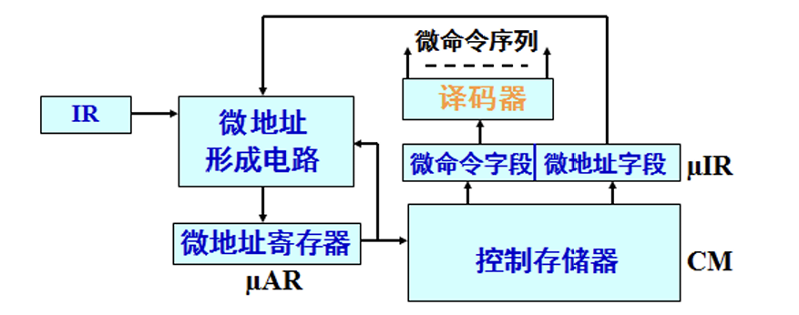
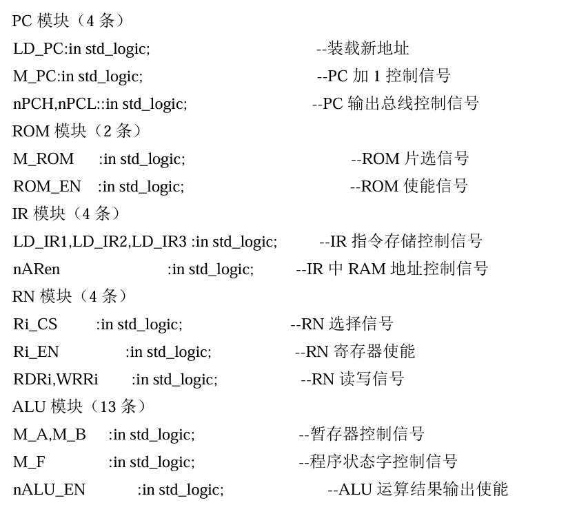
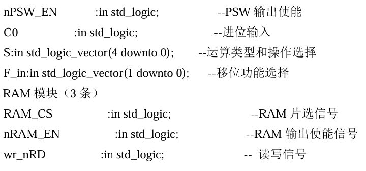
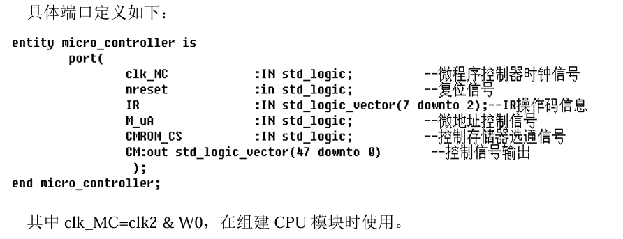

# SOC微体系结构设计实验报告

## 22009290060王舒贤

## 并行全加器ParAdder



加法器有串行和并行之分。在串行加法器中，只有一个全加器。并行加法器则由多个全加器组成。

顶层模块如图


`a_in`，`b_in`:输入 8 位加数和被加数；
`sel_in`:数码管片选端；  
`c_in`，`c_out`:进位输入，进位输出；
`sum_out`:运算结果的输出

将程序下载到FPGA并进行检验
资源使用要求：用开关（SW0 ~ SW7）输入加数，被加数，（SW8 ~ SW11）控制用哪个数 码管显示数据，s12用于进位输入；用D8显示结果进位。 


## 数码管显示程序

要求：通过数码管输出自己的学号

`key_in(15:0)`为四组数码管的输入显示值。  
`Clk，rst` 为时钟和复位信号的输入。
时钟主要用于状态机的设计。采用异步复位信号进行数据输入。  
`seg_sel(3:0)`为数码管选择编码输出信号；  
`seg_data(7:0)`为数码管显示数据输出

通过设定s15~s0的值来显示学号，核心程序如下：

```vhdl
when s0 =>
     if(k_in(0) = '1') then
     seg_sel <= "1111111111111110";
     seg_data <="11000000";--11000000表示0
     end if;
     next_state <= s1;
```

```
对应数字ASCLL列表如下
11000000表示0
11111001表示1
10100100表示2
10110000表示3
10011001表示4
10010010表示5
10000010表示6
11111000表示7
10000000表示8
10010000表示9
10001000表示A
10000011表示b
11000110表示c
```

## 阵列乘法器

## 加减交替除法器


## FIFO存储器

## PC程序计数器

| sw0       | rst   |
| --------- | ----- |
| sw1       | ld    |
| sw2       | pc    |
| sw3       | nPCH  |
| sw4       | nPCL  |
| sw16~sw27 | PC_in |

- 当`nPCH = '0'`且`nPCL = '1'`时，将`myPC`的高 4 位（11 downto 8）输出到`d`的低 4 位（3 downto 0），`d`的高 4 位（7 downto 4）设置为 04。
- 当`nPCL = '0'`且`nPCH = '1'`时，将`myPC`的低 8 位（7 downto 0）直接输出到`d`4。
- 当不满足以上两种情况时，`d`设置为高阻态 “ZZZZZZZZ

## 程序存储器ROM

## IR

| sw0        | rst         |
| ---------- | ----------- |
| sw1        | LD_IR1      |
| sw2        | LD_IR2      |
| sw3        | LD_IR3      |
| sw4        | nARen       |
| sw7        | RD          |
| sw8        | RS          |
| sw9~sw15   | AR0~AR7     |
| sw16~sw21  | IR0~IR5     |
| sw24~sw31  | data0~data7 |
| led0~led11 | PC          |

1. **数据输入**：通过 sw24 - sw31 设置 data0 - data7 的值，这是要存储到 IR 或用于设置 PC、AR 地址的数据。
2. **指令存储操作**：先设置好 data 值，然后在 clk_IR 上升沿时刻，将 sw1（LD_IR1）置为高电平，可将 data 数据传送到 IR 中。
3. PC 地址设置
   - 若要设置 PC 的高 4 位（11 - 8 位），在 clk_IR 上升沿时，将 sw2（LD_IR2）置高，同时通过 data0 - data3 设置好对应的值。
   - 若要设置 PC 的低 8 位（7 - 0 位），在 clk_IR 上升沿时，将 sw3（LD_IR3）置高，同时通过 data0 - data7 设置好对应的值。
4. **RAM 地址设置**：设置好 PC 的值后，将 sw4（nARen）置为低电平，PC (6…0) 的值会传送到 AR (6…0)，用于确定 RAM 的读写地址。

## RN

| sw29 | write |
| ---- | ----- |
| sw30 | read  |

## RAM

| sw0~sw6  | address |
| -------- | ------- |
| sw8~sw15 | data    |
| sw27     | write   |
| sw28     | en      |
| sw30     | read    |

## ALU

| S（sw16~sw19） | M（sw20） | 功能                                        |
| :------------- | :-------- | :------------------------------------------ |
| 0000           | 0/1       | F9 = A9 + CN / F9 = ¬A9                     |
| 0001           | 0/1       | F9 = (A9 ∨ B9) + CN / F9 = ¬(A9 ∨ B9)       |
| 0010           | 0/1       | F9 = (A9 ∨ ¬B9) + CN / F9 = ¬A9 ∧ B9        |
| 0011           | 0/1       | F9 = "000000000" - CN / F9 = "000000000"    |
| 0100           | 0/1       | F9 = A9 + (A9 ∧ ¬B9) + CN / F9 = ¬(A9 ∧ B9) |
| 0101           | 0/1       | F9 = (A9 ∨ B9) + (A9 ∧ ¬B9) + CN / F9 = ¬B9 |
| 0110           | 0/1       | F9 = A9 - B9 - CN / F9 = A9 ⊕ B9            |
| 0111           | 0/1       | F9 = (A9 ∨ ¬B9) - CN / F9 = A9 ∧ ¬B9        |
| 1000           | 0/1       | F9 = A9 + (A9 ∧ B9) + CN / F9 = ¬A9 ∧ B9    |
| 1001           | 0/1       | F9 = A9 + B9 + CN / F9 = ¬(A9 ⊕ B9)         |
| 1010           | 0/1       | F9 = (A9 ∨ ¬B9) + (A9 ∧ B9) + CN / F9 = B9  |
| 1011           | 0/1       | F9 = (A9 ∧ B9) - CN / F9 = A9 ∧ B9          |
| 1100           | 0/1       | F9 = A9 + A9 + CN / 000000001               |
| 1101           | 0/1       | F9 = (A9 ∨ B9) + A9 + CN / F9 = A9 ∨ ¬B9    |
| 1110           | 0/1       | F9 = (A9 ∨ ¬B9) + A9 + CN / F9 = A9 ∨ B9    |
| 1111           | 0/1       | F9 = A9 - CN / F9 = A9                      |

zn（零负标志位） led1；cy（最终进位） led0 ；c0（进位） sw23 ； 左移 sw22 ；右移 sw21

## IO

	

输入锁存：  clk_PO 上升沿有效，P0_CS 高电平，P0_IEN 低电平，P0_IN-> 暂存器，RIEN 低电平， 暂存器->数据总线（data）
输出锁存：  clk_PO 上升沿有效，P0_CS高电平，P0_OEN低电平，数据总线（data)->暂存器，ROEN 低电平，暂存器->P0_OUT。

sw0~sw7  IO_in0~IO_in7

sw31 nreset

sw30 IO_CS

sw29 IO_IEN

sw28 IO_OEN

sw27 RI_EN

sw26 RO_EN

## SP

	

其中clk_SP=nclk2，在组建CPU模块时使用

数据存储功能：clk_SP上升沿有效，SP_CS高电平，nSP_EN 高电平，data->SP 
加1功能：clk_SP上升沿有效，SP_CS高电平，SP_UP高电平，nSP_EN低电平有效，SP+1->SP,SP->AR
减1功能：clk_SP上升沿有效，SP_CS高电平，SP_DN高电平，nSP_EN低电平有效， SP-1->SP,SP->AR

消抖

该代码通过一个四状态的状态机实现了按键消抖功能。当按键按下时，状态机从 `s0` 状态开始，经过 `s1` 状态的 3ms 延时，确认按键信号稳定后，在 `s2` 状态输出高电平，表示按键有效。当按键释放时，状态机从 `s3` 状态回到 `s0` 状态，等待下一次按键操作

`clk='1' and clk'event` 来检测时钟信号的上升沿，以此确保状态机的状态转换和计数器的操作都是在时钟上升沿触发的，保证了电路的同步性

消抖逻辑是在状态机的 `s1` 状态下实现的。在这个状态里，每当时钟上升沿到来时，计数器 `count` 就会加 1。当 `count` 的值达到 `count_num` 时，就意味着已经经过了 3ms 的延时，此时状态机就会从 `s1` 状态转换到 `s2` 状态。

sw31 nreset

sw30 SP_CS

sw29 key_in

sw28 nSP_EN

sw27 SP_UP

sw26 SP_DN

LED0~6 AR

sw0~7 DATA_BUS

## UC

	


控制存储器CM --存放微程序
微指令寄存器µIR --存放现行微指令
微地址形成电路--提供下一条微地址 
微地址寄存器µAR--存放现在微地址

控制信号汇总

	

	

控制信号设计

39条控制信号（39位编码）
27条指令（5位编码）->8位微地址 

**端口定义**

	

sw2~sw7 IR2~IR7

sw31 nreset

sw30 CMROM_CS

sw29 M_uA

