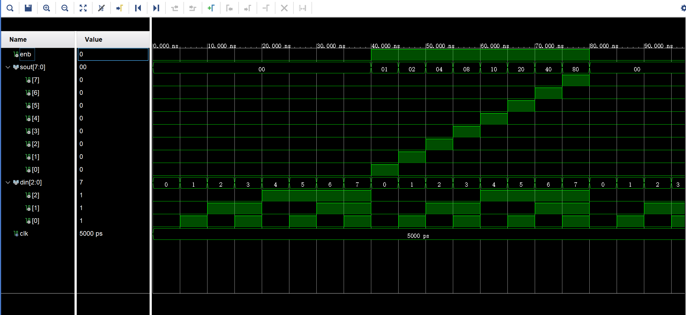

# 3-8 译码器设计
## 基本原理
+ 根据3-8译码器工作原理，即将3位的编码值进行译码并输出8种独热码，同时存在一个使能端控制是否正常工作，因此可以设计出端口信号：enb, sout, din；
+ 针对使能端和输入信号，设计不同的选择输出，借用信号赋值分别传送给 sout；
+ 电路仿真配置：定义译码器实体后，需要再编写一个实例化文件将实体与具体输入信号值进行关联以进行功能仿真；在本文中，将 encoder 作为一个组件导入到仿真文件中，并进行端口与信号的映射，利用两个进程分别控制使能信号与输入信号，统一时钟周期 clk = 10ns；
## VHDL描述
```vhdl
library IEEE;
use IEEE.STD_LOGIC_1164.ALL;

entity encoder is
    port( enb: in std_logic;
            sout: out std_logic_vector(7 downto 0);
            din: in std_logic_vector(2 downto 0));
end encoder;

architecture Behavioral of encoder is
signal sel: std_logic_vector(3 downto 0):= "0000"; 
begin
        sel(0)<=enb;
        sel(1)<=din(0);
        sel(2)<=din(1);
        sel(3)<=din(2);

    with sel select
        sout <= "00000001" when "0001",
                "00000010" when "0011",
                "00000100" when "0101",
                "00001000" when "0111",
                "00010000" when "1001",
                "00100000" when "1011",
                "01000000" when "1101",
                "10000000" when "1111",
                "00000000" when others;
end Behavioral;
```
## 仿真配置
```vhdl

library IEEE;
use IEEE.STD_LOGIC_1164.ALL;

entity encoder_sim is
--  Port ( );
end encoder_sim;

architecture Behavioral of encoder_sim is

component encoder
    port( enb: in std_logic;
            sout: out std_logic_vector(7 downto 0);
            din: in std_logic_vector(2 downto 0));
end component;

signal enb : std_logic := '0';
signal sout : std_logic_vector(7 downto 0);
signal din : std_logic_vector(2 downto 0) := "000";
constant clk : time := 5 ns;

begin
uut: encoder port map(
        enb => enb,
        sout => sout,
        din => din
        );

-- enb production
enb_process :process
begin
    enb <= '0';
    wait for clk * 8;
    enb <= '1';
    wait for clk * 8;
end process;

-- encoder stimulation
stimulus: process
begin
    din <= "000";
    wait for clk;
    din <= "001";
    wait for clk;
    din <= "010";
    wait for clk;
    din <= "011";
    wait for clk;
    din <= "100";
    wait for clk;
    din <= "101";
    wait for clk;
    din <= "110";
    wait for clk;
    din <= "111";
    wait for clk;
end process;

end Behavioral;
```

## 仿真结果


## 结果分析
从功能仿真结果可以看出，当使能端为 0 时，不论输入信号如何变化，译码器始终输出全为 0；只有当使能端为1时，译码器正常工作，将 3 为输入信号译码输出为 8 位独热编码。