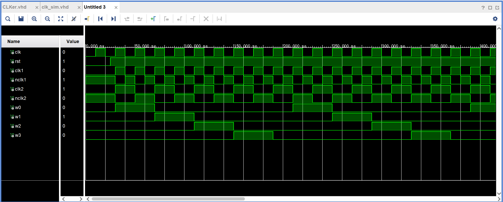

# 时钟模块设计
## 一、端口信号分析
+ 输入信号：clk, rst:  同步时钟，复位信号
+ 输入信号：clk1, nclk1: 时钟信号，以及反相时钟信号 
+ 输入信号：clk2, nclk2：时钟二分频信号以及其反相信号
+ 输出信号：w0, w1, w2, w3: 生成的四个节拍信号

## 二、功能设计
+ 二分频信号设计
为了生成二分频时钟信号，本设计采用在时钟信号的上升沿对二分频信号取反实现分频时钟信号；
+ 节拍信号设计
为了生成四路节拍信号，并且保证每两个时钟周期一个节拍，引入时钟计数器，每当计数两个时钟周期，自动转换生成下一个节拍信号；

## 三、VHDL 描述
```vhdl
library IEEE;
use IEEE.STD_LOGIC_1164.ALL;
 
entity clock is
    Port(
        clk, rst: in std_logic;
        clk1, nclk1: out std_logic;   -- clk, not clk
        clk2, nclk2: buffer std_logic;   -- f = f_clk / 2
        w0, w1, w2, w3: out std_logic   -- four signals
    );
end clock;
 
architecture Behavioral of clock is
begin
   
    process(clk)
    variable count_w: integer:=0;   -- record the number of clk periods
    begin
        if(rst = '0')then
            w0<='0';
            w1<='0';
            w2<='0';
            w3<='0';
            clk1<='0';   -- reset the clk
            nclk1<='1';
            clk2<='0';
            nclk2<='1';
            count_w:=0;
        elsif(rst = '1')then
            clk1 <= clk;   -- get the clk
            nclk1 <= not clk;
            if(clk'event and clk='1')then
                clk2 <= not clk2;
                nclk2 <= not nclk2;
                                
                if(count_w >= 0 and count_w <= 1) then 
                    w0 <= '1'; 
                else w0 <= '0';
                end if;
                
                if(count_w >= 2 and count_w <= 3) then
                    w1 <= '1';
                else w1<='0';
                end if;
                
                if(count_w>=4 and count_w<=5) then 
                    w2<='1';
                else w2<='0';
                end if;
                
                if(count_w >=6 and count_w<=7) then
                   w3<='1';
                else w3<='0';
                end if;
                
                if(count_w<8) then 
                    count_w :=count_w+1;   -- add clk periods
                else count_w:=0;           -- clear for next circle
                end if;
            end if;
        end if;
    end process;
 
end Behavioral;
```

## 四、仿真配置
+ **仿真 Pipline:  产生同步时钟 $\Rightarrow$ 复位系统**
``` vhdl
library IEEE;
use IEEE.STD_LOGIC_1164.ALL;
 
entity clock_tb is
--  Port ( );
end clock_tb;
 
architecture Behavioral of clock_tb is
component clock
    Port(
        clk, rst: in std_logic;
        clk1, nclk1: out std_logic;   -- clk, not clk
        clk2, nclk2: buffer std_logic;   -- f = f_clk / 2
        w0, w1, w2, w3: out std_logic   -- four signals
    );
end component;
 
signal clk, rst:std_logic;
signal clk1, nclk1:std_logic;   
signal clk2, nclk2:std_logic;   
signal w0, w1, w2, w3:std_logic;  
 
begin
clock_inst:clock port map(clk, rst, clk1, nclk1, clk2, nclk2, w0, w1, w2, w3);

clock_gen:process
begin
    clk<='0';
    wait for 10ns;
    clk<='1';
    wait for 10ns;
end process;
 
reset_gen: process
begin
    rst<='0';
    wait for 25ns;
    rst<='1';
    wait;
end process;
 
end Behavioral;
```
## 五、功能仿真结果与分析



+ 从仿真结果可以看出，clk是同步时钟，系统复位 rst=0后，产生的时钟信号都初始化为 0;
+ 当 rst = 1时，系统产生时钟信号 clk1 及其反向信号 nclk1;
+ clk2 是对产生的时钟信号 clk1 进行二分频得到的信号，及其反向信号；
+ w0-w3 为四路节拍信号，依次产生四个节拍，并且每个节拍信号占用两个时钟周期;
