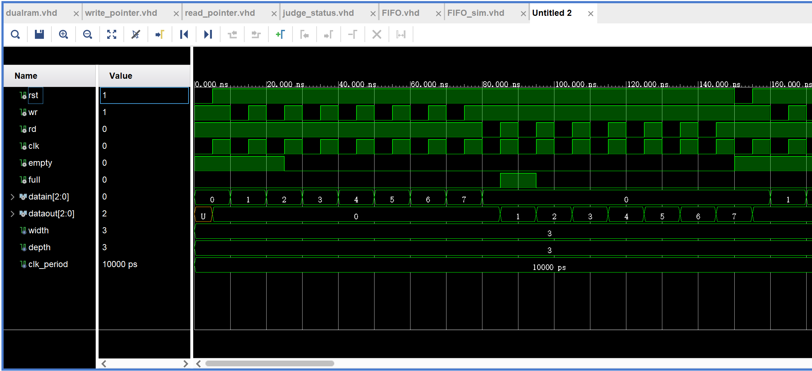
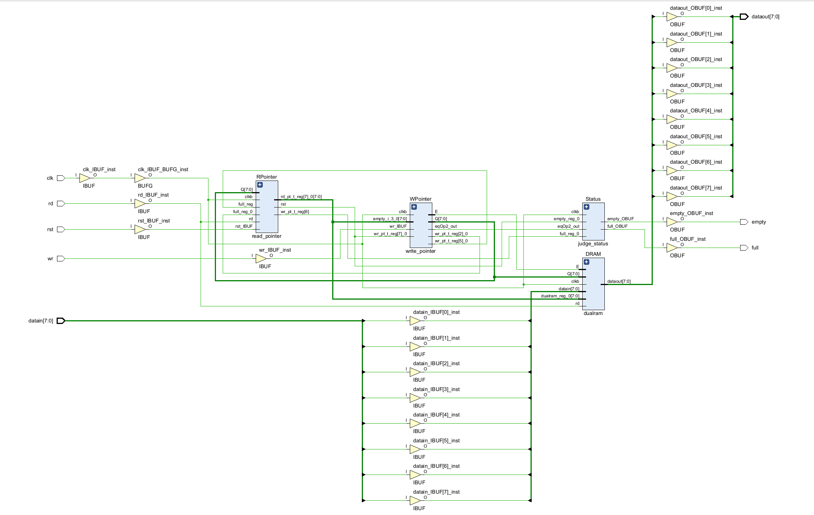

# 同步 FIFO 设计
## 一、功能分析
+ FIFO为空，不可从FIFO读数据，但可写；
+ FIFO为满，不可向FIFO写数据，但可读；
+ 非空非满时，FIFO可读、可写；
+ FIFO的读写受同一时钟控制； 
+ FIFO的大小为N；
## 二、空满判定分析
+ 当wr_ptr=rd_ptr时，FIFO数据为空；
+ 当wr_ptr-rd_ptr=M - l 或 rd_ptr-wr_ptr=l 时， FIFO数据为满；
+ 当wr_ptr>=rd_ptr时，wr_ptr-rd_ptr 为 FIFO 内 数据个数；
+  当wr_ptr<=rd_ptr时，M-(rd_ptr-wr_ptr) 为 FIFO 内数据个数；

## 三、端口信号分析
+ 配置参数：width: 数据位宽
+ 配置参数：depth: 存储器地址线长度
+ 输入信号：clk, rst:  同步时钟，复位信号
+ 输入信号：datain:  输入数据
+ 输入信号：wr, rd：读写使能信号
+ 输出信号：dataout: 读出数据
+ 输出信号：full, empty: 存储器满空标志

## 四、VHDL 描述
### 4.1 顶层模块设计
```vhdl
library IEEE;
use IEEE.STD_LOGIC_1164.ALL;
use IEEE.STD_LOGIC_UNSIGNED.ALL;

entity FIFO is
    generic
    (
        width : positive := 8;
        depth : positive := 8);
    port ( clk: in std_logic;
           rst: in std_logic;
           datain : in std_logic_vector(width-1 downto 0);
           dataout : out std_logic_vector(width -1 downto 0);
           wr : in std_logic;
           rd : in std_logic;
           empty : out std_logic;
           full : out std_logic);
end FIFO;

architecture Behavioral of FIFO is
component dualram is
    generic
    (
        width : positive := 8;
        depth : positive := 8);
    
    port 
    ( 
        ------------------------------- port a is only for writing ------------------------
        clka : in std_logic;
        wr : in std_logic;
        addra : in std_logic_vector(depth-1 downto 0);
        datain : in std_logic_vector(width-1 downto 0);
        
        ------------------------------- port b is only for reading ------------------------
        clkb : in std_logic;
        rd : in std_logic;
        addrb : in std_logic_vector(depth-1 downto 0);
        dataout : out std_logic_vector(width -1 downto 0));
end component;

component read_pointer is
    generic( depth: positive);
    Port ( clk : in STD_LOGIC;
           rst : in std_logic;
           rq : in std_logic;
           rd_pt : out std_logic_vector(depth-1 downto 0));
end component;

component write_pointer is
    generic
    ( depth: positive);
    port ( 
        clk : in std_logic;
        rst: in std_logic;
        wq : in std_logic;
        wr_pt : out std_logic_vector(depth-1 downto 0));
end component;

component judge_status is
    generic( depth: positive);
    port ( clk : in STD_LOGIC;
            rst : in std_logic;
            wr_pt : in std_logic_vector(depth - 1 downto 0);
            rd_pt : in std_logic_vector(depth - 1 downto 0);
            empty : out std_logic;
            full : out std_logic);
end component;

signal wr_pt, rd_pt: std_logic_vector(depth-1 downto 0);

begin
    DRAM: dualram generic map(width, depth)
               port map(
                    clka => clk,
                    clkb => clk,
                    wr => wr,
                    rd => rd,
                    datain => datain,
                    dataout => dataout,
                    addra => wr_pt,
                    addrb => rd_pt);
    WPointer: write_pointer generic map(depth)
                   port map(
                        clk => clk,
                        wq => wr,
                        rst => rst,
                        wr_pt => wr_pt);
                        
   RPointer: read_pointer generic map(depth)
                   port map(
                        clk => clk,
                        rq => rd,
                        rst => rst,
                        rd_pt => rd_pt);
                 
    Status: judge_status generic map(depth)
               port map(
                    clk => clk,
                    rst => rst,
                    wr_pt => wr_pt,
                    rd_pt => rd_pt,
                    empty => empty,
                    full => full);
end Behavioral;
```
### 4.2 双端口 RAM 设计

```vhdl
library IEEE;
use IEEE.STD_LOGIC_1164.ALL;
use IEEE.STD_LOGIC_UNSIGNED.ALL;

entity dualram is
    generic
    (
        width : positive := 8;
        depth : positive := 8);
    
    port 
    ( 
        ------------------------------- port a is only for writing ------------------------
        clka : in std_logic;
        wr : in std_logic;
        addra : in std_logic_vector(depth-1 downto 0);
        datain : in std_logic_vector(width-1 downto 0);
        ------------------------------- port b is only for reading ------------------------
        clkb : in std_logic;
        rd : in std_logic;
        addrb : in std_logic_vector(depth-1 downto 0);
        dataout : out std_logic_vector(width -1 downto 0));
end dualram;


architecture Behavioral of dualram is
type ram is array(2 ** depth - 1 downto 0) of std_logic_vector(width - 1 downto 0);
signal dualram: ram;
begin
    process(clka)
    begin
        if(clka'event and clka = '1') then
            if wr = '0' then
                dualram(conv_integer(addra)) <= datain;
            end if;
        end if;
    end process;
    
    process(clkb)
    begin
        if( clkb'event and clkb = '1') then
            if rd = '0'then
                dataout <= dualram(conv_integer(addrb));
            else
                dataout <= (others => '0');
            end if;
        end if;
    end process;    
end Behavioral;
```
### 4.3 写地址计数器设计
```vhdl
library IEEE;
use IEEE.STD_LOGIC_1164.ALL;
use IEEE.STD_LOGIC_UNSIGNED.ALL;

entity write_pointer is
    generic
    ( depth: positive);
    port ( 
        clk : in std_logic;
        rst: in std_logic;
        wq : in std_logic;
        wr_pt : out std_logic_vector(depth-1 downto 0));
end write_pointer;

architecture Behavioral of write_pointer is
signal wr_pt_t : std_logic_vector(depth - 1 downto 0); -- write pointer counter
begin
    process(rst, clk)
        begin 
            if rst = '0' then
                wr_pt_t <= (others => '0');
            elsif clk'event and clk = '1' then
                if wq = '0' then
                    wr_pt_t <= wr_pt_t + 1;
                end if;
            end if;
    end process;
    wr_pt <= wr_pt_t;
end Behavioral;
```
### 4.4 读地址计数器设计

```vhdl
library IEEE;
use IEEE.STD_LOGIC_1164.ALL;
use IEEE.STD_LOGIC_UNSIGNED.ALL;

entity read_pointer is
    generic( depth: positive);
    Port ( clk : in STD_LOGIC;
           rst : in std_logic;
           rq : in std_logic;
           rd_pt : out std_logic_vector(depth-1 downto 0));
end read_pointer;

architecture Behavioral of read_pointer is
signal rd_pt_t : std_logic_vector(depth - 1 downto 0); -- read pointer counter
begin
    process(rst, clk)
        begin
            if rst = '0' then
                rd_pt_t <= (others => '0');
            elsif clk'event and clk = '1' then
                if rq = '0' then
                    rd_pt_t <= rd_pt_t + 1;
                end if;
            end if;
    end process;  
    rd_pt <= rd_pt_t;
end Behavioral;
```
### 4.5 空满状态产生器设计

```vhdl
library IEEE;
use IEEE.STD_LOGIC_1164.ALL;
use IEEE.STD_LOGIC_UNSIGNED.ALL;

entity judge_status is
    generic( depth: positive);
    port ( clk : in STD_LOGIC;
            rst : in std_logic;
            wr_pt : in std_logic_vector(depth - 1 downto 0);
            rd_pt : in std_logic_vector(depth - 1 downto 0);
            empty : out std_logic;
            full : out std_logic);
end judge_status;

architecture Behavioral of judge_status is
begin
    process(rst, clk)
    begin
        if rst = '0' then
            empty <= '1';
        elsif clk'event and clk = '1' then
            if wr_pt = rd_pt then
                empty <= '1';
            else
                empty <= '0';
            end if;
        end if;
     end process;
     
     process(rst, clk)
     begin
        if rst = '0' then
            full <= '0';
        elsif clk'event and clk = '1' then
            if wr_pt > rd_pt then
                if (rd_pt + 2 ** depth - 1) = wr_pt then
                    full <= '1';
                else
                    full <= '0';
                end if;
            else
                if (wr_pt+1) = rd_pt then
                    full <= '1';
                else
                    full <= '0';
                end if;
            end if;
        end if;
      end process;
end Behavioral;
```

## 五、仿真配置
+ **仿真 Pipline: 系统复位 $\Rightarrow$ 写入数据直至满 $\Rightarrow$ 读出数据直至空**
``` vhdl
library IEEE;
use IEEE.STD_LOGIC_1164.ALL;
use IEEE.STD_LOGIC_UNSIGNED.ALL;

entity FIFO_sim is
  -- Port ( );
end FIFO_sim;

architecture Behavioral of FIFO_sim is
component FIFO is
    generic
    (
        width : positive := 8;
        depth : positive := 8);
    port ( clk: in std_logic;
           rst: in std_logic;
           datain : in std_logic_vector(width-1 downto 0);
           dataout : out std_logic_vector(width -1 downto 0);
           wr : in std_logic;
           rd : in std_logic;
           empty : out std_logic;
           full : out std_logic);
end component;

constant width: integer := 3;     -- define 3 bits
constant depth: integer := 3;     -- define 000 - 111 address
signal rst, wr, rd: std_logic := '1';
signal clk, empty, full: std_logic := '0';
signal datain: std_logic_vector(width-1 downto 0) := "000";
signal dataout: std_logic_vector(width-1 downto 0) := "000";
constant clk_period : time := 10 ns;

begin
    FIFO_Instance: FIFO generic map(width, depth)
                   port map(
                        clk => clk,
                        rst => rst,
                        datain => datain,
                        dataout => dataout,
                        empty => empty,
                        full => full,
                        wr => wr,
                        rd => rd);
                        
     clk <= not clk after clk_period / 2;   -- clk production
     
     process
     begin
            -- reset firstly
            rst <= '0';
            wait for clk_period / 2;
            rst <= '1';
            wait for clk_period / 2;
            
            -- write 001-111 data to ram in turn
            for i in 0 to 6 loop
                datain <= datain + 1;
                wr <= '0';
                wait for clk_period / 2;
                wr <= '1';
                wait for clk_period / 2;
            end loop;
            
            -- read 001-111 data from ram in turn
            datain <= (others => '0');
            for i in 0 to 6 loop
                rd <= '0';
                wait for clk_period / 2; 
                rd <= '1';
                wait for clk_period / 2;
            end loop;   
     end process;
    
end Behavioral;
```
## 六、功能仿真结果与分析
### 6.1 仿真电路时序图



+ 从仿真结果可以看出，在系统初始化复位后，empty = 1, full = 0, rd = 1, wr = 1;
+ depth = 3 时,表示存储器地址线宽度为 3, 即地址范围: 000~111, 但是 FIFO 存储器最后一个单元用于满标志判定, 因此实际大小 M = 7;
+ 依次写入数据 1~7, 在写入完毕后下一周期存储器输出 full = 1 表示已经写满;
+ 之后开始读取数据, 可以看出从存储器依次读取的数据是按照先进先出的顺序读出的, 当读出数据 7 后, empty = 1 表示存储器此时状态为空;

### 6.2 电路连接关系图


