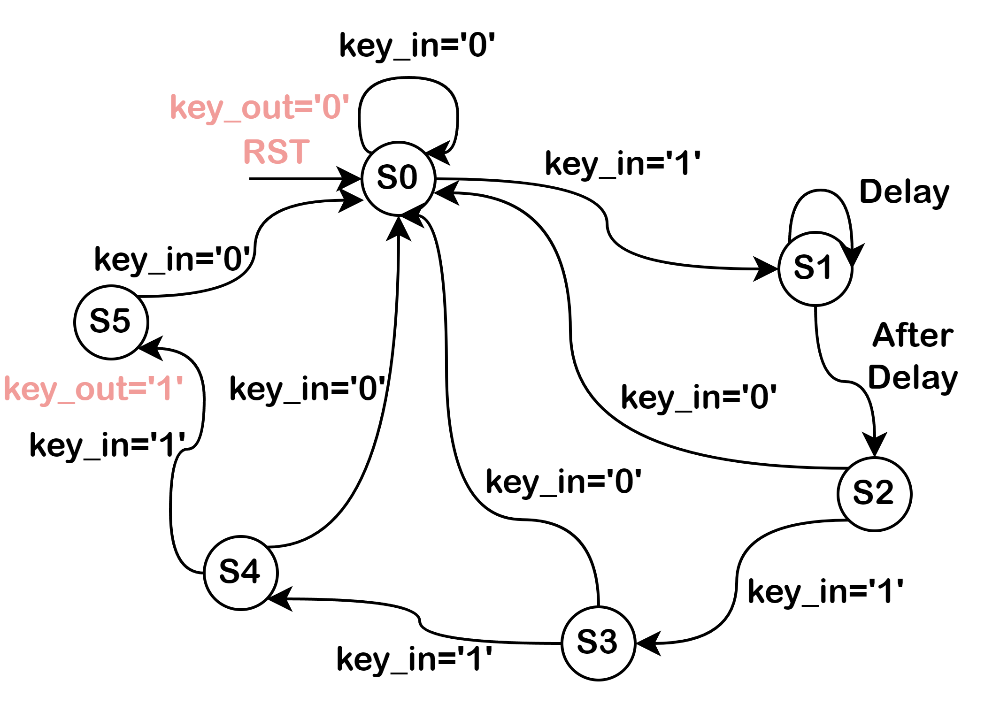
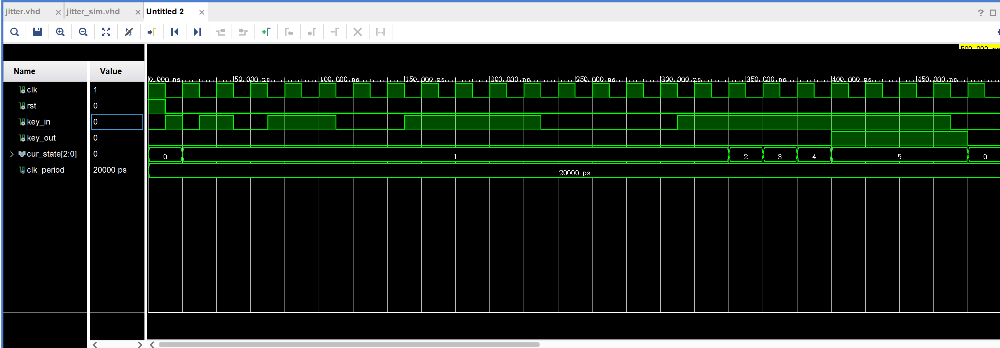
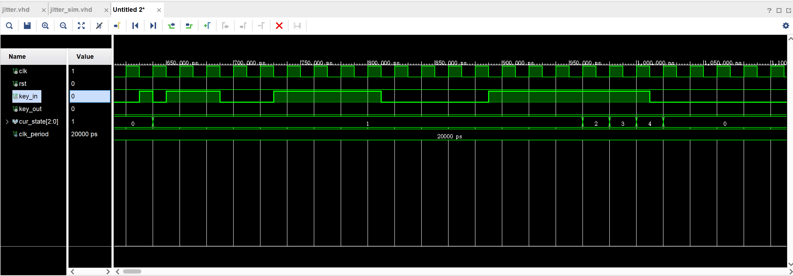

# 按键消抖电路设计
## 一、输入输出端口信号分析
+ 输入信号：clk, rst;
+ 输入信号：按键输入：key_in;  // key_in = 1 表示按下按键
+ 输出信号：按键输出：key_out;  // key_out = 1 表示有按键按下
+ 输出信号：系统状态：cur_state: // cur_state = "000" ~ "101" 分别对应状态 s0 ~ s5
## 二、系统状态分析
### 2.1 状态说明
+ S0: 初始状态；
+ S1: 延时状态；
+ S2: 延时结束状态；
+ S3: 按键检测状态；
+ S4: 按键输出状态；
+ S5: 按键预复位状态；

### 2.2 状态转移图


### 2.3 状态转移关系

1. 始态 S0，根据状态转移条件 key_in 决定是否进行状态转移，当检测到有按键按下时转移到 S1;
2. 状态 S1，无条件进行延时，只有当延时结束时状态转移到 S2;
3. 状态 S2，根据状态转移条件 key_in 决定是否进行状态转移，当检测到有按键按下时转移到 S3;
4. 状态 S3，根据状态转移条件 key_in 决定是否进行状态转移，当检测到有按键按下时转移到 S4;
5. 状态 S4，根据状态转移条件 key_in 决定是否进行状态转移，当检测到有按键按下时转移到 S5，并输出 key_out =  '1' 表示真正有按键按下;
6. 状态 S5，根据状态转移条件 key_in 决定是否进行状态转移，当 key_in = '0' 时表示一次按键结束复位到 S0, 否则仍是在按键中按键;

## 三、VHDL 描述
### 3.1 实体配置
```vhdl
library IEEE;
use IEEE.STD_LOGIC_1164.ALL;

entity jitter is
    generic(DelayClks: integer := 20);
    Port ( clk, rst, key_in : in STD_LOGIC;
           key_out : out bit;
           cur_state : out bit_vector(2 downto 0));
end jitter;

architecture Behavioral of jitter is
    type states is (s0, s1, s2, s3, s4, s5);
    signal state: states;
begin
    process (clk, rst, key_in)
    variable count: integer := DelayClks;  -- delay = DelayClks
    begin
        if(rst = '1') then
            state <= s0;
            cur_state <= "000";
        elsif(clk'event and clk = '1') then
            case state is
                when s0 =>
                    if(key_in = '1') then
                        state <= s1;
                        cur_state <= "001";
                    else null;
                    end if;
                when s1 =>
                    count := count - 1;
                    if (count = 0) then
                        count := DelayClks;
                        state <= s2;
                        cur_state <= "010";
                    else null;
                    end if;
                when s2 =>
                    if(key_in = '0') then
                        state <= s0;
                        cur_state <= "000";
                    else 
                        state <= s3;
                        cur_state <= "011";
                    end if;
                when s3 => 
                    if(key_in = '0') then
                        state <= s0;
                        cur_state <= "000";
                    else 
                        state <= s4;
                        cur_state <= "100";
                    end if;
                when s4 =>
                    if(key_in ='0') then
                        state <= s0;
                        cur_state <= "000";
                    else
                        state <= s5;
                        cur_state <= "101";
                        key_out <= '1';
                    end if;
               when s5 =>
                    if(key_in ='0') then
                        key_out <= '0';
                        state <= s0;
                        cur_state <= "000";
                    else null;
                    end if;
                end case;
         end if;
      end process;
end Behavioral;
```
### 3.2 仿真配置
+ **仿真 Pipline: 系统复位 $\Rightarrow$ 检测按键 $\Rightarrow$ 检测按键抖动**
``` vhdl
library IEEE;
use IEEE.STD_LOGIC_1164.ALL;

entity jitter_sim is
--  Port ( );
end jitter_sim;

architecture Behavioral of jitter_sim is

component jitter is
    generic(DelayClks: integer := 20);
    Port ( clk, rst, key_in : in STD_LOGIC;
           key_out : out bit;
           cur_state : out bit_vector(2 downto 0));
end component;

signal rst, key_in : std_logic := '0';
signal clk : std_logic := '1';
signal key_out : bit := '0';
signal cur_state : bit_vector(2 downto 0) := "000";
constant clk_period : time := 20 ns;

begin
    clk <= not clk after clk_period / 2;
    
    Instance: jitter generic map(16)
                port map(
                        clk => clk,
                        rst => rst,
                        key_in => key_in,
                        key_out => key_out,
                        cur_state => cur_state);
    
    process
        begin
            -- reset firstly
            rst <= '1';
            wait for clk_period / 2;
            rst <= '0';
            
            -- produce some signals to check pushing button
            key_in <= '1';
            wait for clk_period / 2;
            key_in <= '0';
            wait for clk_period / 2;
            -- delay
            for i in 0 to 3 loop
                key_in <= '1';
                wait for clk_period * (2 ** i);
                key_in <= '0';
                wait for clk_period * (2 ** i);
            end loop;
            
            -- produce some signals to check shake
            key_in <= '1';
            wait for clk_period / 2;
            key_in <= '0';
            wait for clk_period / 2;
            -- delay
            for i in 0 to 3 loop
                key_in <= '1';
                wait for clk_period * (2 * i);
                key_in <= '0';
                wait for clk_period * (2 * i);
            end loop;

   end process;
end Behavioral;
```
## 四、功能仿真结果与分析
### 4.1 检测按键按下



+ 从仿真结果可以看出，在系统初始化复位后，状态 cur_state = 0 (s0), 下一时钟周期检测 key_in = 1 信号，cur_state 转移到 s1, 之后进行延时 Delay = 16 Tclks, 延时结束后继续检测 key_in = 1进行状态迁移，通过 s2, s3, s4的多次确定，可以断定是一次按键按下，最终输出 key_out = 1 直到按键结束重新回到初始态 s0;

### 4.2 检测按键抖动



+ 从仿真结果可以看出，在系统初始化复位后，状态 cur_state = 0 (s0), 下一时钟周期检测 key_in = 1 信号，cur_state 转移到 s1, 之后进行延时 Delay = 16 Tclks, 延时结束后继续检测 key_in = 1进行状态迁移，经过 s2, s3 检测 key_in = 1 但是 s4 检测时 key_in = 0 表示无效按键，仍然属于是按键抖动，复位到 s0.
