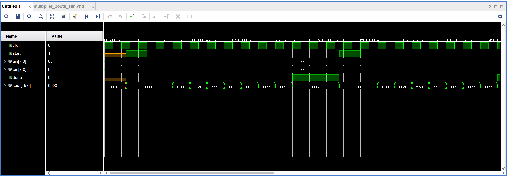

# 布斯乘法器设计
## 一、VHDL 描述
### 1.1 顶层模块设计
```vhdl
library IEEE;
use IEEE.STD_LOGIC_1164.ALL;
 
entity multiplier_booth is
    Port(
        clk,start:in std_logic;
        ain,bin:in std_logic_vector(7 downto 0);
        done:out std_logic;
        sout:inout std_logic_vector(15 downto 0)
    );
end multiplier_booth;
 
architecture Behavioral of multiplier_booth is
 
component multiplier_booth_ctrl
    Port (
        clk,start:in std_logic;
        clkout,rstall,done:out std_logic
     );
end component;
component multiplier_booth_8bitshiftreg
    Port (
        clk,load:in std_logic;
        din:in std_logic_vector(7 downto 0);
        qb0,qb1:out std_logic
     );
end component;
component multiplier_booth_16bitreg
    Port (
        clk,clr:in std_logic;
        d:in std_logic_vector(8 downto 0);
        q:out std_logic_vector(15 downto 0)
     );
end component;
component multiplier_booth_selector
    Port (
        clk,rst:in std_logic;
        a0,a1:in std_logic;
        din:in std_logic_vector(7 downto 0);
        dout:out std_logic_vector(7 downto 0)
     );
end component;
component multiplier_booth_8bitadder
    Port (
        clk,rst:in std_logic;
        ain,bin:in std_logic_vector(7 downto 0);
        sout:out std_logic_vector(8 downto 0)
     );
end component;
 
signal clk_line:std_logic;
signal rst_line:std_logic;
signal qb1_line,qb0_line:std_logic;
signal bin_line:std_logic_vector(7 downto 0);
signal sout_line:std_logic_vector(8 downto 0);
signal test_line:std_logic_vector(8 downto 0);
 
begin
multiplier_booth_ctrl_inst:multiplier_booth_ctrl port map(clk=>clk,start=>start,clkout=>clk_line,rstall=>rst_line,done=>done);
multiplier_booth_8bitshiftreg_inst:multiplier_booth_8bitshiftreg port map(clk=>clk_line,load=>rst_line,din=>ain,qb0=>qb0_line,qb1=>qb1_line);
multiplier_booth_16bitreg_inst:multiplier_booth_16bitreg port map(clk=>clk_line,clr=>rst_line,d=>sout_line,q=>sout);
multiplier_booth_selector_inst:multiplier_booth_selector port map(clk=>clk_line,rst=>rst_line,a0=>qb0_line,a1=>qb1_line,din=>bin,dout=>bin_line);
multiplier_booth_8bitadder_inst:multiplier_booth_8bitadder port map(clk=>clk_line,rst=>rst_line,ain=>sout(15 downto 8),bin=>bin_line,sout=>sout_line);
 
end Behavioral;
```
### 1.2 控制器设计

```vhdl
library IEEE;
use IEEE.STD_LOGIC_1164.ALL;
use IEEE.STD_LOGIC_UNSIGNED.ALL;
entity multiplier_booth_ctrl is
    Port (
        clk,start:in std_logic;
        clkout,rstall,done:out std_logic
     );
end multiplier_booth_ctrl;
 
architecture Behavioral of multiplier_booth_ctrl is
 
signal cnt4b:std_logic_vector(3 downto 0);
 
begin
 
process(clk,start)
begin
    rstall<=start;
    if(start='1')then cnt4b<="0000";
    elsif clk'event and clk='1'then if cnt4b<=8 then cnt4b<=cnt4b+1;end if;
    end if;
end process;
 
process(clk,cnt4b,start)
begin
    if (start='1')then
        clkout<='0';done<='0'; 
    elsif(start='0')then    
        if cnt4b<=8 then clkout<=clk;
        else clkout<='0';done<='1';
        end if; 
    end if;
end process;
 
end Behavioral;
```
### 1.3 8位移位寄存器设计
```vhdl
library IEEE;
use IEEE.STD_LOGIC_1164.ALL;
use IEEE.STD_LOGIC_UNSIGNED.ALL;
entity multiplier_booth_8bitshiftreg is
    Port (
        clk,load:in std_logic;
        din:in std_logic_vector(7 downto 0);
        qb0,qb1:out std_logic
     );
end multiplier_booth_8bitshiftreg;
 
architecture Behavioral of multiplier_booth_8bitshiftreg is
 
signal reg8b:std_logic_vector(8 downto 0);
 
begin
 
process(clk,load)
begin
    if load='1'then 
        if(din(7)='1')then reg8b(8 downto 1)<=(din(7)&(not din(6 downto 0)))+1;else reg8b(8 downto 1)<=din;end if;  --取补码
        reg8b(0)<='0';
        qb0<='0';qb1<='0';
    end if;
    if(load='0'and clk='1')then 
        qb0<=reg8b(0);
        qb1<=reg8b(1);
        reg8b(7 downto 0)<=reg8b(8 downto 1);
        reg8b(8)<='0';   
    end if;     
end process;
 
end Behavioral;
```
### 1.4 16 位锁存器设计

```vhdl
library IEEE;
use IEEE.STD_LOGIC_1164.ALL;
use IEEE.STD_LOGIC_UNSIGNED.ALL;
entity multiplier_booth_16bitreg is
    Port (
        clk,clr:in std_logic;
        d:in std_logic_vector(8 downto 0);
        q:out std_logic_vector(15 downto 0)
     );
end multiplier_booth_16bitreg;
 
architecture Behavioral of multiplier_booth_16bitreg is
 
begin
 
process(clk,clr)
variable sr16b:std_logic_vector(15 downto 0);
begin
    if clr='1'then
        sr16b:="0000000000000000";
    elsif(clr='0'and clk'event and clk='1')then  
        sr16b(15 downto 8):=d(7 downto 0);
        sr16b(14 downto 0):=sr16b(15 downto 1);
        sr16b(15):=d(8);    --移位复制符号位
    end if;   
    q<=sr16b;
end process;
 
end Behavioral;
```
### 1.5 8 位加法器设计

```vhdl
library IEEE;
use IEEE.STD_LOGIC_1164.ALL;
use IEEE.STD_LOGIC_UNSIGNED.ALL;
entity multiplier_booth_8bitadder is
    Port (
        clk,rst:in std_logic;
        ain,bin:in std_logic_vector(7 downto 0);
        sout:out std_logic_vector(8 downto 0)
     );
end multiplier_booth_8bitadder;
 
architecture Behavioral of multiplier_booth_8bitadder is
begin
 
process(clk,rst,ain,bin)
begin
    if(rst='1')then sout<="000000000";
    elsif(rst='0'and clk='0')then
        sout<=(ain(7) & ain)+(bin(7)  & bin);   --符号位扩展加法
    end if;
end process;
 
end Behavioral;
```

### 1.6 数据选择器设计

```vhdl
library IEEE;
use IEEE.STD_LOGIC_1164.ALL;
use IEEE.STD_LOGIC_UNSIGNED.ALL;
entity multiplier_booth_selector is
    Port (
        clk,rst:in std_logic;
        a0,a1:in std_logic;
        din:in std_logic_vector(7 downto 0);
        dout:out std_logic_vector(7 downto 0)
     );
end multiplier_booth_selector;
 
architecture Behavioral of multiplier_booth_selector is
 
begin
 
process(clk,a0,a1,din)
variable complement_x:std_logic_vector(7 downto 0);
variable complement_x_negative:std_logic_vector(7 downto 0);
begin
    if(rst='1')then dout<="00000000";
    elsif(rst='0'and clk'event and clk='0')then
        if(din(7)='1')then complement_x:=(din(7)&(not din(6 downto 0)))+1;else complement_x:=din;end if;    --取X补码
        if((not din(7))='1')then complement_x_negative:=((not din(7))&(not din(6 downto 0)))+1;else complement_x_negative:=(not din(7))&din(6 downto 0);end if; --取-X补码
        if(a1=a0)then dout<="00000000";
        elsif(a0='1'and a1='0')then dout<=complement_x;
        elsif(a0='0'and a1='1')then dout<=complement_x_negative;
        end if;
    end if;    
end process;
 
end Behavioral;
```

## 二、仿真配置
``` vhdl
library IEEE;
use IEEE.STD_LOGIC_1164.ALL;
 
entity multiplier_booth_sim is
--  Port ( );
end multiplier_booth_sim;
 
architecture Behavioral of multiplier_booth_sim is
component multiplier_booth
    Port(
        clk,start:in std_logic;
        ain,bin:in std_logic_vector(7 downto 0);
        done:out std_logic;
        sout:inout std_logic_vector(15 downto 0)
    );
end component;
signal clk,start: std_logic;
signal ain,bin: std_logic_vector(7 downto 0);
signal done: std_logic;
signal sout: std_logic_vector(15 downto 0);
begin
multiplier_booth_inst:multiplier_booth port map(clk,start,ain,bin,done,sout);
 
clock_gen:process
begin  
    clk<='1';
    wait for 10ns;
    clk<='0';
    wait for 10ns;
end process;
 
test:process
begin
    ain<="00000011";
    bin<="10000011";
    wait for 25ns;
    start<='1';
    wait for 25ns;
    start<='0';    
    wait for 200ns;
end process;
 
end Behavioral;
```
## 三、功能仿真结果与分析
### 3.1 仿真电路时序图



+ 从仿真结果可以看出，乘法器输入两个 8位原码数：a = 03H = 0000 0011B,  即 a = +3; b = 83H = 1000 0011B, 即 b = -3;
+ 计算完成后，done = 1, 输出计算结果 sout = FFF7H = [-9]补 = [1000 0000 0000 1001B]补 = 1111 1111 1111 0111B = FFF7H, 经验证结果计算正确；

### 3.2 电路连接关系图

