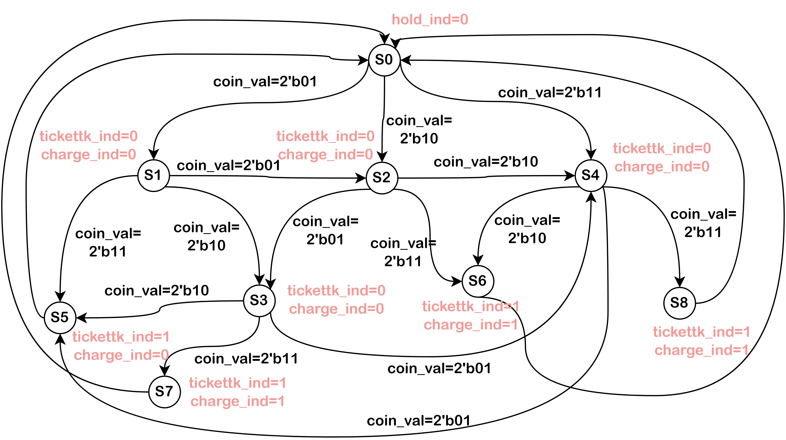
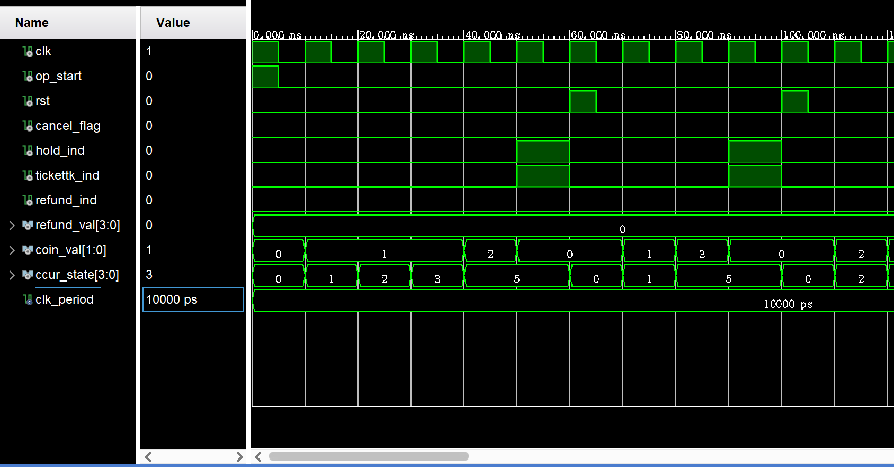
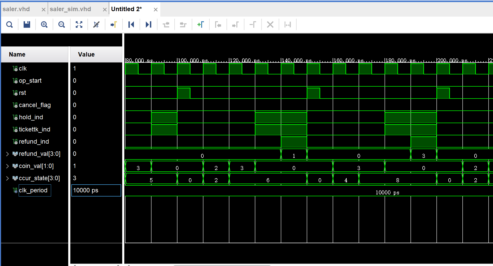
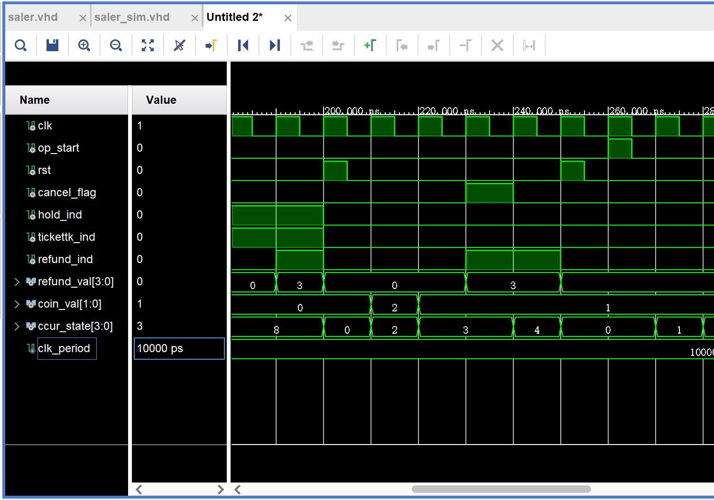

# 基于有限状态机的自动售票系统设计
## 一、输入输出端口信号分析
+ 输入信号：clk, rst;
+ 输入信号：操作开始：op_start;  // op_start = 1 开始操作
+ 输入信号：投币币值：coin_val;  // 2'b00 表示 0 元，2'b01 表示 5 元，2'b10 表示 10 元，2'b11表示 20 元；
+ 输入信号：取消操作指示：cancel_flag; // cancel_flag = 1 表示取消操作
+ 输出信号：机器是否可用：hold_ind;  // hold_ind = 0表示可以使用
+ 输出信号：取票信号：tickettk_ind;  // tickettk_ind = 1 表示取票
+ 输出信号：找零与退币标志：charge_ind;  // charge_ind = 1 表示找零
+ 输出信号：找零与退币币值：charge_val;  // 3'b000 表示找 5 元，3'b001 表示找 10 元，3'b010 表示找 15 元，3'b011 表示找 20 元，3'b100 表示找 25 元，3'b101 表示找 30 元，3'b110 表示找 35 元，3'b111 表示找 40 元；
## 二、系统状态分析
### 2.1 状态说明
+ S0: 初始状态；
+ S1: 已投币 5 元；
+ S2: 已投币 10 元；
+ S3: 已投币 15 元；
+ S4: 已投币 20 元；
+ S5: 已投币 25 元；
+ S6: 已投币 30 元；
+ S7: 已投币 35 元；
+ S8: 已投币 40 元；

### 2.2 状态转移图


### 2.3 状态转移关系

1. 始态 S0 (coin=0元)，根据状态转移条件 coin_val 分别转移到 S1(coin=5元)/S2(coin=10元)/S3(coin=15元);
2. 状态 S1(coin=5元)，根据状态转移条件 coin_val 分别转移到 S2(coin=10元)/S3(coin=15元)/S5(coin=25元);
3. 状态 S2(coin=10元)，根据状态转移条件 coin_val 分别转移到 S3(coin=15元)/S4(coin=20元)/S6(coin=30元);
4. 状态 S3(coin=15元)，根据状态转移条件 coin_val 分别转移到 S4(coin=20元)/S5(coin=25元)/S7(coin=35元);
5. 状态 S4(coin=20元)，根据状态转移条件 coin_val 分别转移到 S5(coin=25元)/S6(coin=30元)/S8(coin=40元);
6. 状态 S5(coin=25元)，无条件转移到始态 S0;
7. 状态 S6(coin=30元)，无条件转移到始态 S0;
8. 状态 S7(coin=35元)，无条件转移到始态 S0;
9. 状态 S8(coin=40元)，无条件转移到始态 S0;

### 2.4 系统工作流程

1. 在 S0 状态下，如果检测到 op_start = 1，开始检测是否有投币，如果有，一次新的售票操作开始；
2. 在状态 S1/S2/S3/S4 下，如果检测到 cancel_flag = 1，则取消操作，状态退回到 S0，并退回相应的币值，否则进行投币；
3. 在状态 S5 下，售票不找零；在状态 S6/S7/S8 下，售票并找零；
4. 在状态 S5/S6/S7/S8 操作完后，都返回状态 S0，等待下一轮新的操作开始；
5. 只有在 S0 状态下，hold_ind = 0，可以发起新一轮操作，其他状态都为 1.

## 三、VHDL语言描述

```vhdl
library IEEE;

entity saler is
    Port ( clk : in bit;
           rst : in bit;
           op_start : in bit;
           coin_val : in bit_vector(1 downto 0);
           cancel_flag : in bit;
           hold_ind : buffer bit;
           tickettk_ind : buffer bit;
           refund_ind : buffer bit;
           refund_val : buffer bit_vector(3 downto 0);
           ccur_state : buffer bit_vector(3 downto 0));
end saler;

architecture Behavioral of saler is

type states is (s0, s1, s2, s3, s4, s5, s6, s7, s8);
signal state: states;

begin
    saling_system: process(clk, rst, op_start, cancel_flag)
    begin
        -- start the saling system and initialize
        if(op_start = '1' or rst = '1') then
            state <= s0;
            tickettk_ind <= '0';
            refund_ind <= '0';
            refund_val <= "0000";
            hold_ind <= '0';
            ccur_state <= "0000";
        elsif(cancel_flag = '1') then     -- cancel the operations
        -- refund for canceling the operation
            case state is
                     when s1 => refund_val <= "0001";
                                refund_ind <= '1';
                     when s2 => refund_val <= "0010";
                                refund_ind <= '1';
                     when s3 => refund_val <= "0011";
                                refund_ind <= '1';
                     when s4 => refund_val <= "0100";
                                refund_ind <= '1';
                     when s5 => refund_val <= "0101";
                                refund_ind <= '1';
                     when s6 => refund_val <= "0110";
                                refund_ind <= '1';
                     when s7 => refund_val <= "0111";
                                refund_ind <= '1';
                     when s8 => refund_val <= "1000";
                                refund_ind <= '1';
                     when others => refund_val <= "0000";
                                refund_ind <= '0';
             end case;
        -- states transfer
        elsif(clk = '1' and hold_ind = '0') then     -- the machine is available        
            case state is
                when s0 => case coin_val is
                               when "01" => state <= s1;
                                   ccur_state <= "0001";
                               when "10" => state <= s2;
                                   ccur_state <= "0010";
                               when "11" => state <= s4;
                                    ccur_state <= "0100";
                               when others => state <= s0;
                                     ccur_state <= "0000";
                            end case;
                when s1 => case coin_val is
                               when "01" => state <= s2;
                                   ccur_state <= "0010";
                               when "10" => state <= s3;
                                    ccur_state <= "0011";
                               when "11" => state <= s5;
                                    ccur_state <= "0101";
                               when others => state <= s1;
                                    ccur_state <= "0001";
                            end case;        
                when s2 => case coin_val is
                               when "01" => state <= s3;
                                    ccur_state <= "0011";
                               when "10" => state <= s4;
                                    ccur_state <= "0100";
                               when "11" => state <= s6;
                                    ccur_state <= "0110";
                               when others => state <= s2;
                                    ccur_state <= "0010";
                            end case;
                when s3 => case coin_val is
                               when "01" => state <= s4;
                               ccur_state <= "0100";
                               when "10" => state <= s5;
                               ccur_state <= "0101";
                               when "11" => state <= s7;
                               ccur_state <= "0111";
                               when others => state <= s3;
                               ccur_state <= "0011";
                            end case;
                when s4 => case coin_val is
                               when "01" => state <= s5;
                               ccur_state <= "0101";
                               when "10" => state <= s6;
                               ccur_state <= "0110";
                               when "11" => state <= s8;
                               ccur_state <= "1000";
                               when others => state <= s1;
                               ccur_state <= "0001";
                            end case;
                when s5 => tickettk_ind <= '1';
                            hold_ind <= '1';
                when s6 => tickettk_ind <= '1';
                            hold_ind <= '1';
                when s7 => tickettk_ind <= '1';
                            hold_ind <= '1';
                when s8 => tickettk_ind <= '1';
                            hold_ind <= '1';
                when others => refund_ind <= '1';    -- uncommon state to refund and exit
                            hold_ind <= '1';
            end case;
        -- get the last states
        elsif(clk = '1' and tickettk_ind ='1') then
        -- refund for extra model
            case state is
                 when s6 => refund_val <= "0001";
                            refund_ind <= '1';
                 when s7 => refund_val <= "0010";
                            refund_ind <= '1';
                 when s8 => refund_val <= "0011";
                            refund_ind <= '1';
                 when others => refund_val <= "0000";
                            refund_ind <= '0';
             end case;
        end if;
    end process;
    
end Behavioral;
```
## 四、仿真配置
**仿真配置 Pipline: 系统启动 $\rightarrow$ 购票不找零$\rightarrow$ 购票找零$\rightarrow$ 取消操作**

```vhdl
library IEEE;
use IEEE.STD_LOGIC_1164.ALL;

entity saler_sim is
end saler_sim;

architecture Behavioral of saler_sim is

component saler is
    Port ( clk : in bit;
           rst : in bit;
           op_start : in bit;
           coin_val : in bit_vector(1 downto 0);
           cancel_flag : in bit;
           hold_ind : buffer bit;
           tickettk_ind : buffer bit;
           refund_ind : buffer bit;
           refund_val : buffer bit_vector(3 downto 0);
           ccur_state : buffer bit_vector(3 downto 0));
end component;

signal clk, rst, op_start, cancel_flag, hold_ind, tickettk_ind, refund_ind : bit := '0';
signal coin_val : bit_vector(1 downto 0) := "00";
signal refund_val, ccur_state : bit_vector(3 downto 0) := "0000";
constant clk_period : time := 10 ns;

begin
    UUT: saler port map(
            clk => clk,
            rst => rst,
            op_start => op_start,
            coin_val => coin_val,
            cancel_flag => cancel_flag,
            hold_ind => hold_ind,
            tickettk_ind => tickettk_ind,
            refund_ind => refund_ind,
            refund_val => refund_val,
            ccur_state => ccur_state );
    
    -- clk production
    process
        begin
            clk <= '1';
            wait for clk_period / 2;
            clk <= '0';
            wait for clk_period / 2;
    end process;
    

    
    process
        begin
            
            -- start the saling system
            op_start <= '1';
            wait for clk_period / 2;
            op_start <= '0';
            wait for clk_period / 2;
            
            -- check coining
            coin_val <= "01";
            wait for clk_period;
            coin_val <= "01";
            wait for clk_period;
            coin_val <= "01";
            wait for clk_period;
            coin_val <= "10";
            wait for clk_period;
            coin_val <= "00";
            wait for clk_period;
            
            -- reset
            rst <= '1';
            wait for clk_period / 2;
            rst <= '0';
            wait for clk_period / 2;
            
            -- check coining
            coin_val <= "01";
            wait for clk_period;
            coin_val <= "11";
            wait for clk_period;
            coin_val <= "00";
            wait for clk_period;
            
            -- reset
            rst <= '1';
            wait for clk_period / 2;
            rst <= '0';
            wait for clk_period / 2;
            
            -- check refund
            coin_val <= "10";
            wait for clk_period;
            coin_val <= "11";
            wait for clk_period;
            coin_val <= "00";
            wait for clk_period;
            coin_val <= "00";
            wait for clk_period;
            
            -- reset
            rst <= '1';
            wait for clk_period / 2;
            rst <= '0';
            wait for clk_period / 2;
            
            -- check refund
            coin_val <= "11";
            wait for clk_period;
            coin_val <= "11";
            wait for clk_period;
            coin_val <= "00";
            wait for clk_period;
            coin_val <= "00";
            wait for clk_period;
            
            -- reset
            rst <= '1';
            wait for clk_period / 2;
            rst <= '0';
            wait for clk_period / 2;
            
            -- check cancel
            coin_val <= "10";
            wait for clk_period;
            coin_val <= "01";
            wait for clk_period;
            cancel_flag <= '1';
            wait for clk_period;
            cancel_flag <= '0';
            wait for clk_period;
            
            -- rst
            rst <= '1';
            wait for clk_period / 2;
            rst <= '0';
            wait for clk_period / 2;
            
        end process;
end Behavioral;
```
## 五、测试代码编写、仿真与结果分析
### 5.1 买票不找零：5元 + 5元 + 5元 + 10元 / 5元 + 20元



+ 结果分析：
  + 5元 + 5元 + 5元 + 10元：从仿真结果可以看出，在 op_start 产生一个上升沿信号时，系统初始化并开始启动工作；coin_val = 1 (5元）持续三个 CLK，使得状态从 S0 迁移到 S3，再次 coin_val = 2（10元）使得状态迁移到 S5 (已投币25元)；下一个时钟周期检测到可以取票，此时设置系统被占用，并计算不找零；一轮操作结束后，系统异步复位初始化所有状态；
  + 5元 + 20元：系统复位后，coin_val = 1 (5元）、coin_val = 3 (20元）使得状态从 S0 迁移到 S1再迁移到 S5；下一个时钟周期检测到可以取票，此时设置系统被占用，并计算不找零；一轮操作结束后，系统异步复位初始化所有状态；

### 5.2 买票找零：10元 + 20元 / 20元 + 20元



+ 结果分析：
  + 10元 + 20元 ：从仿真结果可以看出，在系统复位后，coin_val = 2 (10元）、coin_val = 3 (20元）使得状态从 S0 迁移到 S2 再迁移到 S6；下一个时钟周期检测到可以取票，并计算需要找零，找零 refund_val=1（5元）；一轮操作结束后，系统异步复位初始化所有状态；
  + 20元 + 20元 ：从仿真结果可以看出，在系统复位后，coin_val = 3 (20元）持续两个CLK，使得状态从 S0 迁移到 S4 再迁移到 S8；下一个时钟周期检测到可以取票，并计算需要找零，找零 refund_val=3（15元）；一轮操作结束后，系统异步复位初始化所有状态；

### 5.3 取消操作并退款：10元+5元



+ 结果分析：
  + 10元 + 5元 ：从仿真结果可以看出，在系统复位后，coin_val = 2 (10元）、coin_val = 1 (5元）使得状态从 S0 迁移到 S2 再迁移到 S3；此时用户取消操作，使得cancel_flag = 1，则系统进行自动退款，退款refund_val = 3(15元）；下一个时钟周期对系统异步复位并初始化所有状态；
