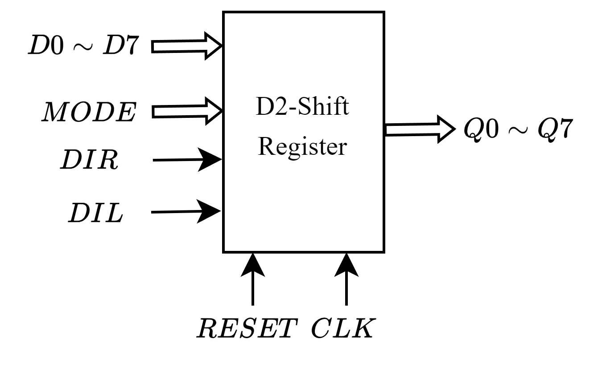
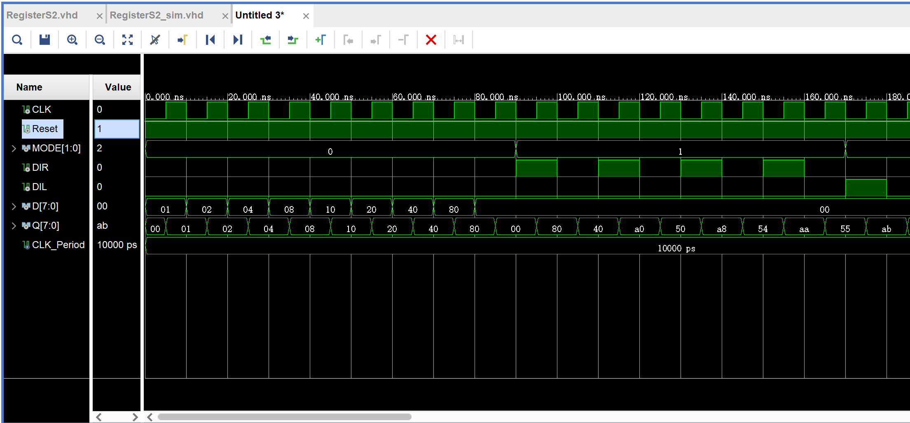
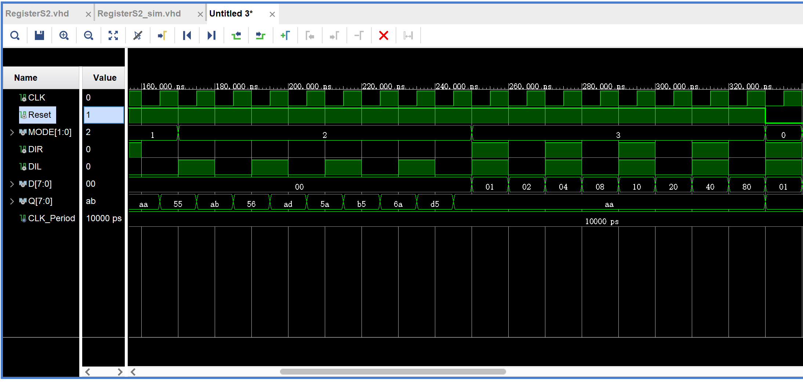
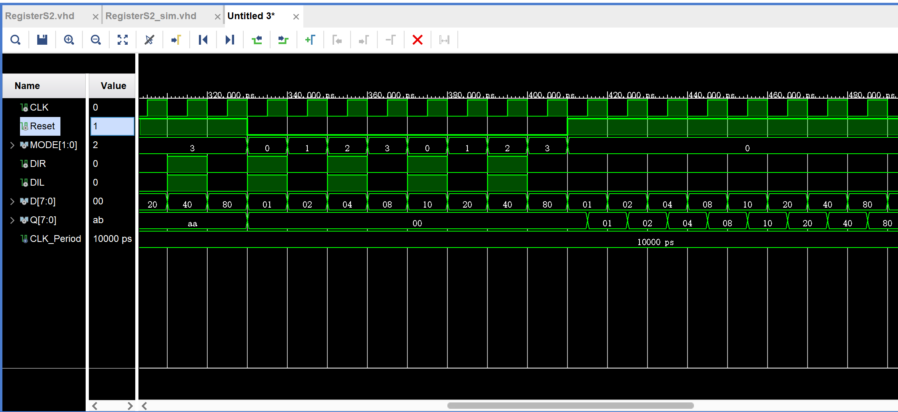

# 8 位双向移位寄存器
## 一、基本原理
### 1.1 模型结构
根据寄存器设计要求，统一其引脚的模型结构如下图所示：
<center></center>

### 1.2 功能设计
根据芯片结构以及引脚分配，可得 8 位双向移位寄存器的功能设计表，如下所示：
|CLK|RESET|MODE|工作状态|
|:----:|:----:|:----:|:----:|
|x|0|xx|复位|
|$\uparrow$|1|00|置数|
|$\uparrow$|1|01|右移|
|$\uparrow$|1|10|左移|
|x|1|11|保持|


## 二、VHDL描述
```vhdl
library IEEE;
use IEEE.STD_LOGIC_1164.ALL;

entity RegisterS2 is
    Port ( D : in bit_vector(7 downto 0);
           MODE : in bit_vector(1 downto 0);
           CLK : in bit;
           DIR : in bit;
           DIL : in bit;
           Reset : in bit;
           Q : buffer bit_vector(7 downto 0));
end RegisterS2;

architecture Behavioral of RegisterS2 is
begin  
    process(Reset, CLK, MODE, DIR, DIL)
        begin
            if Reset = '0' then Q <= "00000000";   -- clear Q
            elsif CLK'event and CLK = '1' then    -- keep with clk
                if MODE = "00" then           -- load D
                    Q <= D;
                elsif MODE = "01" then        -- right shift
                    for i in 7 downto 1 loop
                        Q(i-1) <= Q(i);
                    end loop;
                    Q(7) <= DIR;
                elsif MODE = "10" then        -- left shift
                    for i in 0 to 6 loop
                        Q(i+1) <= Q(i);
                    end loop;
                    Q(0) <= DIL;
                else                          -- keep Q
                    Q <= Q;
                end if;
            end if;
    end process;
end Behavioral;
```
## 三、仿真配置
**仿真配置 Pipline: 同步置数 $\rightarrow$ 同步右移$\rightarrow$ 同步左移$\rightarrow$ 状态保持$\rightarrow$ 异步清零**

```vhdl
library IEEE;
use IEEE.STD_LOGIC_1164.ALL;

entity RegisterS2_sim is
-- port()
end RegisterS2_sim;

architecture Behavioral of RegisterS2_sim is

component RegisterS2 is
    Port ( D : in bit_vector(7 downto 0);
           MODE : in bit_vector(1 downto 0);
           CLK : in bit;
           DIR : in bit;
           DIL : in bit;
           Reset : in bit;
           Q : buffer bit_vector(7 downto 0));
end component;

signal CLK, DIR, DIL, Reset : bit := '0';
signal D : bit_vector(7 downto 0) := "00000000";
signal MODE : bit_vector(1 downto 0) := "00";
signal Q : bit_vector(7 downto 0);
constant CLK_Period : time := 10 ns;

begin
    UUT: RegisterS2 port map(
            CLK => CLK,
            DIR => DIR,
            DIL => DIL,
            Reset => Reset,
            D => D,
            MODE => MODE,
            Q => Q );
            
    -- clk production
    process
        begin
            CLK <= '0';
            wait for CLK_Period / 2;
            CLK <= '1';
            wait for CLK_Period / 2;
    end process;
       
    -- register simulation
    process
        begin
            Reset <= '1';
            MODE <= "00";     -- load D
            for i in 0 to 8 loop
                D <= "00000000";
                if i < 8 then D(i) <= '1';
                end if;
                wait for CLK_Period;
            end loop;
            
            MODE <= "01";     -- right shift
            for i in 0 to 7 loop
                DIR <= not DIR;
                wait for CLK_Period;
            end loop;
            
            MODE <= "10";     -- left shift
            for i in 0 to 7 loop
                DIL <= not DIL;
                wait for CLK_Period;
            end loop;
            
            MODE <= "11";     -- keep Q
            for i in 0 to 7 loop
                D <= "00000000";
                D(i) <= '1';
                DIL <= not DIL;
                DIR <= not DIR;
                wait for CLK_Period;
            end loop;
            
            Reset <= '0';     -- clear Q
            for i in 0 to 7 loop
                D <= "00000000";
                D(i) <= '1';
                DIL <= not DIL;
                DIR <= not DIR;
                MODE(0) <= not MODE(0);
                MODE(1) <= MODE(1) XOR MODE(0);
                wait for CLK_Period;
            end loop;
    end process;
end Behavioral;
```

## 四、仿真结果及分析
### 4.1 同步置数、同步右移


+ 从功能仿真结果可以看出，当RESET=1、MODE=00时，进行同步置数，即 Q = D：

  在时钟上升沿 Q 状态都会获取输入的数据 D 进行更新；

+ 从功能仿真结果可以看出，当RESET=1、MODE=01时，进行同步右移：

  Q 始态 = 00H=00000000B，第一个时钟上升沿时，DIR=1，Q状态更新为 80H=10000000B，即右移一位输入串行数据 DIR，后各时钟周期同理；

### 4.2 同步左移、状态保持



+ 从功能仿真结果可以看出，当RESET=1、MODE=10时，进行同步左移：

  Q 始态 = 55H=01010101B，第一个时钟上升沿时，DIL=1，Q状态更新为 abH=10101011B，即左移一位输入串行数据 DIL，后各时钟周期同理；

+ 从功能仿真结果可以看出，当RESET=1、MODE=11时，进行状态保持，即 Q(n+1) = Q(n)：

  Q始态 = aaH，而后不论 DIR, DIL, D 数据如何变化，Q 始终保持最初的状态;

### 4.3 异步清零


+ 从功能仿真结果可以看出，当RESET=0时，进行异步清零：

  Q 始态 = aaH，当 Reset = 0 时，不论 MODE, DIR, DIL, D 数据如何变化，Q始终保持输出为全 0；
