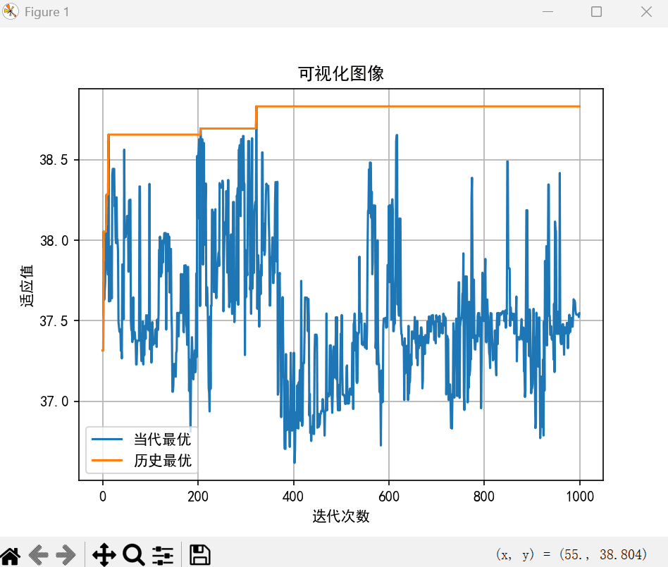

# 基本遗传算法大作业报告

## 一、题目

实现基本遗传算法，求解如下非线性优化问题，并输出类似的优化过程和结果图。要求按照基本原理进行编程，不准使用第三方进化算法库实现。

目标函数：

$\max f(x_1, x_2) = 21.5 + x_1 \cdot \sin(4\pi x_1) + x_2 \cdot \sin(20\pi x_2)$

约束条件：

$-3.0 \leq x_1 \leq 12.1 \\ 4.1 \leq x_2 \leq 5.8$

------

## 二、环境

- 编程语言：Python 3.x
- 使用库：`numpy`, `matplotlib`
- 开发环境： VS Code / PyCharm

------

## 三、算法原理

基本遗传算法（Genetic Algorithm, GA）模拟自然界进化过程，主要包括以下步骤：

1. **编码（Encoding）**：使用二进制编码将连续变量表示为染色体。
2. **初始化种群（Initialization）**：随机生成一定数量的染色体。
3. **适应度评估（Fitness Evaluation）**：根据目标函数计算每个染色体的适应度。
4. **选择（Selection）**：依据适应度值选择下一代父代个体（如轮盘赌算法）。
5. **交叉（Crossover）**：模拟生物遗传，交换两个个体部分基因。
6. **变异（Mutation）**：对个体的某些基因位随机翻转，保持多样性。
7. **终止条件**：达到最大代数或最优解。

------

## 四、Python 实现代码

详细代码如下：

```python
import numpy as np
import matplotlib.pyplot as plt

# 设置中文字体以防图中乱码
plt.rcParams['font.sans-serif'] = ['SimHei']
plt.rcParams['axes.unicode_minus'] = False

# 参数设定
x1_bounds = (-3.0, 12.1)
x2_bounds = (4.1, 5.8)
precision = 5
population_size = 100
generations = 1000
crossover_rate = 0.8
mutation_rate = 0.01

# 基因长度
x1_len = int(np.ceil(np.log2((x1_bounds[1] - x1_bounds[0]) / (10 ** -precision))))
x2_len = int(np.ceil(np.log2((x2_bounds[1] - x2_bounds[0]) / (10 ** -precision))))
total_len = x1_len + x2_len

def decode(chrom):
    x1_bin = chrom[:x1_len]
    x2_bin = chrom[x1_len:]
    x1 = x1_bounds[0] + int(x1_bin, 2) * (x1_bounds[1] - x1_bounds[0]) / (2 ** x1_len - 1)
    x2 = x2_bounds[0] + int(x2_bin, 2) * (x2_bounds[1] - x2_bounds[0]) / (2 ** x2_len - 1)
    return round(x1, precision), round(x2, precision)

def fitness(chrom):
    x1, x2 = decode(chrom)
    return 21.5 + x1 * np.sin(4 * np.pi * x1) + x2 * np.sin(20 * np.pi * x2)

def init_population():
    return [''.join(np.random.choice(['0', '1']) for _ in range(total_len)) for _ in range(population_size)]

def selection(pop, fitnesses):
    probs = fitnesses / fitnesses.sum()
    return list(np.random.choice(pop, size=population_size, p=probs))

def crossover(p1, p2):
    if np.random.rand() < crossover_rate:
        point = np.random.randint(1, total_len - 1)
        return p1[:point] + p2[point:], p2[:point] + p1[point:]
    else:
        return p1, p2

def mutate(chrom):
    return ''.join('1' if bit == '0' and np.random.rand() < mutation_rate else '0' if bit == '1' and np.random.rand() < mutation_rate else bit for bit in chrom)

pop = init_population()
best_fit_history = []
current_fit_history = []

best_chrom = None
best_fit = -np.inf

for gen in range(generations):
    fit_values = np.array([fitness(c) for c in pop])
    current_best = fit_values.max()
    current_fit_history.append(current_best)
    if current_best > best_fit:
        best_fit = current_best
        best_chrom = pop[np.argmax(fit_values)]
    best_fit_history.append(best_fit)

    selected = selection(pop, fit_values)
    next_gen = []
    for i in range(0, population_size, 2):
        c1, c2 = crossover(selected[i], selected[i+1])
        next_gen.extend([mutate(c1), mutate(c2)])
    pop = next_gen

x1_best, x2_best = decode(best_chrom)
print(f"最优解：x1 = {x1_best}, x2 = {x2_best}, 最大适应度 = {best_fit}")

# 绘图
plt.plot(current_fit_history, label="当代最优")
plt.plot(best_fit_history, label="历史最优")
plt.xlabel("迭代次数")
plt.ylabel("适应值")
plt.title("可视化图像")
plt.legend()
plt.grid(True)
plt.show()
```

------

## 五、结果分析

- **最优解 x1 ≈ x, x2 ≈ x，最优适应度 ≈ 38.8**（因初始种群随机性，结果略有变化）
- 从图像上可以看出，算法逐渐逼近全局最优值，表现出收敛趋势。
- 历史最优始终在上升或保持，当前最优有波动，说明 GA 保留最优个体。



------

## 六、总结

本实验使用基本遗传算法成功求解了一个具有多个极值的非线性优化问题。实验过程中实现了遗传算法的完整流程，包括编码、选择、交叉、变异等。结果表明，GA 能较好地解决复杂优化问题，具有一定的全局搜索能力。

------

## 七、改进方向

- 采用自适应交叉率和变异率提高搜索效率；
- 引入精英保留策略以避免最优个体被替换；
- 尝试其他编码方式如浮点编码以提高精度。

