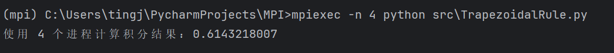

# README

使用命令行进行控制

## Test.py

测试函数

```commandline
mpiexec -n 4 python src\Test.py
```

需要使用 *cmd* 打开，而不使 *powershell*，否则找不到环境变量中的 *MPI*。
运行结果：


## TrapezoidalRule.py

### 被积函数定义
```python
def f(x):
    """默认被积函数"""
    return x * x
```

### 积分核心函数
```python
def trapezoidal_rule(a, b, n, func = f):
    """梯形法计算定积分"""
    h = (b - a) / n
    integral = (func(a) + func(b)) / 2.0
    for i in range(1, n):
        x = a + i * h
        integral += func(x)
    return integral * h
```
- 默认使用上文被积函数，调用时可以进行函数的指定。

### 主逻辑
```python
def main():
    # 获取通信器相关信息
    comm = MPI.COMM_WORLD
    rank = comm.Get_rank()
    size = comm.Get_size()

    # 定义积分区间和步数
    a = 0.0  # 积分下限
    b = 1.0  # 积分上限
    n = 1024  # 总的梯形数量

    # 确保梯形数量能被进程数整除
    if n % size != 0:
        if rank == 0:
            print("梯形数量必须能被进程数整除。")
        MPI.Finalize()
        return

    # 每个进程计算的梯形数量
    local_n = n // size
    h = (b - a) / n  # 步长

    # 每个进程的计算区间
    local_a = a + rank * local_n * h
    local_b = local_a + local_n * h

    # 每个进程计算其子区间的积分
    local_integral = trapezoidal_rule(local_a, local_b, local_n, lambda x: np.sin(x * x + x))

    # 所有进程将结果汇总到主进程
    total_integral = comm.reduce(local_integral, op=MPI.SUM, root=0)

    if rank == 0:
        print(f"使用 {size} 个进程计算积分结果：{total_integral:.10f}")
```


### 模块保护逻辑

```python
# 在作为模块导入时不运行 main 函数
if __name__ == "__main__":
    main()
```
\_\_name\_\_ 是一个内置变量，表示当前模块的名称。

如果模块是被直接运行的（如通过 python script.py 执行），\_\_name\_\_ 的值会被设置为 "\_\_name\_\_"。

如果模块是被其他模块导入的（如 import script），\_\_name\_\_ 的值会是模块的名字（如 "script"）。

### 运行结果

