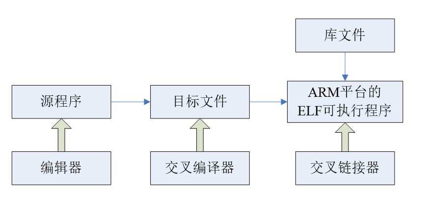
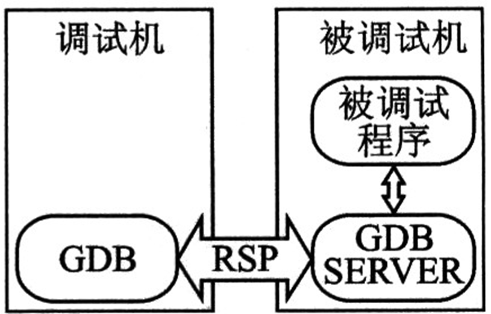
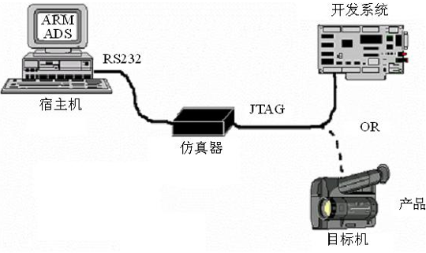

# 嵌入式程序设计——作业

## 第一次

1.什么是嵌入式系统，它具有哪些特点？从各方面比较嵌入式系统与通用计算机的区别

以应用为中心，以计算机技术为基础，软硬件在设计上量体裁衣，去除冗余，面向特定应用的专用计算机系统

特点：**嵌入式，专用性，计算机**
软硬件设计上尤其追求可靠性，性能和成本
软件代码尤其要求精简，高效，高质量，高可靠性

嵌入式系统的软件一般都固化在存储器芯片中或单片机本身，而不是存储于磁盘里
嵌入式系统本身一般不具有二次开发能力；用户通常不能在该平台直接对程序进行修改
智能手机，平板电脑模糊了他们两个的界限

2.嵌入式系统由哪些部分组成，常用的嵌入式操作系统有哪些，分别有什么特点？

一般包括以下三个方面：**硬件设备（hadware），嵌入式操作系统（embedded operating system）和应用软件（application）**

|                   Linux                   |                     标准内核裁剪                     |
| :---------------------------------------: | :--------------------------------------------------: |
|                 uC/OS-II                  | 开源，课抢先的硬实时内核，编译后不超过10KB（单片机） |
|                  VxWorks                  |                 实时嵌入式OS，不开源                 |
| Windows CE/ Windows Mobile/ Windows Phone |                                                      |
|                  Android                  |                                                      |
|                    iOs                    |                                                      |

3.CISC处理器和RISC处理器分别有哪些优点和缺点？

|      指标      |                             RISC                             |                             CISC                             |
| :------------: | :----------------------------------------------------------: | :----------------------------------------------------------: |
|     指令集     | 一个周期执行一条指令，通过简单指令的组合实现复杂操作；指令长度固定 |               指令长度不固定，执行需要多个周期               |
|     流水线     |                        每周期前进一步                        |             指令的执行需要调用微带吗的一个微程序             |
|     寄存器     |                        更多通用寄存器                        |                   用于特定目的的专用寄存器                   |
| Load/Store结构 |  独立的Load/Store指令完成数据在寄存器和外部存储器之间的传输  |               处理器能够直接处理存储器中的数据               |
|      缺点      | 采用硬连线的指令译码逻辑，开发更简单，容易实现高性能，但给优化编译程序带来困难 | 20%的简单指令使用率达到80% 指令长度不一，高性能VLSI实现难度大 微指令技术增加了硬件复杂度 |

4.什么是交叉编译？为什么要进行交叉编译？

嵌入式软件开发所采用的编译为交叉编译。所谓交叉编译就是在一个平台上生成可以在另一个平台上执行的代码。编译的最主要的工作就在将程序转化成运行该程序的CPU所能识别的机器代码，由于不同的体系结构有不同的指令系统。因此，不同的CPU需要有相应的编译器，而交叉编译就如同翻译一样，把相同的程序代码翻译成不同CPU的对应可执行二进制文件。要注意的是，编译器本身也是程序，也要在与之对应的某一个CPU平台上运行。

这里一般将进行交叉编译的主机称为宿主机，也就是普通的通用PC，而将程序实际的运行环境称为目标机，也就是嵌入式系统环境。由于一般通用计算机拥有非常丰富的系统资源、使用方便的集成开发环境和调试工具等，而嵌入式系统的系统资源非常紧缺，无法在其上运行相关的编译工具，因此，嵌入式系统的开发需要借助宿主机（通用计算机）来编译出目标机的可执行代码。

由于编译的过程包括编译、链接等几个阶段，因此，嵌入式的交叉编译也包括交叉编译、交叉链接等过程，通常ARM的交叉编译器为arm-elf-gcc、arm-linux-gcc等，交叉链接器为arm-elf-ld、arm-linux-ld等

5.嵌入式开发的常用调试手段有哪几种？说出它们各自的优缺点。

交叉调试：软件方式
Gdb server作为调试桩运行在目标机上，Gdb client运行在宿主机上，二者通过串口，网卡(tcp/ip）通信，通信协议为标准的gdb远程串行协议RSP
只能用于调试运行于目标操作系统之上的应用程序，不宜用来调试内核代码及启动代码

交叉调试：硬件方式
硬件直接支持远程调试：监视内存、寄存器、设置断点
优点：对目标机性能影响小、可调试代码范围广
缺点：依赖于芯片厂商
ICE：In-Circuit Emulator
ICD:  In-Circuit Debugger

