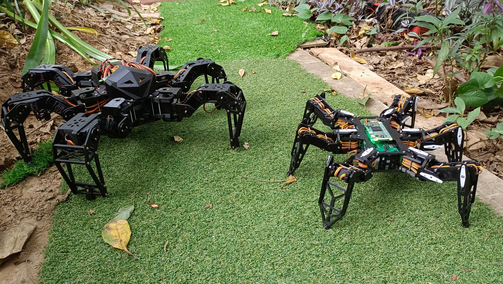
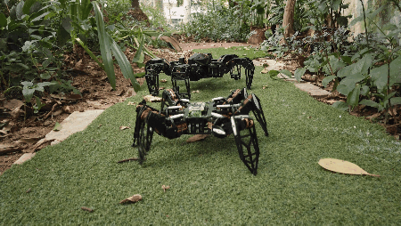
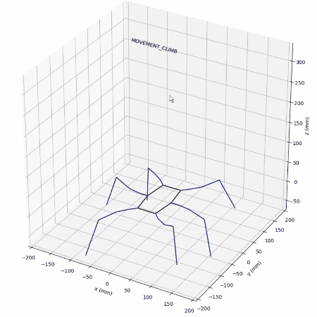

<div align="center">



# PiHexa V1

**使用树莓派 Zero 2 W 和 Python 的六足机器人项目**

[](README.md)

</div>

---

## 📋 目录

- [PiHexa V1](#pihexa-v1)
  - [📋 目录](#-目录)
  - [⚙️ 树莓派 Zero 2 W 设置](#️-树莓派-zero-2-w-设置)
  - [🚀 运行主程序](#-运行主程序)
  - [🎬 动画演示](#-动画演示)
  - [📖 项目简介](#-项目简介)
  - [🎥 演示视频](#-演示视频)
  - [🚀 新项目：ESP32 六足机器人](#-新项目esp32-六足机器人)
    - [主要改进：](#主要改进)

---

## ⚙️ 树莓派 Zero 2 W 设置

在树莓派操作系统已安装的前提下：

- 通过 `/etc/wpa_supplicant.conf` 文件配置 WIFI 连接
- 使树莓派（蓝牙）可被发现并配对
- 启用 I2C 接口用于 PCA9685 通信
- 开启 SSH 用于调试

---

## 🚀 运行主程序

在树莓派上运行此脚本：

```bash
sudo cd ~/PiHexa18/pihexa && python3 running.py
```

<div align="center">



</div>

---

## 🎬 动画演示

在安装了 matplotlib 和 pynput 的 PC 上运行此脚本，然后您可以通过按计算机键盘上的不同键来切换虚拟六足机器人的行走模式：

```bash
python pihexa/animate.py
```

**观看此视频了解更多：** [用Python写一个步态动画展示程序](https://www.bilibili.com/video/BV1a64y187wR)

<div align="center">



</div>

---

## 📖 项目简介

- 本项目是 [hexapod-v2-7697](https://github.com/SmallpTsai/hexapod-v2-7697) 项目的 Python 版本，该项目使用 C++ 编写。我修改了尺寸和结构，并重新设计了 PCB
- **遥控**通过 `树莓派 Zero 2 W` 的 `BLE` 实现
- 它有 6 条腿，每条腿有 3 个关节。所以总共有 `18` 个**舵机**（目前仅支持国华 `A0090`、JX `PDI1181MG`，未来将支持 TowerPro `MG92B`）
- 使用 2 个 NXP `PCA9685` 来控制这些舵机
- **电源**来自 `2S 锂电池 (7.4v)`。还使用了 7 个 `mini360 DC-DC` 降压稳压器。一个为树莓派提供 `5V`，其他六个为每条腿提供 `5V`（1 个 mini360 服务 3 个舵机）
- **机身**是 3D 打印的 PLA。我使用 `Anycubic i3 Mega S`
- 所有内容（3D STL、PCB 原理图、Python 源代码）都在 **GPL 许可证**下包含在项目中，祝您制作愉快！

---

## 🎥 演示视频

- [Bilibili: 开源树莓派Python编程六足机器人功能介绍和运动测试](https://www.bilibili.com/video/BV1Pg411N7Cg/)
- [YouTube: Open Source Hexapod using Raspberry Pi Zero 2 W and Python](https://www.youtube.com/watch?v=hejPARfBBR8&t=43s)

---

## 🚀 新项目：ESP32 六足机器人

**正在寻找升级版本？** 查看我最新使用 **ESP32** 驱动的六足机器人项目，具有改进的硬件设计和增强的性能！

🔗 **[ESP32 六足机器人项目](https://github.com/ViolinLee/NodeHexa)**

### 主要改进：

- **ESP32** 主控制器，提供更好的性能和连接性
- **升级的硬件设计**，改进的舵机控制
- **更好的电源管理**和效率
- **更响应**的实时控制

---

<div align="center">

**祝您制作愉快！🤖**

</div>
