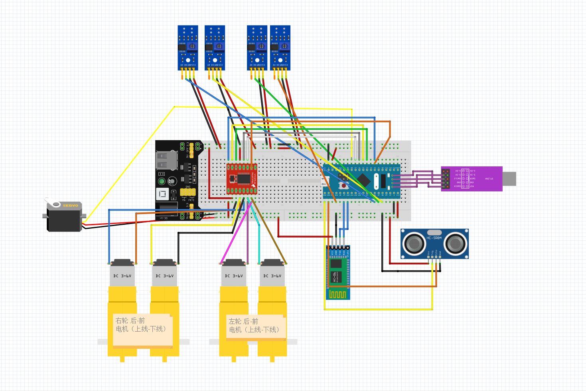
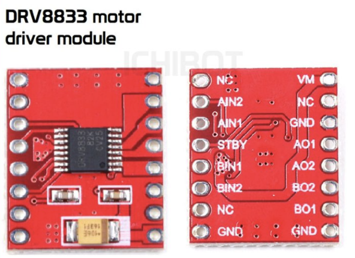
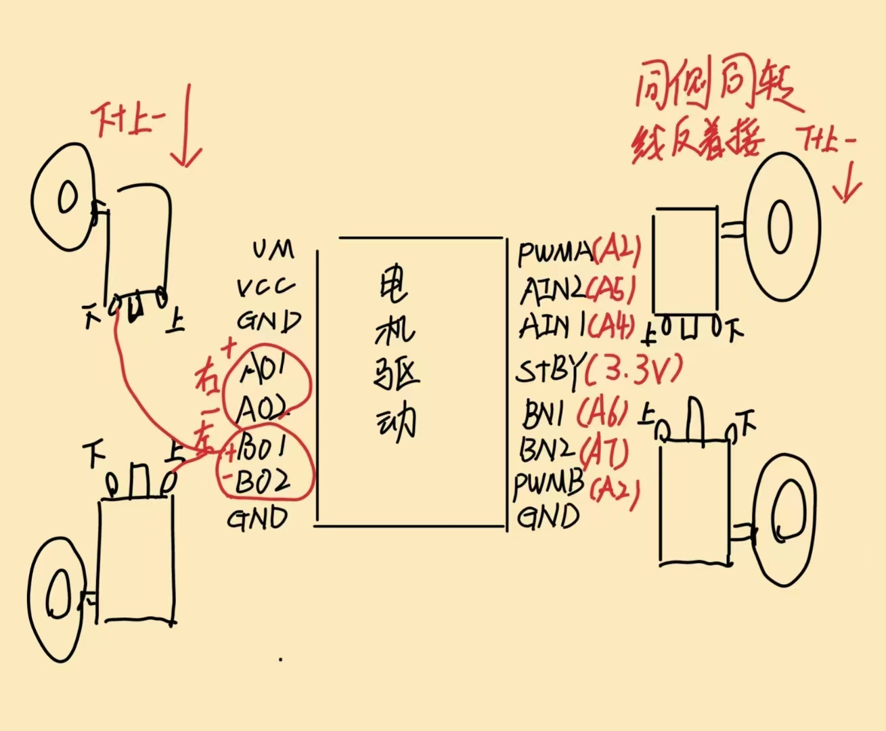
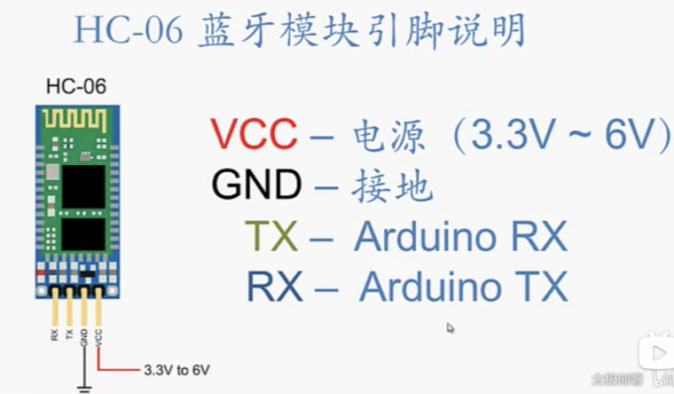
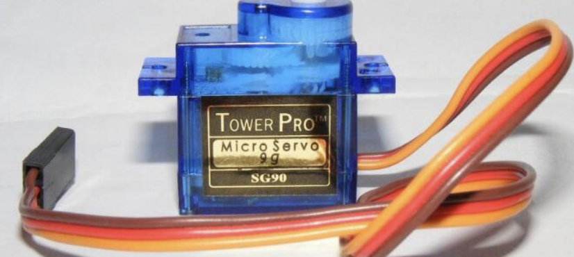
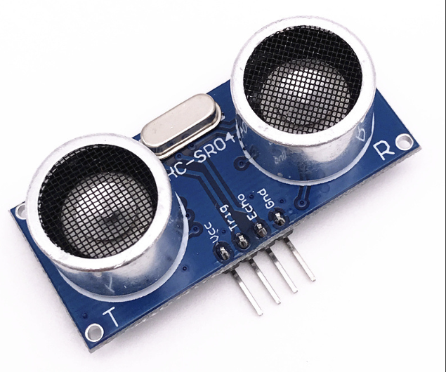
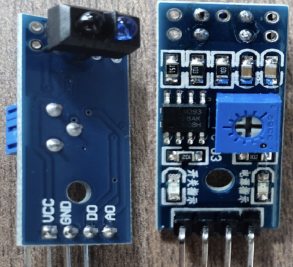

# 基于STM32的小车设计

## 前置准备

需要学习stm32，建议B站江科大的视频，本次综合实践的大部分代码也是从江科大的代码修改而来

软件使用Keli5，开发语言C语言，手机连接蓝牙软件是蓝牙调试器

### 元件购买

stm32F103c8t6芯片

ST-LINK烧录器

小车模块（带直流电机）

面包板（9*15及以上最好）

面包板黑板电源模块（需要DC口或者USB转USB口供电）

DC口5号4节装电池盒（给电源模块供电，也可以用充电宝）

3.3V稳压模块（普通电池盒供电，无面包板供电模块时需要）

超声波测距模块HC-SR04（1个）

SG90舵机（1个）

超声波测距模块云台（1个）

DRV8833电机驱动模块（或者TB6612电机驱动）（1个）

循迹模块TCRT5000（4个及以上）

蓝牙串口透传模块HC-06（1个）

3种杜邦线若干（非常多）

两边开口的连接线（接地接电方便，还可以接电机）

黑色胶布（循迹）

排针排母（看情况）

小灯和开关（学习stm32时好用，可有可无）

电烙铁及焊锡，胶枪，万用表（看情况和需求，不一定要用）

## 功能实现

### 接线图

	

### PWN驱动电机旋转

电机驱动使用DRV8833

	

	

我们要使用定时器(TIM) 2的通道(Channel) 2，使用PWMA控制左边两个轮子，PWMB控制右边两个轮子

这里使用pa4、pa5、pa6、pa7 做控制四个电机，根据Aspet的值控制左边与右边的轮子

```c
void Motor_SetSpeed(unsigned char Aspet,int8_t Speed)
{
	if(Aspet == 1)
	{
		if(Speed > 0)
		{
			GPIO_SetBits(GPIOA, GPIO_Pin_6);
			GPIO_ResetBits(GPIOA, GPIO_Pin_7);
			PWM_SetCompare(3,Speed);
		}else
		{
			GPIO_ResetBits(GPIOA, GPIO_Pin_6);
			GPIO_SetBits(GPIOA, GPIO_Pin_7);
			PWM_SetCompare(3,-Speed);
		}
	}else if(Aspet == 2)
	{
		if(Speed > 0)
		{
			GPIO_SetBits(GPIOA, GPIO_Pin_4);
			GPIO_ResetBits(GPIOA, GPIO_Pin_5);
			PWM_SetCompare(2,Speed);
		}else
		{
			GPIO_ResetBits(GPIOA, GPIO_Pin_4);
			GPIO_SetBits(GPIOA, GPIO_Pin_5);
			PWM_SetCompare(2,-Speed);
		}
	}
}
```

根据Motor_SetSpeed的Speed参数正负值控制前进与后退、Aspet控制左轮与右轮，新建一个车模块，封装前进、后退、左拐、右拐、后左拐、后右拐等功能。

```c
void Car_Init(void){
	Motor_Init();
}
void Go_Ahead(void){
	Motor_SetSpeed(1,50);
	Motor_SetSpeed(2,50);
}
void Go_Back(void){
	Motor_SetSpeed(1,-50);
	Motor_SetSpeed(2,-50);
}
void Turn_Left(void){
	Motor_SetSpeed(1,0);
	Motor_SetSpeed(2,90);
}
void Turn_Right(void){
	Motor_SetSpeed(2,0);
	Motor_SetSpeed(1,90);
	
}
void Self_Left(void){
	Motor_SetSpeed(1,-90);
	Motor_SetSpeed(2,90);
}
void Self_Right(void){
	Motor_SetSpeed(1,90);
	Motor_SetSpeed(2,-90);
}
void Car_Stop(void){
	Motor_SetSpeed(1,0);
	Motor_SetSpeed(2,0);
}
```

### 蓝牙模块

	

串口通信里面，tx发送信息，rx接受信息，这里我使用了pa9口作为tx，pa10作为rx

要注意，蓝牙的TX接RX（pa10），RX接TX（pa9）

```c
void Serial_Init(void)
{
	RCC_APB2PeriphClockCmd(RCC_APB2Periph_USART1, ENABLE);
	RCC_APB2PeriphClockCmd(RCC_APB2Periph_GPIOA, ENABLE);
	

GPIO_InitTypeDef GPIO_InitStructure;
GPIO_InitStructure.GPIO_Mode = GPIO_Mode_AF_PP;
GPIO_InitStructure.GPIO_Pin = GPIO_Pin_9;//TX
GPIO_InitStructure.GPIO_Speed = GPIO_Speed_50MHz;
GPIO_Init(GPIOA, &GPIO_InitStructure);

GPIO_InitStructure.GPIO_Mode = GPIO_Mode_IPU;
GPIO_InitStructure.GPIO_Pin = GPIO_Pin_10;//RX
GPIO_InitStructure.GPIO_Speed = GPIO_Speed_50MHz;
GPIO_Init(GPIOA, &GPIO_InitStructure);

USART_InitTypeDef USART_InitStructure;
USART_InitStructure.USART_BaudRate = 9600;
USART_InitStructure.USART_HardwareFlowControl = USART_HardwareFlowControl_None;
USART_InitStructure.USART_Mode = USART_Mode_Tx | USART_Mode_Rx;
USART_InitStructure.USART_Parity = USART_Parity_No;
USART_InitStructure.USART_StopBits = USART_StopBits_1;
USART_InitStructure.USART_WordLength = USART_WordLength_8b;
USART_Init(USART1, &USART_InitStructure);

USART_ITConfig(USART1, USART_IT_RXNE, ENABLE);

NVIC_PriorityGroupConfig(NVIC_PriorityGroup_2);

NVIC_InitTypeDef NVIC_InitStructure;
NVIC_InitStructure.NVIC_IRQChannel = USART1_IRQn;
NVIC_InitStructure.NVIC_IRQChannelCmd = ENABLE;
NVIC_InitStructure.NVIC_IRQChannelPreemptionPriority = 1;
NVIC_InitStructure.NVIC_IRQChannelSubPriority = 1;
NVIC_Init(&NVIC_InitStructure);

USART_Cmd(USART1, ENABLE);

}
```

然后通过发送指定命令遥控

### 自动避障

舵机与超声波模块联合使用，实现检查前面是否有障碍物，如有，左拐或右拐，如果遇到死胡同（前左右都有障碍物）停下来

	

#### 舵机定义：PB0口，定时器3

```c
void PWMServo_Init(void)
{

RCC_APB2PeriphClockCmd(RCC_APB2Periph_GPIOB, ENABLE);
RCC_APB1PeriphClockCmd(RCC_APB1Periph_TIM3, ENABLE);
GPIO_InitTypeDef GPIO_InitStructure;
GPIO_InitStructure.GPIO_Mode = GPIO_Mode_AF_PP;
GPIO_InitStructure.GPIO_Pin = GPIO_Pin_0;
GPIO_InitStructure.GPIO_Speed = GPIO_Speed_50MHz;
GPIO_Init(GPIOB, &GPIO_InitStructure);

TIM_InternalClockConfig(TIM3);

TIM_TimeBaseInitTypeDef TIM_TimeBaseInitStructure;
TIM_TimeBaseInitStructure.TIM_ClockDivision = TIM_CKD_DIV1;
TIM_TimeBaseInitStructure.TIM_CounterMode = TIM_CounterMode_Up;
TIM_TimeBaseInitStructure.TIM_Period = 20000 - 1;  
TIM_TimeBaseInitStructure.TIM_Prescaler = 72 - 1; 
TIM_TimeBaseInitStructure.TIM_RepetitionCounter = 0;
TIM_TimeBaseInit(TIM3, &TIM_TimeBaseInitStructure);

TIM_OCInitTypeDef TIM_OCInitStructure;
TIM_OCStructInit(&TIM_OCInitStructure);
TIM_OCInitStructure.TIM_OCMode = TIM_OCMode_PWM1;
TIM_OCInitStructure.TIM_OCPolarity = TIM_OCPolarity_High; 
TIM_OCInitStructure.TIM_OutputState = TIM_OutputState_Enable;
TIM_OCInitStructure.TIM_Pulse = 0;
TIM_OC3Init(TIM3, &TIM_OCInitStructure);

TIM_Cmd(TIM3, ENABLE);

}

void PWMServo_SetCompare3(uint16_t Compare)
{
	TIM_SetCompare3(TIM3, Compare); 

}
```

#### 舵机初始化封装和转弯角度

这里就直接使用江科大给出的计算公式就行

```c
void Servo_Init(void)
{
	PWMServo_Init();
}

void Servo_SetAngle(float Angle)
{
	PWMServo_SetCompare3(Angle / 180 * 2000 + 500);
}
```

#### 超声波模块

	

使用PB12口，具体原理可见[此文章](https://blog.csdn.net/qq_52900974/article/details/128324980)

```c
uint16_t Cnt;
uint16_t OverCnt;
void Ultrasound_Init(void)
{
	RCC_APB1PeriphClockCmd(RCC_APB1Periph_TIM4, ENABLE);
	RCC_APB2PeriphClockCmd(RCC_APB2Periph_GPIOB, ENABLE);
	

GPIO_InitTypeDef GPIO_InitStructure;
GPIO_InitStructure.GPIO_Mode = GPIO_Mode_Out_PP; // trig
GPIO_InitStructure.GPIO_Pin = GPIO_Pin_12;
GPIO_InitStructure.GPIO_Speed = GPIO_Speed_50MHz;
GPIO_Init(GPIOB, &GPIO_InitStructure);

GPIO_InitStructure.GPIO_Mode = GPIO_Mode_IPD; // echo
GPIO_InitStructure.GPIO_Pin = GPIO_Pin_13;
GPIO_InitStructure.GPIO_Speed = GPIO_Speed_50MHz;
GPIO_Init(GPIOB, &GPIO_InitStructure);

TIM_InternalClockConfig(TIM4);
TIM_TimeBaseInitTypeDef TIM_TimeBaseInitStructure;
TIM_TimeBaseInitStructure.TIM_ClockDivision = TIM_CKD_DIV1;
TIM_TimeBaseInitStructure.TIM_CounterMode = TIM_CounterMode_Up;
TIM_TimeBaseInitStructure.TIM_Period = 60000 - 1; // arr
TIM_TimeBaseInitStructure.TIM_Prescaler = 72 - 1; // psc
TIM_TimeBaseInitStructure.TIM_RepetitionCounter = 0;
TIM_TimeBaseInit(TIM4, &TIM_TimeBaseInitStructure);

}
```

检测函数

```c
float Test_Distance()
{
	GPIO_SetBits(GPIOB, GPIO_Pin_12);
	Delay_us(20);
	GPIO_ResetBits(GPIOB, GPIO_Pin_12);
	

while(GPIO_ReadInputDataBit(GPIOB, GPIO_Pin_13) == RESET){};
TIM_Cmd(TIM4, ENABLE);
while(GPIO_ReadInputDataBit(GPIOB, GPIO_Pin_13) == SET){};
TIM_Cmd(TIM4, DISABLE);
	
Cnt = TIM_GetCounter(TIM4);
float distance = (Cnt * 1.0 / 10 * 0.34) / 2;
TIM4->CNT = 0;
Delay_us(100);
return distance;

}
```

#### 自动避障代码

```c
 Go_Ahead();  // 向前走
    uint16_t front = Test_Distance();
    Serial_SendNumber(front, 3);

if(front < 15) {
    Car_Stop();
    Delay_ms(300);

    uint8_t best_angle = 90;
    uint16_t max_dist = 0;

    // 从左到右扫描（45°~135°）
    for(uint8_t angle = 45; angle <= 135; angle += 15){
        Servo_SetAngle(angle);
        Delay_ms(300);
        uint16_t dist = Test_Distance();
        Serial_SendNumber(dist, 3);
        if(dist > max_dist){
            max_dist = dist;
            best_angle = angle;
        }
    }

    if(max_dist > 15) {
        Servo_SetAngle(best_angle);
        Delay_ms(300);

        if(best_angle < 85){
            Turn_Left();  // 如果舵机方向偏左，小车也左转
            Delay_ms(600);
        } else if(best_angle > 95){
            Turn_Right(); // 偏右，小车右转
            Delay_ms(600);
        }

        Go_Ahead();
    } else {
        // 左右都不通，执行后退 + 原地右转
        Go_Back();
        Delay_ms(800);
        Self_Right();
        Delay_ms(800);
        Go_Ahead();
    }
}

Delay_ms(100);
break;

}
```

### 自动循迹

#### 寻迹模块使用的红外

	

使用的PB5到PB8口，然后使用GPIO_ReadInputDataBit 读取信号，也就是0或1 ，0代表没有检测到黑线，1代表检测到黑线

```c
// 寻迹模块
void Track_Init(void)
{
	RCC_APB2PeriphClockCmd(RCC_APB2Periph_GPIOB, ENABLE);
	

GPIO_InitTypeDef GPIO_InitStructure;
GPIO_InitStructure.GPIO_Mode = GPIO_Mode_IN_FLOATING;
GPIO_InitStructure.GPIO_Pin = GPIO_Pin_5 | GPIO_Pin_7 | GPIO_Pin_8 | GPIO_Pin_6;
GPIO_InitStructure.GPIO_Speed = GPIO_Speed_50MHz;
GPIO_Init(GPIOB, &GPIO_InitStructure);

}
```

#### 检测原理

主流策略是检测到黑线，红外光被吸收无返回，车辆前进

红外检测要放在偏中间位置

但是为了显示不同，我们用检测不到红线前进，红外检测放在两边

只有黑线在车中间时前进，偏离再调整

缺点就是不如检测黑线前进稳定，容易出去继续前进

```c
if(GPIO_ReadInputDataBit(GPIOB,GPIO_Pin_8)==0&&
                    GPIO_ReadInputDataBit(GPIOB,GPIO_Pin_6)==0&&
                    GPIO_ReadInputDataBit(GPIOB,GPIO_Pin_7)==0&&
                    GPIO_ReadInputDataBit(GPIOB,GPIO_Pin_15)==0)
                {
                    Go_Ahead();
                }else if(GPIO_ReadInputDataBit(GPIOB,GPIO_Pin_8)==1&&
                    GPIO_ReadInputDataBit(GPIOB,GPIO_Pin_6)==1&&
                    GPIO_ReadInputDataBit(GPIOB,GPIO_Pin_7)==1&&
                    GPIO_ReadInputDataBit(GPIOB,GPIO_Pin_15)==1){
                    Car_Stop();
                }else if(GPIO_ReadInputDataBit(GPIOB,GPIO_Pin_8)==0&&
                    GPIO_ReadInputDataBit(GPIOB,GPIO_Pin_6)==0&&
                    GPIO_ReadInputDataBit(GPIOB,GPIO_Pin_7)==1&&
                    GPIO_ReadInputDataBit(GPIOB,GPIO_Pin_15)==1){
                        Self_Right();
                }else if(GPIO_ReadInputDataBit(GPIOB,GPIO_Pin_8)==0&&
                    GPIO_ReadInputDataBit(GPIOB,GPIO_Pin_6)==0&&
                    GPIO_ReadInputDataBit(GPIOB,GPIO_Pin_7)==1&&
                    GPIO_ReadInputDataBit(GPIOB,GPIO_Pin_15)==0){
                        Turn_Right();
                }else if(GPIO_ReadInputDataBit(GPIOB,GPIO_Pin_8)==0&&
                    GPIO_ReadInputDataBit(GPIOB,GPIO_Pin_6)==0&&
                    GPIO_ReadInputDataBit(GPIOB,GPIO_Pin_7)==0&&
                    GPIO_ReadInputDataBit(GPIOB,GPIO_Pin_15)==1){
                        Turn_Right();
                    }
                    else if(GPIO_ReadInputDataBit(GPIOB,GPIO_Pin_8)==0&&
                    GPIO_ReadInputDataBit(GPIOB,GPIO_Pin_6)==1&&
                    GPIO_ReadInputDataBit(GPIOB,GPIO_Pin_7)==0&&
                    GPIO_ReadInputDataBit(GPIOB,GPIO_Pin_15)==0){
                        Turn_Left();
                    }else if(GPIO_ReadInputDataBit(GPIOB,GPIO_Pin_8)==1&&
                    GPIO_ReadInputDataBit(GPIOB,GPIO_Pin_6)==1&&
                    GPIO_ReadInputDataBit(GPIOB,GPIO_Pin_7)==0&&
                    GPIO_ReadInputDataBit(GPIOB,GPIO_Pin_15)==0){
                        Self_Left();
                    }else if(GPIO_ReadInputDataBit(GPIOB,GPIO_Pin_8)==1&&
                    GPIO_ReadInputDataBit(GPIOB,GPIO_Pin_6)==0&&
                    GPIO_ReadInputDataBit(GPIOB,GPIO_Pin_7)==0&&
                    GPIO_ReadInputDataBit(GPIOB,GPIO_Pin_15)==0){
                        Turn_Left();
                    }
```

### 综合实现

我们使用蓝牙遥控小车的所有功能

功能表如下：

| DATA1 |        功能         |
| :---: | :-----------------: |
| 0x30  |     Car_Stop()      |
| 0x31  |     Go_Ahead()      |
| 0x32  |      Go_Back()      |
| 0x33  |     Turn_Left()     |
| 0x34  |    Turn_Right()     |
| 0x35  |     Self_Left()     |
| 0x36  |    Self_Right()     |
| 0x37  |  Servo_SetAngle(0)  |
| 0x38  | Servo_SetAngle(90)  |
| 0x39  | Servo_SetAngle(180) |
| 0x40  |      红外循迹       |
| 0x41  |      自动避障       |
| 0x42  |    回到遥控模式     |

主函数如下：

```c
#include "stm32f10x.h"                  // Device header
#include "Delay.h"
#include "OLED.h"
#include "PWM.h"
#include "CAR.h"
#include "Serial.h"
#include "Servo.h"
#include "Ultrasound.h"
#include "Track.h"

uint16_t Data1;
uint8_t CarMode = 0; // 0: 遥控模式, 0x40: 红外循迹模式, 0x41: 自动避障模式

int main(void)
{ 
    Car_Init();
    Serial_Init();
    Servo_Init();
    Ultrasound_Init();
    Infrared_Init();
    

while (1)
{
    // 根据当前模式执行相应功能
    switch(CarMode)
    {
        case 0x40: // 红外循迹模式
            if(GPIO_ReadInputDataBit(GPIOB,GPIO_Pin_8)==0&&
                GPIO_ReadInputDataBit(GPIOB,GPIO_Pin_6)==0&&
                GPIO_ReadInputDataBit(GPIOB,GPIO_Pin_7)==0&&
                GPIO_ReadInputDataBit(GPIOB,GPIO_Pin_15)==0)
            {
                Go_Ahead();
            }else if(GPIO_ReadInputDataBit(GPIOB,GPIO_Pin_8)==1&&
                GPIO_ReadInputDataBit(GPIOB,GPIO_Pin_6)==1&&
                GPIO_ReadInputDataBit(GPIOB,GPIO_Pin_7)==1&&
                GPIO_ReadInputDataBit(GPIOB,GPIO_Pin_15)==1){
                Car_Stop();
            }else if(GPIO_ReadInputDataBit(GPIOB,GPIO_Pin_8)==0&&
                GPIO_ReadInputDataBit(GPIOB,GPIO_Pin_6)==0&&
                GPIO_ReadInputDataBit(GPIOB,GPIO_Pin_7)==1&&
                GPIO_ReadInputDataBit(GPIOB,GPIO_Pin_15)==1){
                    Self_Right();
            }else if(GPIO_ReadInputDataBit(GPIOB,GPIO_Pin_8)==0&&
                GPIO_ReadInputDataBit(GPIOB,GPIO_Pin_6)==0&&
                GPIO_ReadInputDataBit(GPIOB,GPIO_Pin_7)==1&&
                GPIO_ReadInputDataBit(GPIOB,GPIO_Pin_15)==0){
                    Turn_Right();
            }else if(GPIO_ReadInputDataBit(GPIOB,GPIO_Pin_8)==0&&
                GPIO_ReadInputDataBit(GPIOB,GPIO_Pin_6)==0&&
                GPIO_ReadInputDataBit(GPIOB,GPIO_Pin_7)==0&&
                GPIO_ReadInputDataBit(GPIOB,GPIO_Pin_15)==1){
                    Turn_Right();
                }
                else if(GPIO_ReadInputDataBit(GPIOB,GPIO_Pin_8)==0&&
                GPIO_ReadInputDataBit(GPIOB,GPIO_Pin_6)==1&&
                GPIO_ReadInputDataBit(GPIOB,GPIO_Pin_7)==0&&
                GPIO_ReadInputDataBit(GPIOB,GPIO_Pin_15)==0){
                    Turn_Left();
                }else if(GPIO_ReadInputDataBit(GPIOB,GPIO_Pin_8)==1&&
                GPIO_ReadInputDataBit(GPIOB,GPIO_Pin_6)==1&&
                GPIO_ReadInputDataBit(GPIOB,GPIO_Pin_7)==0&&
                GPIO_ReadInputDataBit(GPIOB,GPIO_Pin_15)==0){
                    Self_Left();
                }else if(GPIO_ReadInputDataBit(GPIOB,GPIO_Pin_8)==1&&
                GPIO_ReadInputDataBit(GPIOB,GPIO_Pin_6)==0&&
                GPIO_ReadInputDataBit(GPIOB,GPIO_Pin_7)==0&&
                GPIO_ReadInputDataBit(GPIOB,GPIO_Pin_15)==0){
                    Turn_Left();
                }
            break;
            
        case 0x41: // 自动避障模式

{
    Go_Ahead();  // 向前走
    uint16_t front = Test_Distance();
    Serial_SendNumber(front, 3);

if(front < 15) {
    Car_Stop();
    Delay_ms(300);

    uint8_t best_angle = 90;
    uint16_t max_dist = 0;

    // 从左到右扫描（45°~135°）
    for(uint8_t angle = 45; angle <= 135; angle += 15){
        Servo_SetAngle(angle);
        Delay_ms(300);
        uint16_t dist = Test_Distance();
        Serial_SendNumber(dist, 3);
        if(dist > max_dist){
            max_dist = dist;
            best_angle = angle;
        }
    }

    if(max_dist > 15) {
        Servo_SetAngle(best_angle);
        Delay_ms(300);

        if(best_angle < 85){
            Turn_Left();  // 如果舵机方向偏左，小车也左转
            Delay_ms(600);
        } else if(best_angle > 95){
            Turn_Right(); // 偏右，小车右转
            Delay_ms(600);
        }

        Go_Ahead();
    } else {
        // 左右都不通，执行后退 + 原地右转
        Go_Back();
        Delay_ms(800);
        Self_Right();
        Delay_ms(800);
        Go_Ahead();
    }
}

Delay_ms(100);
break;

}

        default: // 遥控模式，主循环不执行自动功能
            // 仅通过蓝牙命令控制
            break;
    }
}

}

void USART1_IRQHandler(void)
{
    if (USART_GetITStatus(USART1, USART_IT_RXNE) == SET)
    {
        Data1=USART_ReceiveData(USART1);
        

    // 模式选择命令
    if(Data1==0x40) {
        CarMode = 0x40; // 红外循迹模式
        Car_Stop();     // 切换模式时先停止
    }
    if(Data1==0x41) {
        CarMode = 0x41; // 自动避障模式
        Car_Stop();     // 切换模式时先停止
    }
    if(Data1==0x42) {
        CarMode = 0;    // 遥控模式
        Car_Stop();     // 切换模式时先停止
    }
    
    // 仅在遥控模式下响应基本控制命令
    if(CarMode == 0) {
        if(Data1==0x30) Car_Stop();
        if(Data1==0x31) Go_Ahead();
        if(Data1==0x32) Go_Back();
        if(Data1==0x33) Turn_Left();
        if(Data1==0x34) Turn_Right();
        if(Data1==0x35) Self_Left();
        if(Data1==0x36) Self_Right();
        if(Data1==0x37) Servo_SetAngle(0);
        if(Data1==0x38) Servo_SetAngle(90);
        if(Data1==0x39) Servo_SetAngle(180);
    }
    
    USART_ClearITPendingBit(USART1, USART_IT_RXNE);
}

}
```

