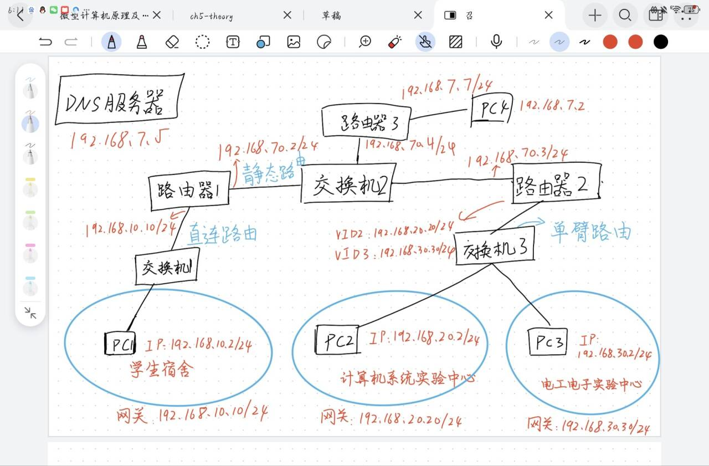

# 组网与运维综合实验报告

## 实验人员

罗子超 22009290030

王乐山 22009290068

王舒贤 22009290060

## 实验要求

结合给定的综合组网的应用场景，完成网络总体架构设计、网络规划与拓扑结构设计、网络地址规划、VLAN划分与配置以及网络路由等设计，并开展相应的功能测试。

**应用场景设计**

终端设备部署：分别部署于学生宿舍、EII区计算机系统实验中心、系统实验中心教师办公室、电工电子实验中心、电工电子中心教师办公室、大学生创新创业中心等5个不同的部门（分属不同VLAN，不同网段）。

要求：要求不同的终端设备之间能够互相访问，所有终端设备均能够正常访问服务器（Windows下的服务器）。

服务器和终端设备在不同的子网。

**网络总体架构设计**

学生宿舍内容的主机划分为一个局域网，用一台交换机连接，并通过一台路由器访问服务器。

EII区不同地点的终端主机分属于不用VLAN和不同的网段（为了简化设计，网络架构中简单罗列了其中的两个）。

路由器端口较少且价格昂贵，EII区不同VLAN和网段下的主机通过单臂路由的形式，借助一台路由器访问服务器。

学生宿舍和EII区部门间的主机通过各自连接的路由器实现互相访问。

## 实验内容

#### **网络规划与拓扑结构设计**

	

	

基本设计完成，接下来依照拓扑结构一步步配置即可

#### 配置IP和网关

	

	

	

#### 路由器配置

**路由器1**

	

	

**路由器2**

	

	

#### 服务器配置

**服务器1**

	

	

**服务器2**

	

	

#### 结果

pc1可以ping路由器1右端口

	

PC1pingPC4和dns服务器

	

ping dns服务器

	

## 总结

通过此次实验，加深了对计网的理解，强化了实践能力，对各类配置更加了解，收获颇丰