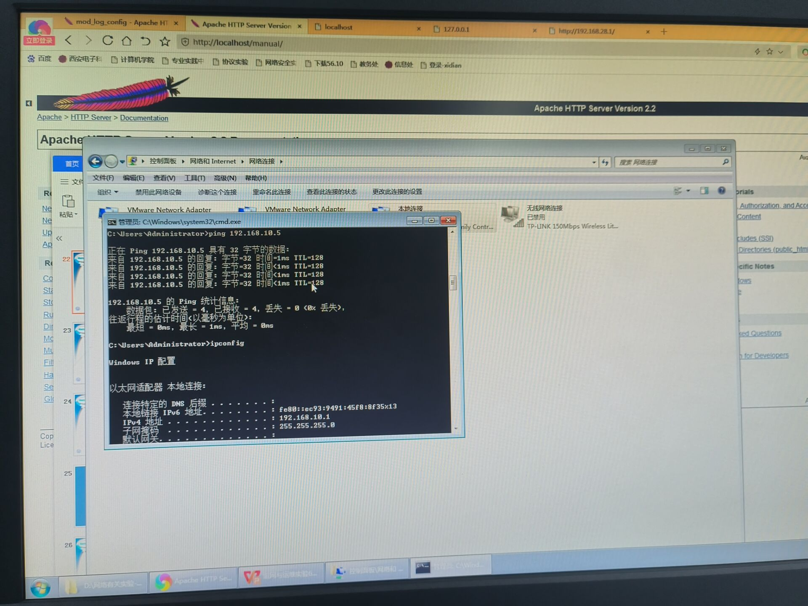
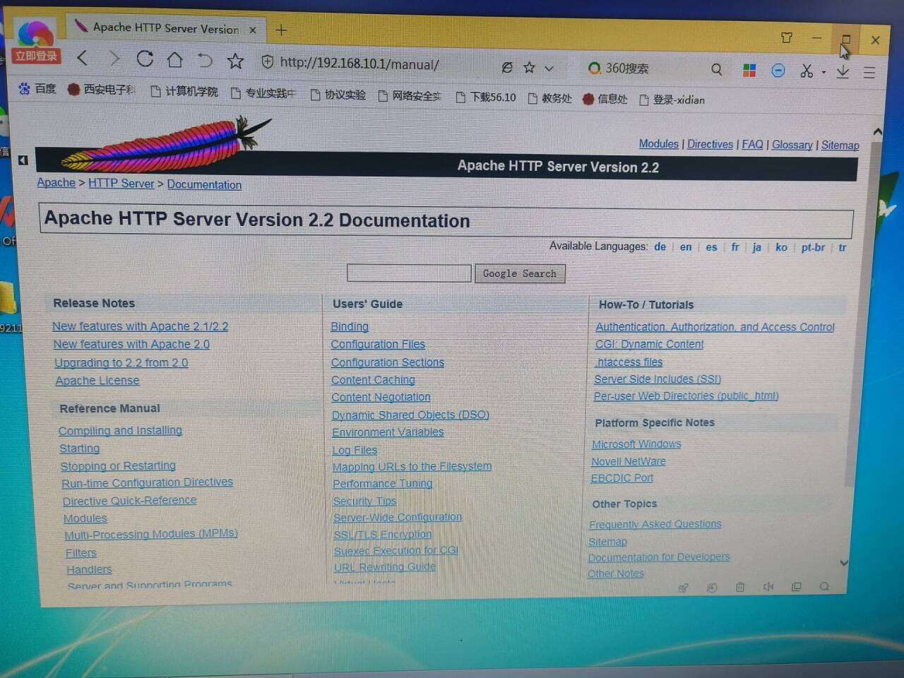
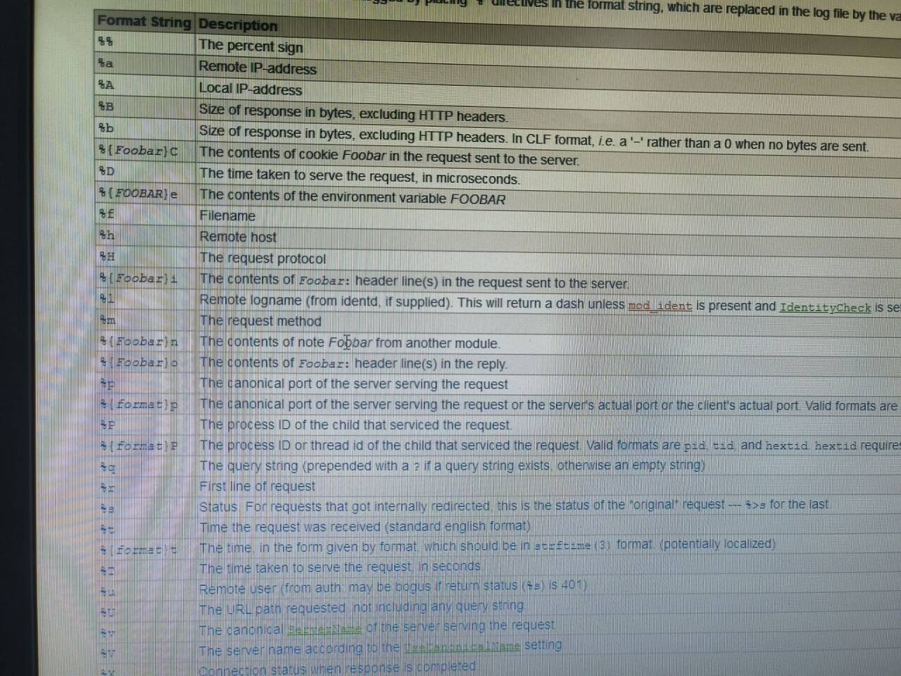
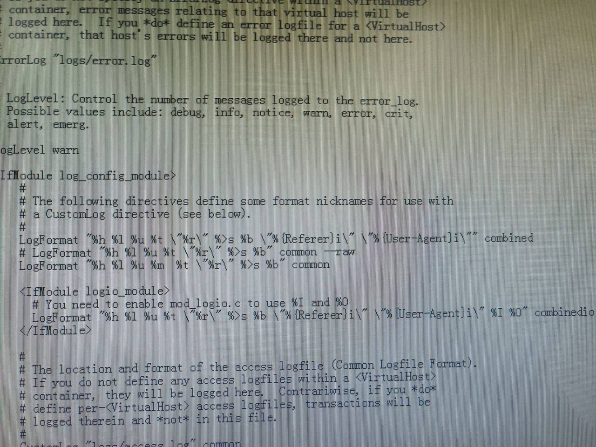
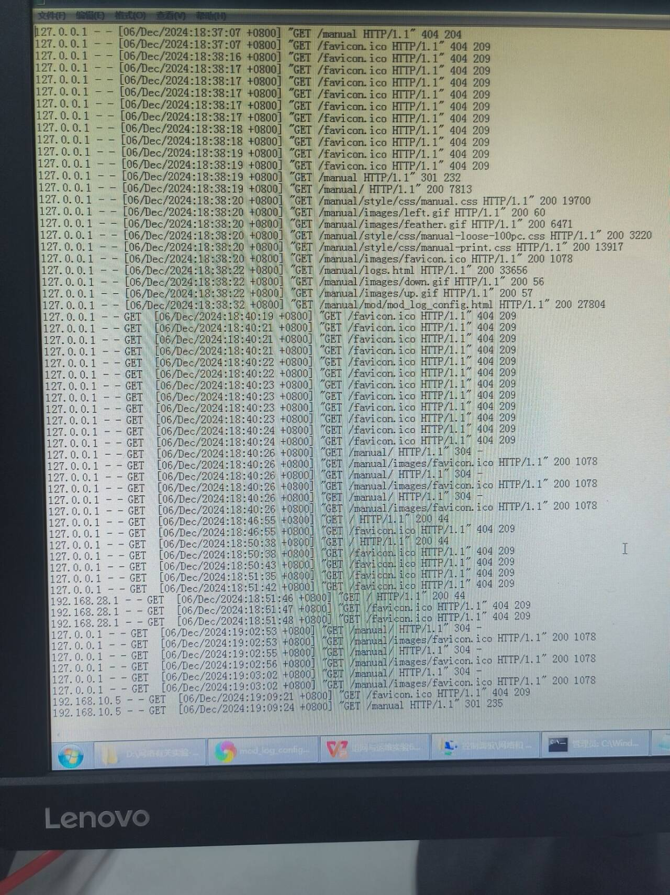
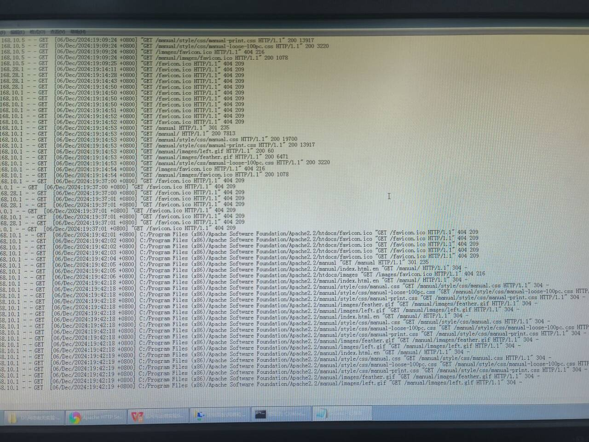

# 组网与运维实验报告

## Apache Web Server配置与分析

### 实验内容

- 安装Apache Web Server服务
- 熟悉AWS的功能特性
- 分析AWS访问日志
- 分析AWS错误日志

### 实验目的

- 学习AWS的配置技巧
- 学习AWS的日志格式
- 学习AWS的故障诊断与测试

### 实验需求

- 两台PC机
- 交换机
- Apache Web Server安装文件

### 实验步骤

**实验操作1：**

为了方便管理员的请求分类统计，如何在访问日志（access.log）中显示每次请求的HTTP请求方法命令名（GET/POST/...）

请修改配置文件并测试，并重新打开access.log验证实现。

**实验操作2：**

假设服务器的存储系统出现了隐患，造成服务器的某些文件无法正常访问，为了快速定位故障源，希望在每次请求的访问日志中，加入实际返回的服务器磁盘中的文件名，请按照前面的方法实现。

**实验操作3：**

假设服务器软件系统出现了负载增大的现象，为了快速定位故障源，希望在每次请求的访问日志中，加入处理请求的进程Process编号，以利于软件系统的测试，请按照前面的方法实现。

**实验操作4：**

为了统计访问服务器的浏览器用户的数量及比例，需要在前面访问日志信息的基础上收集请求的User-Agent字段，请按照前面的方法实现。

**实验操作5：**

服务器的访问量很大，造成访问日志的膨胀，导致服务器的存储空间不足，为了缓解这种问题，希望缩小访问日志的规模，在每次请求时，访问日志仅记录

请求IP地址、访问时间、返回的数据长度

请修改配置文件实现。

### 实验过程

设置好两台实验的PC机，用交换机连通并设置同一内网IP地址。



下载完Apache，确定运行正常

打开内置manual页面



这里可以查看配置命令信息



这里我们打开配置文件，ctrl＋f 查找common，在这里添加相关命令

加入命令以后，注释掉原来的，然后在Apache命令重新启动

第一次让get提前 加%m



第一个要求启动



全部要求实现后最终配置如下



## Microsoft WAS Tool压力测试分析

 你的Web服务器和应用到底能够支持多少并发用户访问？在出现大量并发请求的情况下，软件会出现问题吗？这个实验就是相关内容

### 实验内容

- 安装Microsoft Web Application Stress Tool
- 建立压力测试脚本
- 设置压力测试参数
- 进行HTTP压力测试进行故障分析
- 熟悉压力测试报告

### 实验目的

学习Web压力测试工具WAS

学习通过压力测试进行Web故障分析

### 实验需求

两台PC机

交换机

Apache Web Server

Microsoft WAS Tool安装文件

### 实验操作

#### 实验操作 1

- **变化参数**：线程数分别设置为 1、4、100，每线程均保持 1 连接，测试目标为本机（[localhost](https://localhost/)）。
- **预期分析**：随着线程数的增加，理论上向本机发送的请求数量会增多，平均请求次数应该呈现上升趋势。但同时也要关注系统在处理这些不同量级请求时的稳定性以及是否会出现性能瓶颈，比如响应时间延长、出现错误等情况。

#### 实验操作 2

- **变化参数**：线程数固定为 10，每线程连接数分别设置为 2、4、8，测试对象依然为本机（[localhost](https://localhost/)）。
- **预期分析**：在相同线程数下，每线程连接数的增加意味着同一时间内系统需要处理更多并发的连接请求，这对系统资源（如 CPU、内存、网络带宽等）的消耗会更大，平均请求次数的变化将反映出系统在应对不同并发连接程度时的处理能力，若出现平均请求次数增长缓慢甚至下降，可能表示系统已在该条件下出现性能受限的情况。

#### 实验操作 3

- **变化参数**：线程数分别设为 1、4、100，每线程 1 连接，不过此次测试目标变为远端（交换机连接的另一台 PC）。
- **预期分析**：与测试本机相比，测试远端会涉及到网络传输等额外环节，网络状况（如带宽、延迟、丢包率等）将对测试结果产生影响。即便相同的线程数和每线程连接数设置，平均请求次数可能会比测试本机时有所不同，比如由于网络传输延迟可能导致请求处理效率降低，平均请求次数下降等情况，通过对比本机和远端测试结果可以分析网络因素对系统性能压力测试的影响程度。

## WireShark软件协议分析仪

### 实验内容

- 安装WireShark软件协议分析仪
- 简单的网络协议捕获与分析
- 熟悉网络协议过滤器
- 高级网络协议的过滤分析

### 实验目的

学习网络协议分析仪的使用

学习通过协议分析仪进行网络故障的诊断

### 实验需求

两台PC机

交换机

Apache服务器

WireShark安装文件

### 实验步骤

#### **实验操作1**：简单协议捕获与分析

1. 启动 WireShark 并选择需要监控的网卡接口。
2. 开始捕获数据包，观察实时捕获的二层协议数据包（如 ARP、Ethernet 等）。
3. 停止捕获并分析数据包，记录其关键字段，如 MAC 地址、类型字段。

#### **实验操作2**：捕获HTTP数据包

1. 使用 WireShark 捕获网卡接口的全部数据包。
2. 通过本机浏览器访问远端 Apache 服务器，打开 `/manual` 及其下的页面。
3. 随机访问多个网页（超过100次请求），停止捕获。
4. 保存捕获的数据文件以备后续分析。

#### **实验操作3**：TCP协议过滤

1. 打开捕获的数据包列表。
2. 设置过滤器：`tcp`。
3. 观察和分析 TCP 数据包的三次握手过程、传输数据的过程及其序列号等特征。

#### **实验操作4**：HTTP协议过滤与比较

1. 清除现有过滤条件，设置新的过滤器：`http`。
2. 分析 HTTP 请求和响应的元数据字段，例如：
   - 请求方法：GET、POST
   - 响应状态码：200、404
   - Content-Type、Content-Length 等字段。
3. 对比实验中的 Telnet 协议结果，记录差异。

#### **实验操作5**：HTTP数据长度过滤

1. 设置过滤器，筛选返回数据长度超过2000字节的 HTTP 数据包：

   ```
   http.content_length > 2000
   ```

2. 确认筛选后的数据包并记录相关数据。

#### **实验操作6**：HTTP返回图像的过滤

1. 设置过滤器，筛选返回内容为图像类型的数据包：

   ```
   http.content_type contains "image"
   ```

2. 验证过滤结果是否包含常见图像格式（如 JPEG、PNG）。

#### **实验操作7**：URI包含特定字符串过滤

1. 设置过滤器，筛选 URI 中包含“platform”字符串的请求：

   ```
   http.request.uri contains "platform"
   ```

2. 查看筛选结果并记录相关请求。

#### **实验操作8**：多重过滤条件的设置

1. 设置复合条件的过滤器，筛选满足以下条件的 HTTP 数据包：

   - 返回数据长度超过 2000 字节。
   - 数据类型为 HTML。

   ```
   http.content_length > 2000 && http.content_type contains "text/html"
   ```

2. 验证过滤结果，记录返回的 HTML 页面数据包信息。