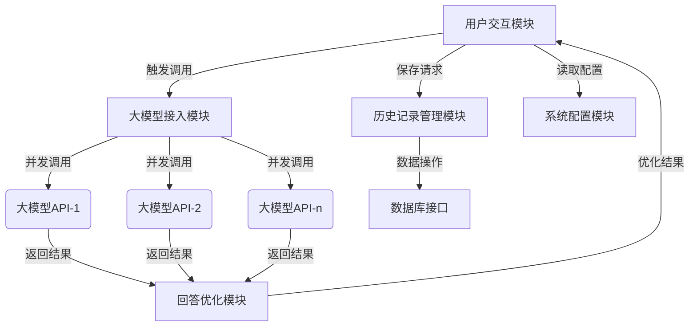
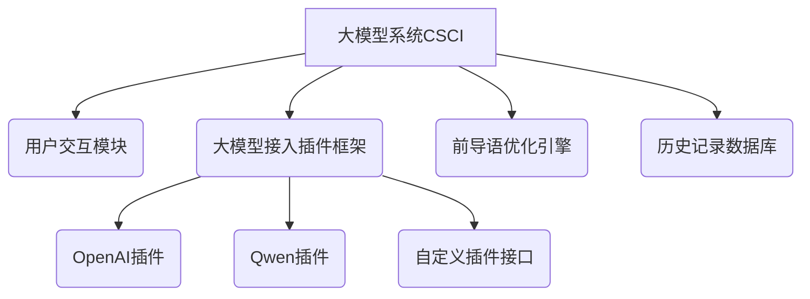
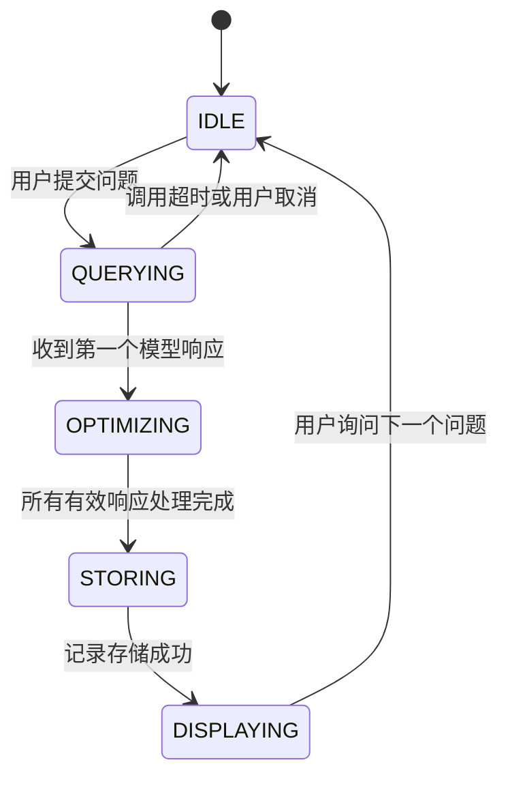

# 软件工程设计说明书

## 1、引言  

### 1.1 标识

SRS适用范围：个人与小型团队

标识号：AITURN001

标题：大模型交叉咨询系统

版本号：V1.0

发行号：Alpha001（内测版）

###  1.2 系统概述  

为了能通过ai获取正确精准而快速的回复，我们决定制作一个轻量化的大语言模型交叉咨询系统，能通过多个大语言模型交叉对问题进行优化和确定。

### 1.3 文档概述  

本文档是大模型交叉编辑系统的软件设计说明书（SDS），旨在通过多个大语言模型交叉对问题进行优化和确定。文档围绕“智能场景驱动” 的核心设计理念，详细阐述系统架构、模块设计、数据模型及接口规范，覆盖用户需求，历史会话保存等核心功能

### 1.4 基线

本文档的设计基线是《GBT8567—2006计算机软件文档编制规范》

## 2、引用文件

[1] GBT8567—2006计算机软件文档编制规范. 2006

[2] Y.Daniel Liang著李娜译,JAVA语言程序设计．北京：机械工业出版社 2012

[3] 刘先锋，数据库系统原理与应用。 武汉：华中科技大学出版社 2012

## 3、CSCI级设计决策

#### 3.1 输入输出设计决策

**输入方面**：系统接受用户以文本形式输入的各类问题或指令。用户通过软件的交互界面，直接输入自然语言文本。同时，为了实现与其他系统的交互，预留标准化 API 接口，可接收其他系统以 JSON 或 XML 格式封装的文本数据请求，实现跨系统的问答功能调用 。与用户的交互接口设计遵循简洁易用原则，支持快捷键输入和粘贴输入等便捷操作方式。

**输出方面**：系统输出为优化后的大模型回答文本。通过交互界面直接展示给用户，输出内容采用清晰的排版格式，区分问题和回答部分。对于通过 API 接口接入的其他系统，按照约定的数据格式（如 JSON）返回结构化的回答数据，包含原始大模型回答和二次优化后的内容。此外，在输出中，若涉及历史记录相关操作（如查看历史问答），也以结构化文本或列表形式展示在交互界面特定区域。

#### 3.2 行为响应设计决策

**输入响应**：当用户输入问题后，系统会同时将问题发送至接入的多个大模型。为每个大模型设置合理的响应超时时间（如 30 秒），若某个大模型在规定时间内未返回结果，则跳过该模型，继续等待其他模型响应。接收到大模型返回的回答后，结合前导语对回答内容进行二次优化，优化过程包括语句通顺性调整、内容补充完善、重点信息突出等操作。

**性能特性**：系统整体响应时间目标控制在用户可接受范围内，平均响应时间不超过 5 秒（在网络正常、大模型负载合理的情况下）。对于高并发请求，采用异步处理和队列机制，保证请求有序处理，避免系统崩溃。

#### 3.3 数据库 / 数据文件呈现设计决策

系统保存用户的历史问答记录，历史记录以数据库形式存储。在用户交互界面，提供历史记录查看功能，用户可通过时间筛选、关键词搜索等方式快速定位历史问答。历史记录展示为列表形式，每条记录包含提问时间、问题内容和回答内容。数据库设计采用关系型数据库（如 MySQL），通过合理的表结构设计（如用户表、问答记录表等）保证数据的完整性和查询效率。对于历史记录的备份和恢复，采用定期备份策略，备份数据存储在安全的存储设备中，当系统出现数据丢失等异常情况时，可快速恢复历史记录数据。

#### 3.4 安全、保密、私密性需求满足方法

**用户隐私保护**：严格遵循相关隐私保护法规，不收集用户的个人敏感信息（如身份证号、银行卡号等）。仅记录与问答相关的必要信息，用户的历史问答记录仅对用户本人可见，系统管理员无权随意查看用户历史记录。提供用户数据删除功能，用户可随时删除自己的历史问答记录。。

#### 3.5 其他 CSCI 级设计决策

**灵活性**：为实现系统的灵活性，采用插件式架构设计接入多个大模型。通过定义统一的大模型接口规范，方便后续新增或替换大模型，只需开发对应的插件即可实现与系统的集成。同时，前导语的设置采用可配置方式，用户或管理员可根据不同的使用场景和需求，灵活调整前导语内容，实现对大模型回答优化方向的控制。

**可用性**：系统提供友好的用户交互界面，界面设计符合用户操作习惯，提供清晰的操作指引和提示信息。设置系统状态监控功能，实时监测系统的运行状态（如服务器负载、大模型连接状态等），当系统出现异常时，及时通过邮件、短信等方式通知管理员进行处理。此外，提供在线帮助文档和客服支持渠道，方便用户在使用过程中遇到问题时获取帮助。

**可维护性**：采用模块化设计思想，将系统划分为不同的功能模块（如大模型接入模块、回答优化模块、历史记录管理模块等），每个模块具有独立的功能和清晰的接口，便于开发和维护。在代码编写过程中，遵循良好的编码规范和注释规范，提高代码的可读性。定期对系统进行代码审查和性能优化，及时修复发现的问题和漏洞，保证系统的稳定运行。

## 4、CSCI体系结构设计

### 4.1 体系结构

####  程序 (模块) 划分

|   **模块名称**   | **标识符** |                         **功能描述**                         |
| :--------------: | :--------: | :----------------------------------------------------------: |
|  大模型管理模块  |    LLM     | 封装多个大模型 API 接口，实现并发调用、超时控制、错误处理等功能 |
|   菜单管理模块   |    Menu    |                    保存用户交互的所有页面                    |
| 历史记录保存模块 |   Saving   |           负责问答记录的存储、查询、删除及备份恢复           |
|     设置模块     |  Setting   | 管理系统参数（如大模型 API 密钥、前导语模板、超时设置等），支持动态加载配置 |
|   用户交互模块   |    Main    | 处理用户输入输出，提供问答界面、历史记录查看、系统配置等交互功能 |

#### 程序 (模块) 层次结构关系

### 4.2 静态关系（组成结构）

### 4.3 用途与需求分配和硬件资源使用

**大模型接入插件框架**：实现多模型并发调用，满足需求 R-LLM-001（支持至少 3 个大模型接入）和设计决策 D-LLM-002（插件式架构）

**历史记录数据库**：存储问答历史，满足需求 R-HIST-001（支持 10 万条以上记录存储）和设计决策 D-DB-001（AES 加密存储）

#### 处理器资源

- **需求覆盖**：满足 R-PERF-001（并发处理≥10 请求 / 秒）
- **假设条件**：最坏情况为 10 个并发请求同时调用 3 个大模型
- 使用数据
  - 单请求处理 CPU 占用：约 5%（Intel i5-10400）
  - 并发峰值占用：≤50%（预留 50% 资源用于系统开销）
- **度量单位**：CPU 利用率百分比

#### 内存资源

- **需求覆盖**：满足 R-PERF-002（单节点支持 512MB 内存）
- 使用数据
  - 单请求内存占用：约 20MB（含模型响应缓存）
  - 并发峰值内存：≤200MB（10 并发）
- **特殊考虑**：使用内存池管理缓存，避免频繁 GC 开销

### 4.4 执行概念

#### 4.4.1 动态交互流程

**用户输入阶段**：用户通过 UI 模块输入问题，

**模型调用阶段**：

- 大模型接入模块通过线程池（最大线程数 = 模型数量）并发调用各 API
- 每个调用线程设置超时控制，超时则跳过该模型

**回答优化阶段**：收集所有有效响应，按前导语规则合并优化

**记录存储阶段**：历史记录模块将问答数据加密后写入数据库

#### 4.4.2 状态转换图

### 4.5 接口设计

|  **接口名称**   |       **接口实体**       |
| :-------------: | :----------------------: |
|  用户交互接口   |      UI 模块与用户       |
| 大模型 API 接口 | 接入模块与外部大模型服务 |
|   数据库接口    |   历史记录模块与数据库   |

## 5、注解

|  **术语**  |                           **定义**                           |
| :--------: | :----------------------------------------------------------: |
|    CSCI    | 计算机软件配置项（Computer Software Configuration Item），指系统中可标识的软件实体 |
|    SCI     |  软件配置项（Software Configuration Item），CSCI 的组成部分  |
|   前导语   | 用于引导大模型生成特定风格回答的提示文本，支持变量替换与模板化配置 |
| 插件式架构 | 通过定义标准接口实现功能模块动态加载的设计模式，便于扩展新的大模型接入 |
|  并发调用  | 同时向多个大模型发送请求的机制，通过线程池管理资源分配与超时控制 |

