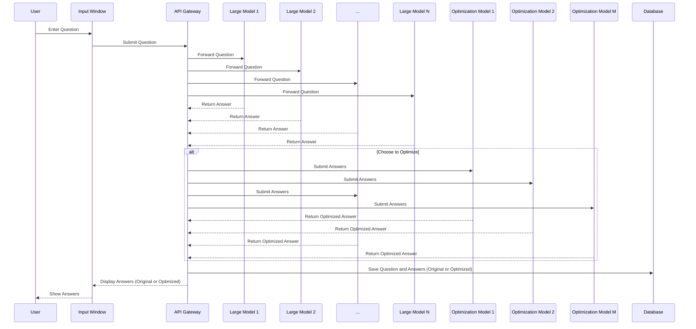

```mermaid
sequenceDiagram
    participant User
    participant Input Window
    participant API Gateway
    participant Large Model 1
    participant Large Model 2
    participant ...
    participant Large Model N
    participant Optimization Model 1
    participant Optimization Model 2
    participant ...
    participant Optimization Model M
    participant Database

    User ->> Input Window: Enter Question
    Input Window ->> API Gateway: Submit Question
    API Gateway ->> Large Model 1: Forward Question
    API Gateway ->> Large Model 2: Forward Question
    API Gateway ->> ...: Forward Question
    API Gateway ->> Large Model N: Forward Question
    Large Model 1 -->> API Gateway: Return Answer
    Large Model 2 -->> API Gateway: Return Answer
    ... -->> API Gateway: Return Answer
    Large Model N -->> API Gateway: Return Answer
    alt Choose to Optimize
        API Gateway ->> Optimization Model 1: Submit Answers
        API Gateway ->> Optimization Model 2: Submit Answers
        API Gateway ->> ...: Submit Answers
        API Gateway ->> Optimization Model M: Submit Answers
        Optimization Model 1 -->> API Gateway: Return Optimized Answer
        Optimization Model 2 -->> API Gateway: Return Optimized Answer
        ... -->> API Gateway: Return Optimized Answer
        Optimization Model M -->> API Gateway: Return Optimized Answer
    end
    API Gateway ->> Database: Save Question and Answers (Original or Optimized)
    API Gateway -->> Input Window: Display Answers (Original or Optimized)
    Input Window -->> User: Show Answers
```