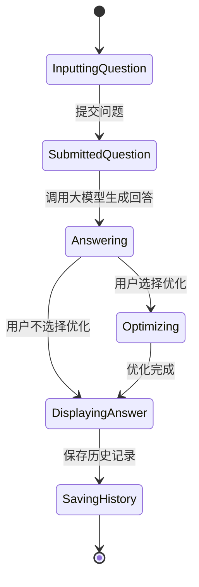

```mermaid
stateDiagram-v2
    [*] --> InputtingQuestion
    InputtingQuestion --> SubmittedQuestion: 提交问题
    SubmittedQuestion --> Answering: 调用大模型生成回答
    Answering --> Optimizing: 用户选择优化
    Answering --> DisplayingAnswer: 用户不选择优化
    Optimizing --> DisplayingAnswer: 优化完成
    DisplayingAnswer --> SavingHistory: 保存历史记录
    SavingHistory --> [*]
```