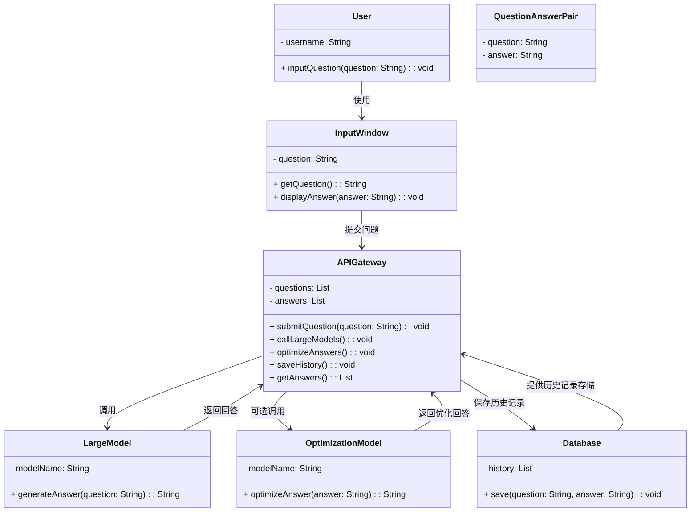

```mermaid
classDiagram
    class User {
        - username: String
        + inputQuestion(question: String): void
    }
    class InputWindow {
        - question: String
        + getQuestion(): String
        + displayAnswer(answer: String): void
    }
    class APIGateway {
        - questions: List<String>
        - answers: List<String>
        + submitQuestion(question: String): void
        + callLargeModels(): void
        + optimizeAnswers(): void
        + saveHistory(): void
        + getAnswers(): List<String>
    }
    class LargeModel {
        - modelName: String
        + generateAnswer(question: String): String
    }
    class OptimizationModel {
        - modelName: String
        + optimizeAnswer(answer: String): String
    }
    class Database {
        - history: List<QuestionAnswerPair>
        + save(question: String, answer: String): void
    }
    class QuestionAnswerPair {
        - question: String
        - answer: String
    }

    User --> InputWindow : 使用
    InputWindow --> APIGateway : 提交问题
    APIGateway --> LargeModel : 调用
    APIGateway --> OptimizationModel : 可选调用
    APIGateway --> Database : 保存历史记录
    LargeModel --> APIGateway : 返回回答
    OptimizationModel --> APIGateway : 返回优化回答
    Database --> APIGateway : 提供历史记录存储
```

